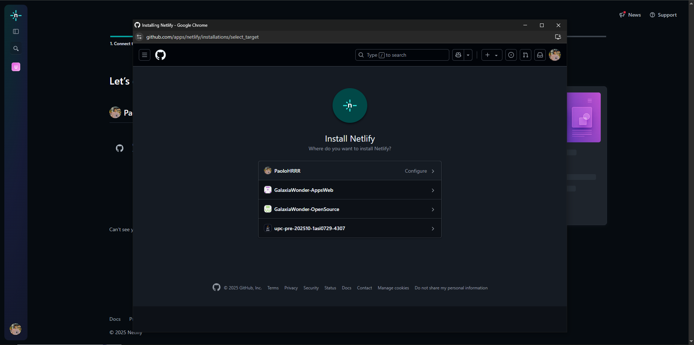

## 5.1. Software Configuration Management

### 5.1.1. Software Development Environment Configuration

En Galaxia Wonder hemos adoptado una serie de herramientas tanto familiares como más recientes para el diseño, desarrollo y despliegue de nuestra solución de software. En la siguiente tabla a continuación, se presentan las principales herramientas a utilizar por el equipo.

<table>
    <thead>
        <tr>
            <th>Nombre</th>
            <th>Propósito de uso en el proyecto</th>
            <th>Enlace de referencia / descarga</th>
        </tr>
    </thead>
    <tbody>
        <tr>
            <td>UXPressia</td>
            <td><strong>UX/UI Design:</strong> Artefactos de UX</td>
            <td><a href="https://uxpressia.com/" target="_blank">UXPressia Web Application</a></td>
        </tr>
        <tr>
            <td>Miro</td>
            <td><strong>UX/UI Design:</strong> As-Is & To-Be Scenario Mapping</td>
            <td><a href="https://miro.com/es/app/" target="_blank">Descargar Miro</a></td>
        </tr>
        <tr>
            <td>Figma</td>
            <td><strong>UX/UI Design:</strong> Wireframes, Mockups & Prototyping</td>
            <td><a href="https://www.figma.com/es-la/downloads/" target="_blank">Descargar Figma</a></td>
        </tr>
        <tr>
            <td>LucidChart</td>
            <td><strong>UX/UI Design:</strong> Wireflows & Userflows</td>
            <td><a href="https://www.lucidchart.com/" target="_blank">LucidChart Web</a></td>
        </tr>
        <tr>
            <td>Vertabelo</td>
            <td><strong>Software Architecture Design:</strong> Database Diagram</td>
            <td><a href="https://vertabelo.com/" target="_blank">Vertabelo Web</a></td>
        </tr>
        <tr>
            <td>PlantUML</td>
            <td><strong>Software Architecture Design:</strong> UML y C4 Model</td>
            <td><a href="https://plantuml.com/es/" target="_blank">PlantUML Web</a></td>
        </tr>
        <tr>
            <td>VSCode</td>
            <td><strong>IDE:</strong> Editor de código ligero y versátil para múltiples lenguajes</td>
            <td><a href="https://code.visualstudio.com/" target="_blank">Descargar VSCode</a></td>
        </tr>
        <tr>
            <td>WebStorm</td>
            <td><strong>IDE:</strong> Desarrollo especializado en JavaScript y frameworks modernos</td>
            <td><a href="https://www.jetbrains.com/webstorm/" target="_blank">WebStorm Web</a></td>
        </tr>
        <tr>
            <td>Rider</td>
            <td><strong>IDE:</strong> Desarrollo en C# y .NET multiplataforma</td>
            <td><a href="https://www.jetbrains.com/rider/" target="_blank">Rider Web</a></td>
        </tr>
        <tr>
            <td>C#</td>
            <td><strong>Lenguaje de Programación:</strong> Backend moderno con tipado fuerte</td>
            <td><a href="https://learn.microsoft.com/en-us/dotnet/csharp/" target="_blank">Documentación de C#</a></td>
        </tr>
        <tr>
            <td>Node.js</td>
            <td><strong>Entorno de Ejecución:</strong> JavaScript del lado del servidor</td>
            <td><a href="https://nodejs.org/" target="_blank">Descargar Node.js</a></td>
        </tr>
        <tr>
            <td>npm</td>
            <td><strong>Gestor de Paquetes:</strong> Manejo de dependencias para proyectos JS</td>
            <td><a href="https://www.npmjs.com/" target="_blank">Sitio de npm</a></td>
        </tr>
        <tr>
            <td>Vue.js</td>
            <td><strong>Framework:</strong> Desarrollo de aplicaciones web SPA con JavaScript</td>
            <td><a href="https://vuejs.org/" target="_blank">Vue.js Web</a></td>
        </tr>
        <tr>
            <td>.NET</td>
            <td><strong>Framework:</strong> Plataforma para aplicaciones backend y frontend modernas</td>
            <td><a href="https://dotnet.microsoft.com/" target="_blank">Sitio oficial .NET</a></td>
        </tr>
    </tbody>
</table>

### 5.1.2. Source Code Management

En Galaxia Wonder, la gestión del código fuente se realiza mediante Git como sistema de control de versiones, y GitHub como plataforma de alojamiento colaborativo y descentralizado. Esta estructura facilita la colaboración entre equipos distribuidos y permite un control riguroso del ciclo de vida del software.

El proyecto está organizado en varios repositorios, según la arquitectura modular de las soluciones tecnológicas utilizadas:

- Landing Page (Vue.js + Tailwind CSS):  
  [https://github.com/GalaxiaWonder-AppsWeb/LandingPage](https://github.com/GalaxiaWonder-AppsWeb/LandingPage)

- FrontEnd Web Application (Vue.js SPA con Vite):  
  [https://github.com/GalaxiaWonder-AppsWeb/FrontEnd](https://github.com/GalaxiaWonder-AppsWeb/FrontEnd)

- RESTful API (C# + ASP.NET Core):  
  [https://github.com/GalaxiaWonder-AppsWeb/API](https://github.com/GalaxiaWonder-AppsWeb/API)

- ProP GMS Web Service (Arquitectura modular basada en .NET):  
  [https://github.com/GalaxiaWonder-AppsWeb/Platform](https://github.com/GalaxiaWonder-AppsWeb/Platform)

Para su gestión interna, se aplicará GitFlow. Se explican a continuación las ramas a crear, así como las convenciones a utilizar para nombrarlas:

**RAMAS PRINCIPALES**

- **main**: Rama principal de producción. Aquí se encuentran las versiones estables del proyecto, listas para ser desplegadas. Toda publicación oficial se hace desde esta rama.

- **develop**: Rama de desarrollo. Aquí se integran las nuevas funcionalidades antes de ser lanzadas a producción. Es la base para las ramas de tipo *feature*, *release* y *bugfix*.

**RAMAS SECUNDARIAS**

- **feature/**: Ramas para el desarrollo de nuevas funcionalidades. Se crean a partir de `develop` y, una vez completadas, se integran de nuevo en `develop`.  
  - **Convención de nombres**:  
    `feature/story-id`  
    Ejemplo: `feature/us77`

- **bugfix/**: Ramas para la correción de errores detectados en fase de desarrollo. Se crean a partir de `develop` y, una vez completadas, se integran de nuevo en `develop`.  
  - **Convención de nombres**:  
    `bugfix/story-id`  
    Ejemplo: `bugfix/us82`

- **release/**: Ramas para preparar una nueva versión de producción. Se crean desde `develop` cuando ya se ha alcanzado un conjunto estable de funcionalidades. Sirven para realizar pruebas, ajustes menores y documentación. Al finalizar, se integran en `main` y `develop`.  
  - **Convención de nombres**:  
    `release/x.y.z`  
    Ejemplo: `release/1.0.0`

- **hotfix/**: Ramas para corregir errores críticos detectados tardíamente en producción. Se crean desde `main` y se integran tanto en `main` como en `develop` (o en `release`, si hubiere alguna rama de ese tipo activa).  
  - **Convención de nombres**:  
    `hotfix/story-id`  
    Ejemplo: `hotfix/swr35`

### 5.1.3. Source Code Style Guide & Coding Conventions

En esta sección se establecen las guías de estilo y convenciones de codificación que el equipo adoptará para mantener la consistencia, legibilidad y calidad del código fuente.

**LENGUAJES DE PROGRAMACIÓN**

Para el desarrollo de la solución, se utilizarán los siguientes lenguajes de programación y marcado:
- HTML  
- CSS  
- JavaScript  
- C#

**CONVENCIONES GENERALES**  
Para todos los lenguajes de programación y marcado mencionados:
- Se aplicará el uso de nomenclaturas en inglés.
- Se nombrarán variables, constantes, elementos y clases de forma explícita.
- Se usarán saltos de línea vacíos para separar unidades lógicas diferentes del código.
- Se promoverá la reutilización de código.

**CONVENCIONES ESPECÍFICAS**

A continuación, se describen las convenciones principales a aplicar por lenguaje:

**HTML & CSS:** Se aplicarán las recomendaciones del HTML Style Guide and Coding Conventions y el Google HTML/CSS Style Guide:
- Escribir etiquetas y atributos en minúsculas.
- Utilizar indentación de 2 espacios.
- Utilizar clases con nombres descriptivos y en `kebab-case`.
- Evitar el uso de estilos en línea.
- Separar el contenido (HTML) de la presentación (CSS).

**JavaScript:** Se adoptarán las recomendaciones del Google JavaScript Style Guide.
- Usar `camelCase` para variables y funciones.
- Usar `PascalCase` para clases y componentes.
- Definir constantes en `UPPER_SNAKE_CASE`.
- Evitar el uso de `var`, preferir `let` y `const`.
- Usar funciones flecha (`=>`) siempre que sea posible.
- Documentar funciones y clases con comentarios JSDoc.
- Diseñar y codificar orientados al desacoplamiento.

**C# (con .NET):** Se seguirán las recomendaciones del Microsoft C# Coding Conventions y .NET documentation.
- Usar `PascalCase` para nombres de clases, métodos públicos y propiedades.
- Usar `camelCase` para variables locales y parámetros.
- Usar nombres descriptivos y evitar abreviaciones innecesarias.
- Organizar archivos en espacios de nombres (`namespace`) lógicos.
- Usar correctamente estructuras como `async/await`, `try/catch`, `LINQ`, y `using`.
- Promover el uso de inyección de dependencias, principios SOLID y separación de capas (por ejemplo: Controllers, Services, DTOs, etc.).

### 5.1.4 Software Deployment Configuration

**LANDING PAGE DEPLOYMENT**

La landing page del proyecto se desplegará utilizando GitHub Pages, una plataforma gratuita proporcionada por GitHub para alojar sitios web estáticos directamente desde un repositorio. Esta solución permite mostrar públicamente la interfaz sin necesidad de servidores externos o configuraciones complicadas.

1. El despliegue se realiza a partir de la rama principal del repositorio (main), asegurando que las versiones mas estables del equipo de desarrollo estén siempre disponibles para visualización inmediata.

Enlace para acceder a la landing page: [https://galaxiawonder-appsweb.github.io/LandingPage/](https://galaxiawonder-appsweb.github.io/LandingPage/)

**LANDING PAGE V2 DEPLOYMENT**

Para la segunda implementación de la landing page del proyecto, se decidió utilizar Netlify. Para ello, se siguio el siguiente proceso:

1. Seleccionar la opción de importar un proyecto existente.

2. Seleccionamos mediante GitHub

3. Seleccionamos la opción de organización

4. Seleccionamos el repositorio de la landing page

5. Se refleja las configuraciones en el dashboard

6. Configuramos el sitename (url) del web page, la rama y el comando de build y guardamos los cambios.

