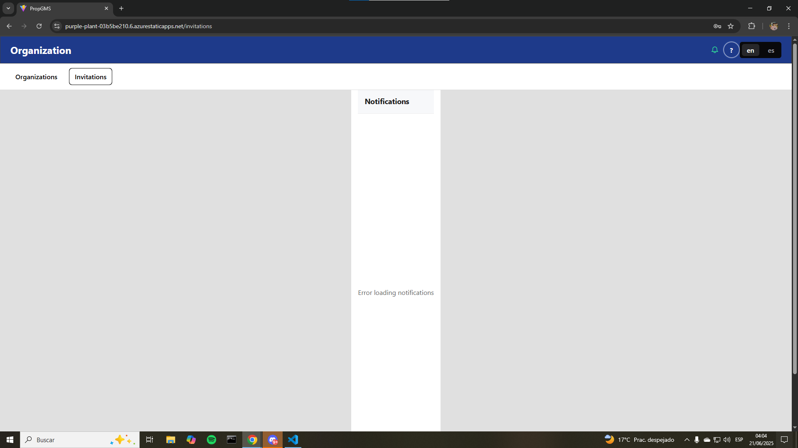
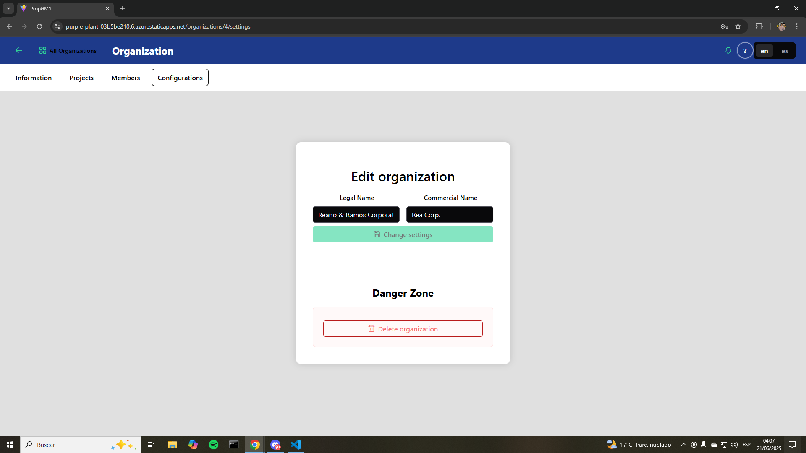
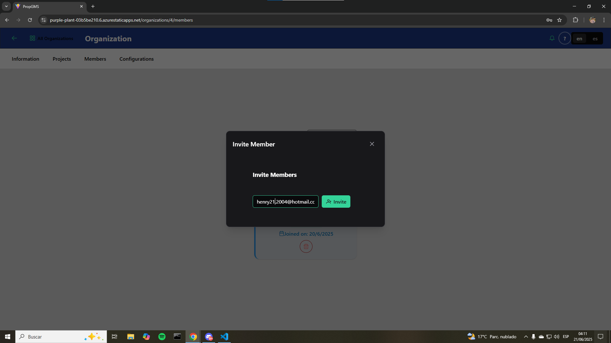
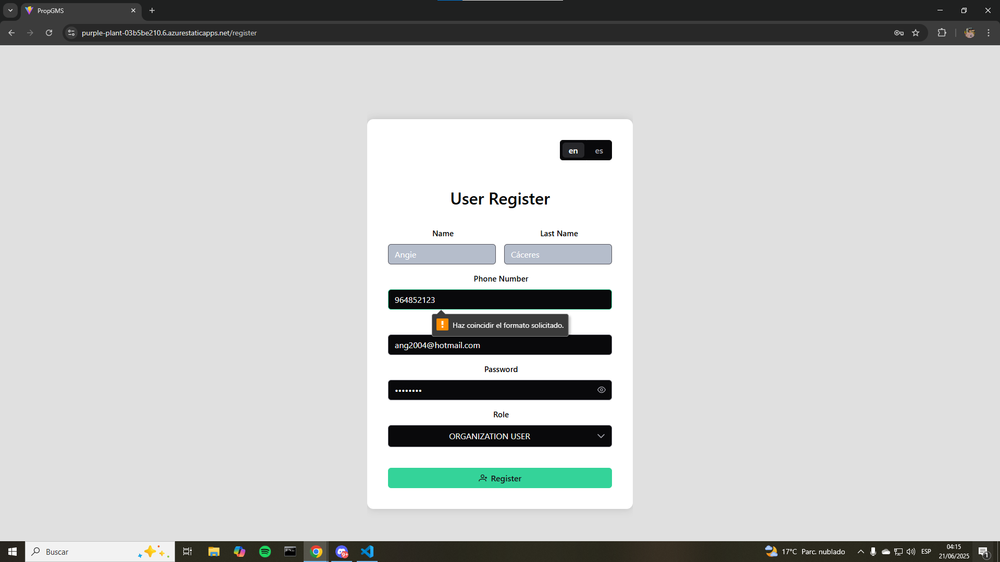

## 5.3. Validation Interviews

### 5.3.1. Diseño de entrevistas

### 5.3.2. Registro de entrevistas

### 5.3.3 UX Heuristics And Principles Evaluation

**Usability – Inclusive Design – Information Architecture**

**CARRERA**  : Ingeniería de Software  
**CURSO**    : Aplicaciones Web  
**SECCIÓN**  : 4363
**PROFESORES**: Todos  
**AUDITOR**  : PaxTech  
**CLIENTE(S)**: Andrea Aponte, Fabrizio León, Mario Lopez, Álvaro Orozco y Henry Reaño

##### SITE o APP A EVALUAR:  
PropGMS

##### TAREAS A EVALUAR:  
1. Registro de un usuario nuevo
2. Creación de una organización
3. Configuración de una organización
4. Invitación de una organización
5. Aceptar invitación de una organización
6. Rechazar invitación de una organización

No estan incluidas en esta versión de la evaluación las siguientes tareas:
1. Creación de un proyecto
2. Configuración de un proyecto
3. Gestionar equipo de un proyecto
4. Crear tarea
5. Crear reunión
6. Asignar responsables a tareas

##### ESCALA DE SEVERIDAD:

Los errores serán puntuados tomando en cuenta la siguiente escala de severidad

| Nivel | Descripción |
|-------|-------------|
| 1     | Problema superficial: puede ser fácilmente superado por el usuario o ocurre con muy poco frecuencia. No necesita ser arreglado a no ser que exista disponibilidad de tiempo. |
| 2     | Problema menor: puede ocurrir un poco más frecuentemente o es un poco más difícil de superar para el usuario. Se le debería asignar una prioridad baja resolverlo de cara al siguiente release. |
| 3     | Problema mayor: ocurre frecuentemente o los usuarios no son capaces de resolverlos. Es importante que sean corregidos y se les debe asignar una prioridad alta. |
| 4     | Problema muy grave: un error de gran impacto que impide al usuario continuar con el uso de la herramienta. Es imperativo que sea corregido antes del lanzamiento. |

---

###### TABLA RESUMEN:

| # | Problema | Escala de severidad | Heurística/Principio violado(a) |
|---|----------|---------------------|---------------------------------|
| 1 | La pantalla se rompe levemente en la sección de notificaciones de un worker cuando este no tiene invitaciones vinculadas a el. | 1 | Usabilidad: Diseño estético y minimalista |
| 2 | Cambiar la razón social y nombre comercial de la organización resulta poco intuitivo. | 1 | Usabilidad: Reconocer en lugar de recordar |
| 3 | Enviar invitación a una organización no valida si se envia invitación a uno mismo | 2 | Usabilidad: Prevención de errores |
| 4 | En la creación de cuenta no se especifica que se debe utilizar el formato E.164 para el número de telefono | 3 | Usabilidad: Ayuda y documentación |

###### DESCRIPCIÓN DE PROBLEMAS:

**PROBLEMA #1:** La pantalla se rompe levemente en la sección de notificaciones de un worker cuando este no tiene invitaciones vinculadas a el

Severidad: 1
Heurística violada: Usabilidad - Diseño estético y minimalista

Problema:
Cuando ingresamos sesión con un usuario de tipo WORKER y nos dirigimos a la sección de invitaciones podemos observar como el componente de notificaciones se rompe por completo al no tener ninguna invitación cargada. 

Recomendación:
Validar en el componente cuando no exista ningun elemento para que el ancho del componente no se vea disminuido y el largo se estire por toda la pantalla.

**PROBLEMA #2:** Cambiar la razón social y nombre comercial de la organización resulta poco intuitivo

Severidad: 1
Heurística violada: Usabilidad - Reconocer en lugar de recordar

Problema:
Al momento de dirigirnos a las configuraciones de una organización observamos dos labels que corresponden a su razón social y nombre comercial, justo debajo de estos existe un botón verde el cual nos dice "Guardar cambios". Sin embargo, consideramos que esta interfaz es poco intuitiva por el hecho de que todo se ve demasiado junto.

Recomendación:
Hacer que los componentes tengan más respiración. Aumentar la distancia entre los mismos. Además, señalar explicitamente que dentro de configuraciones se pueden hacer ediciones de la razón social y nombre comercial de la organización.

**PROBLEMA #3:** Enviar invitación a una organización no valida si se envia invitación a uno mismo

Severidad: 2
Heurística violada: Usabilidad - Prevención de errores

Problema:
Cuando nos encontramos dentro de una organización y nos dirigimos a la sección "Miembros", podemos hacer invitaciones a personas registradas para que puedan unirse a la organización. Sin embargo, no existe la validación de no enviarse invitaciones a si mismo. Este aspecto no tiene sentido ya que una persona no puede invitarse a una organización que el mismo ha creado.

Recomendación:
Validar a través de una query si una persona y una organización ya se encuentran vinculadas a través de una invitación. En caso eso sea cierto podemos simplemente anular la invitación que se esta queriendo generar.

**PROBLEMA #4:** En la creación de cuenta no se especifica que se debe utilizar el formato E.164 para el número de telefono

Severidad: 3
Heurística violada: Usabilidad - Ayuda y documentación

Problema:
Al momento de crear una cuenta no se especifica en ningun momento que el usuario debe ingresar su número de telefono en el formato E.164, es decir con el prefijo de su páis. Además, el mensaje de error no especifica absolutamente nada. Este si es un problema serio pues los nuevos usuarios pueden estancarse y no poder crear su cuenta.

Recomendación:
Se podría hacer dos cosas para solucionar este problema. En primer lugar, se podría informar al usuario a través de un mensaje de error el formato en el cual debe ingresar su número de telefono. En segundo lugar, se podría simplemente colocar un componente Select con todos los prefijos de distintos países en los cuales PropGMS trabaja, así el usuario, intuitivamente escogería el de su país.