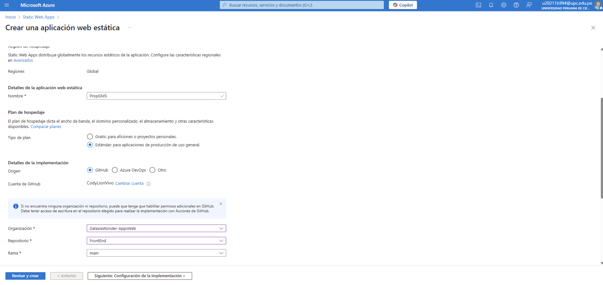
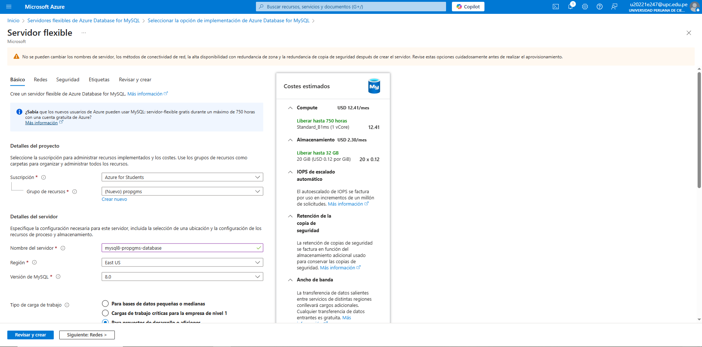
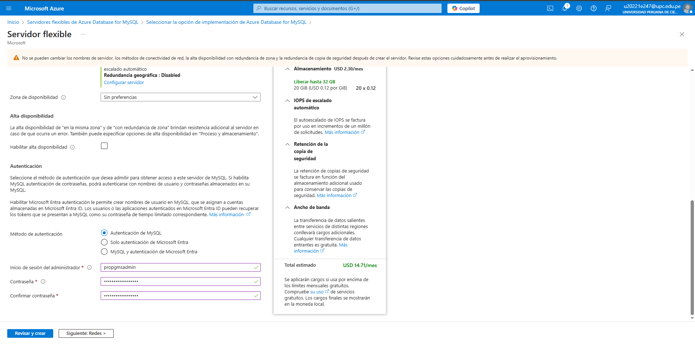
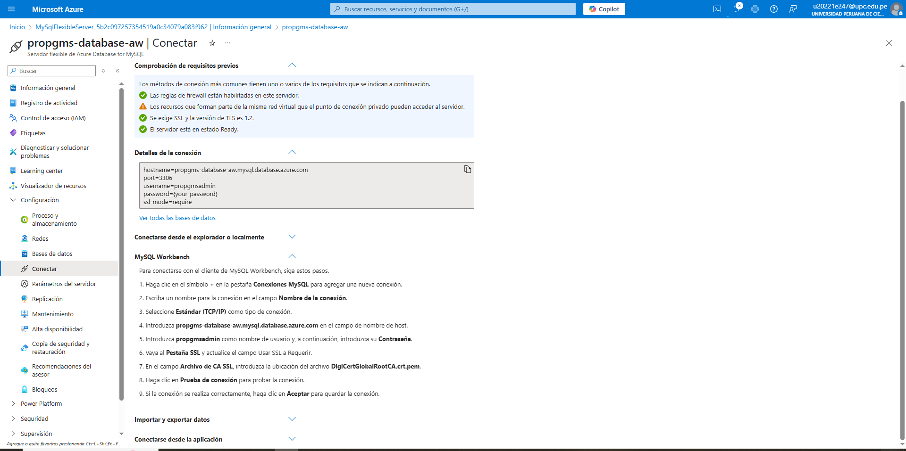
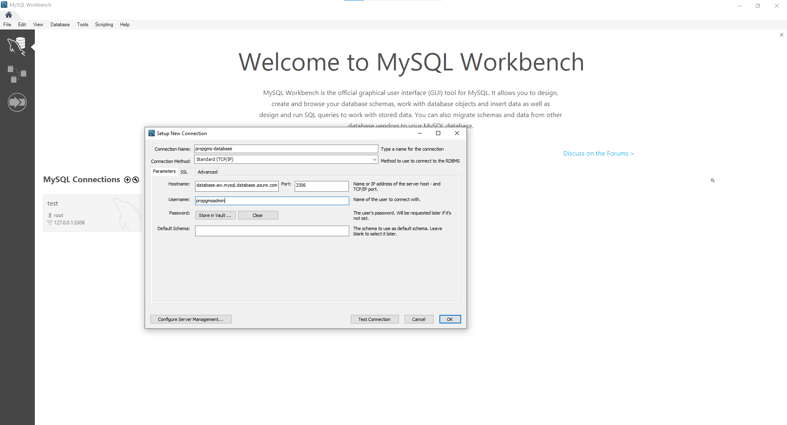
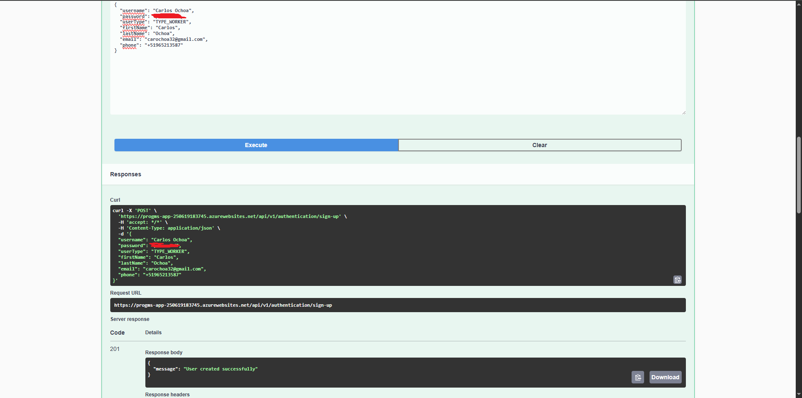

### 5.2.3. Sprint 3

#### 5.2.3.1. Sprint Planning 3

<table cellpadding="6" cellspacing="0" style="border-collapse: collapse; width: 100%;">
  <tr>
    <th colspan="2"><strong>Sprint #</strong></th>
    <td colspan="2">Sprint 3</td>
  </tr>
  <tr>
    <th colspan="4" style="background-color: #d9d9d9;"><strong>Sprint Planning Background</strong></th>
  </tr>
  <tr>
    <th style="width: 20%;">Date</th>
    <td colspan="3">2025-05-16</td>
  </tr>
  <tr>
    <th>Time</th>
    <td colspan="3">07:00 PM</td>
  </tr>
  <tr>
    <th>Location</th>
    <td colspan="3">Reunión virtual -  Discord</td>
  </tr>
  <tr>
    <th>Prepared By</th>
    <td colspan="3">Orozco Torres, Álvaro Joaquín</td>
  </tr>
  <tr>
    <th>Attendees (to planning meeting)</th>
    <td colspan="3">Aponte Cruzado, Andrea Marielena / Orozco Torres, Álvaro Joaquín / León Vivas, Fabrizio Amir</td>
  </tr>
  <tr>
    <th>Sprint 2 Review Summary</th>
    <td colspan="3">El sprint anterior logró realizar la segunda implementación de la Landing Page utilizando el framework de Angular. Se logró realizar un avance de la implementación del Web Application front-end. Sin embargo, este quedó inconcluso y quedaron múltiples task pendientes en estado "To-Do".</td>
  </tr>
  <tr>
    <th>Sprint 2 Retrospective Summary</th>
    <td colspan="3">Se identificó la necesidad de ajustar el modo de trabajo del equipo, a fin de permitir la colaboración efectiva y el desarrollo de capacidades multidisciplinarias por parte de cada miembro del equipo.</td>
  </tr>
  <tr>
    <th colspan="4" style="background-color: #d9d9d9;"><strong>Sprint Goal & User Stories</strong></th>
  </tr>
  <tr>
    <th>Sprint 3 Goal</th>
    <td colspan="3">Nuestro foco es cubrir la deuda técnica acumulada del sprint 2, redefinir y desarrollar las funcionalidades esenciales que permitan realizar un primer despliegue funcional del producto, con el fin de validar su aporte al caso de negocio. Buscamos obtener retroalimentación directa de usuarios reales mediante entrevistas de validación, lo cual nos permitirá confirmar hipótesis, ajustar requisitos no correctamente elicitados y asegurar que la solución responde a necesidades reales.</td>
  </tr>
  <tr>
    <th>Sprint 3 Velocity</th>
    <td colspan="3">45 Story Points</td>
  </tr>
  <tr>
    <th>Sum of Story Points</th>
    <td colspan="3">142 Story Points</td>
  </tr>
</table>

#### 5.2.3.2. Aspect Leaders and Collaborators

Para el Sprint 3, se proyectan actividades como y la implementación de las vistas del Web Application.

<table cellpadding="6" cellspacing="0" style="border-collapse: collapse; width: 100%;">
  <tr>
    <th>Team Member  (Last Name, First Name)</th>
    <th>GitHub Username</th>
    <th>Web Application Front-End Leader (L) / Collaborator (C)</th>
    <th>Web Application Back-End Leader (L) / Collaborator (C)</th>
  </tr>
  <tr>
    <td>Aponte Cruzado, Andrea Marielena</td>
    <td>iconicmiau</td>
    <td>C</td>
    <td>C</td>
  </tr>
  <tr>
    <td>Orozco Torres, Álvaro Joaquín</td>
    <td>CodyLionVivo</td>
    <td>L</td>
    <td>C</td>
  </tr>
  <tr>
    <td>López Acuña, Mario Joaquín</td>
    <td>tertegen</td>
    <td>C</td>
    <td>C</td>
  </tr>
  <tr>
    <td>Orozco Torres, Álvaro Joaquín</td>
    <td>L1LZ4Z</td>
    <td>C</td>
    <td>C</td>
  </tr>
  <tr>
    <td>Reaño Delgadillo, Henry Paolo</td>
    <td>PaoloHRRR</td>
    <td>C</td>
    <td>L</td>
  </tr>
</table>

#### 5.2.3.3. Sprint Backlog 3

<a href="https://galaxiawonder.youtrack.cloud/dashboard?id=213-2" target="_blank">Ver tablero en YouTrack</a>

<b>Credenciales:</b>
<ul>
  <li>
    Correo: 
    
      invitadogw&#64;galaxiawonder.com
    
  </li>
  <li>Contraseña: GA14x4W0nd3r</li>
</ul>

<table cellpadding="6" cellspacing="0">
  <tr>
    <th colspan="8">Sprint #</th>
    <td colspan="8">Sprint n</td>
  </tr>
  <tr>
    <th colspan="2">User Story</th>
    <th colspan="6">Work-Item / Task</th>
  </tr>
  <tr>
    <th>Id</th>
    <th>Title</th>
    <th>Id</th>
    <th>Title</th>
    <th>Description</th>
    <th>Estimation (Hours)</th>
    <th>Assigned To</th>
    <th>Status (To-do / In-Process / To-Review / Done)</th>
<tr>
  <td></td><td></td>
  <td>US017-2</td>
  <td>Controlar visibilidad de acciones</td>
  <td>Ocultar botón de editar/eliminar para el usuario actual</td>
  <td>1</td>
  <td>Aponte Cruzado, Andrea Marielena</td>
  <td>Done</td>
</tr>
<tr>
  <td>US018</td>
  <td>Editar el rol de un miembro del equipo del proyecto</td>
  <td>US018-1</td>
  <td>Mostrar formulario de edición</td>
  <td>Permitir al contratista cambiar el rol del miembro seleccionado</td>
  <td>1</td>
  <td>Orozco Torres, Álvaro Joaquín</td>
  <td>Done</td>
</tr>
<tr>
  <td></td><td></td>
  <td>US018-2</td>
  <td>Validar nuevo rol</td>
  <td>Impedir guardar si no se seleccionó un nuevo rol</td>
  <td>1</td>
  <td>Orozco Torres, Álvaro Joaquín</td>
  <td>Done</td>
</tr>
<tr>
  <td>US019</td>
  <td>Editar la especialidad de un miembro del equipo del proyecto</td>
  <td>US019-1</td>
  <td>Actualizar especialidad si es especialista</td>
  <td>Mostrar campo de especialidad y permitir su edición si el rol es 'especialista'</td>
  <td>2</td>
  <td>Orozco Torres, Álvaro Joaquín</td>
  <td>Done</td>
</tr>
<tr>
  <td></td><td></td>
  <td>US019-2</td>
  <td>Ocultar campo si no aplica</td>
  <td>Ocultar el campo de especialidad si el rol no es 'especialista'</td>
  <td>1</td>
  <td>Orozco Torres, Álvaro Joaquín</td>
  <td>Done</td>
</tr>
<tr>
  <td>US020</td>
  <td>Eliminar un miembro sin tareas asignadas</td>
  <td>US020-1</td>
  <td>Solicitar texto de confirmación</td>
  <td>Requerir que el usuario escriba 'eliminar + nombre' antes de confirmar</td>
  <td>1</td>
  <td>Orozco Torres, Álvaro Joaquín</td>
  <td>Done</td>
</tr>
<tr>
  <td></td><td></td>
  <td>US020-2</td>
  <td>Eliminar miembro y mostrar mensaje</td>
  <td>Eliminar del equipo y notificar éxito si se confirma correctamente</td>
  <td>1</td>
  <td>Orozco Torres, Álvaro Joaquín</td>
  <td>Done</td>
</tr>
<tr>
  <td>US021</td>
  <td>Eliminar un miembro con tareas o reuniones asignadas</td>
  <td>US021-1</td>
  <td>Mostrar advertencia previa</td>
  <td>Informar que sus tareas pasarán a estado DRAFT y saldrá de las reuniones</td>
  <td>2</td>
  <td>Orozco Torres, Álvaro Joaquín</td>
  <td>Done</td>
</tr>
<tr>
  <td></td><td></td>
  <td>US021-2</td>
  <td>Eliminar miembro y actualizar sistema</td>
  <td>Eliminar miembro, cambiar tareas a DRAFT y sacarlo de todas las reuniones</td>
  <td>2</td>
  <td>Orozco Torres, Álvaro Joaquín</td>
  <td>Done</td>
</tr>
<tr>
  <td>US022</td>
  <td>Visualizar opción de añadir hito al cronograma</td>
  <td>US022-1</td>
  <td>Mostrar botón de añadir hito</td>
  <td>Mostrar opción visible solo si el usuario es contratista</td>
  <td>1</td>
  <td>Orozco Torres, Álvaro Joaquín</td>
  <td>Done</td>
</tr>
<tr>
  <td></td><td></td>
  <td>US022-2</td>
  <td>Desplegar formulario al seleccionar</td>
  <td>Mostrar formulario emergente al hacer clic en "Añadir hito"</td>
  <td>1</td>
  <td>Orozco Torres, Álvaro Joaquín</td>
  <td>Done</td>
</tr>
<tr>
  <td>US023</td>
  <td>Ingresar nombre del hito del cronograma</td>
  <td>US023-1</td>
  <td>Diseñar campo de nombre</td>
  <td>Campo obligatorio dentro del formulario de creación de hito</td>
  <td>1</td>
  <td>Orozco Torres, Álvaro Joaquín</td>
  <td>Done</td>
</tr>
<tr>
  <td></td><td></td>
  <td>US023-2</td>
  <td>Validar nombre obligatorio</td>
  <td>Mostrar error si se intenta confirmar sin nombre</td>
  <td>1</td>
  <td>Orozco Torres, Álvaro Joaquín</td>
  <td>Done</td>
</tr>
<tr>
  <td>US024</td>
  <td>Ingresar fechas de inicio y fin del hito</td>
  <td>US024-1</td>
  <td>Diseñar campos de fecha</td>
  <td>Mostrar campos de fecha de inicio y fin al cargar el formulario</td>
  <td>2</td>
  <td>Lopez Acuña, Mario Joaquín</td>
  <td>Done</td>
</tr>
<tr>
  <td></td><td></td>
  <td>US024-2</td>
  <td>Sincronizar fechas inconsistentes</td>
  <td>Actualizar automáticamente la otra fecha si hay inconsistencia</td>
  <td>2</td>
  <td>Lopez Acuña, Mario Joaquín</td>
  <td>Done</td>
</tr>
<tr>
  <td>US025</td>
  <td>Confirmar creación del hito</td>
  <td>US025-1</td>
  <td>Validar datos completos</td>
  <td>Verificar que nombre y fechas estén completos y válidos antes de guardar</td>
  <td>1</td>
  <td>Lopez Acuña, Mario Joaquín</td>
  <td>Done</td>
</tr>
<tr>
  <td></td><td></td>
  <td>US025-2</td>
  <td>Guardar hito y notificar</td>
  <td>Guardar nuevo hito y mostrar mensaje de éxito</td>
  <td>1</td>
  <td>Lopez Acuña, Mario Joaquín</td>
  <td>Done</td>
</tr>
<tr>
  <td>US026</td>
  <td>Visualizar lista de hitos del cronograma del proyecto</td>
  <td>US026-1</td>
  <td>Renderizar lista de hitos</td>
  <td>Mostrar nombre, fecha de inicio y fin de cada hito</td>
  <td>2</td>
  <td>Orozco Torres, Álvaro Joaquín</td>
  <td>Done</td>
</tr>
<tr>
  <td></td><td></td>
  <td>US026-2</td>
  <td>Mostrar controles según rol</td>
  <td>Si el usuario es contratista, mostrar botones de editar y eliminar</td>
  <td>2</td>
  <td>Orozco Torres, Álvaro Joaquín</td>
  <td>Done</td>
</tr>
<tr>
  <td>US027</td>
  <td>Editar nombre de un hito del cronograma</td>
  <td>US027-1</td>
  <td>Prellenar campo de nombre</td>
  <td>Mostrar el nombre actual del hito en el formulario de edición</td>
  <td>1</td>
  <td>Leon Vivas, Fabrizio Amir</td>
  <td>Done</td>
</tr>
<tr>
  <td></td><td></td>
  <td>US027-2</td>
  <td>Validar nombre obligatorio</td>
  <td>Evitar guardar si el campo de nombre está vacío</td>
  <td>1</td>
  <td>Leon Vivas, Fabrizio Amir</td>
  <td>Done</td>
</tr>
<tr>
  <td>US032</td>
  <td>Visualizar lista de tareas del cronograma por hito</td>
  <td>US032-1</td>
  <td>Mostrar tareas según rol</td>
  <td>Mostrar todas las tareas si el usuario es contratista o coordinador, o solo las asignadas si es especialista</td>
  <td>2</td>
  <td>Orozco Torres, Álvaro Joaquín</td>
  <td>Done</td>
</tr>
<tr>
  <td></td><td></td>
  <td>US032-2</td>
  <td>Mostrar botones de acción</td>
  <td>Permitir editar o eliminar tareas solo si el usuario es contratista</td>
  <td>2</td>
  <td>Orozco Torres, Álvaro Joaquín</td>
  <td>Done</td>
</tr>
<tr>
  <td>US033</td>
  <td>Ingresar nombre y especialidad de la tarea</td>
  <td>US033-1</td>
  <td>Diseñar campos del formulario</td>
  <td>Mostrar campos obligatorios para nombre de tarea y selección de especialidad</td>
  <td>2</td>
  <td>Lopez Acuña, Mario Joaquín</td>
  <td>Done</td>
</tr>
<tr>
  <td></td><td></td>
  <td>US033-2</td>
  <td>Validar ambos campos</td>
  <td>Evitar avanzar si no se ingresó nombre o especialidad</td>
  <td>1</td>
  <td>Lopez Acuña, Mario Joaquín</td>
  <td>Done</td>
</tr>
<tr>
  <td>US034</td>
  <td>Ingresar nombre de la tarea</td>
  <td>US034-1</td>
  <td>Mostrar campo de nombre</td>
  <td>Diseñar campo obligatorio visible al crear una tarea</td>
  <td>1</td>
  <td>Lopez Acuña, Mario Joaquín</td>
  <td>Done</td>
</tr>
<tr>
  <td></td><td></td>
  <td>US034-2</td>
  <td>Validar campo obligatorio</td>
  <td>Mostrar error si se deja vacío al confirmar</td>
  <td>1</td>
  <td>Lopez Acuña, Mario Joaquín</td>
  <td>Done</td>
</tr>
<tr>
  <td>US035</td>
  <td>Seleccionar especialidad de la tarea</td>
  <td>US035-1</td>
  <td>Diseñar lista de especialidades</td>
  <td>Incluir lista desplegable con especialidades disponibles al crear tarea</td>
  <td>1</td>
  <td>Orozco Torres, Álvaro Joaquín</td>
  <td>Done</td>
</tr>
<tr>
  <td></td><td></td>
  <td>US035-2</td>
  <td>Validar selección de especialidad</td>
  <td>Bloquear confirmación si no se seleccionó especialidad</td>
  <td>1</td>
  <td>Orozco Torres, Álvaro Joaquín</td>
  <td>Done</td>
</tr>
<tr>
  <td>US036</td>
  <td>Ingresar fechas de inicio y vencimiento de la tarea</td>
  <td>US036-1</td>
  <td>Diseñar campos de fechas</td>
  <td>Mostrar campos separados para ingreso de fecha de inicio y vencimiento</td>
  <td>1</td>
  <td>Leon Vivas, Fabrizio Amir</td>
  <td>Done</td>
</tr>
<tr>
  <td></td><td></td>
  <td>US036-2</td>
  <td>Validar fechas y ajustar</td>
  <td>Bloquear si faltan fechas, ajustar si están fuera de orden o del rango del hito</td>
  <td>2</td>
  <td>Leon Vivas, Fabrizio Amir</td>
  <td>Done</td>
</tr>
<tr>
  <td>US037</td>
  <td>Confirmar creación de la tarea</td>
  <td>US037-1</td>
  <td>Validar campos obligatorios</td>
  <td>Verificar que se ingresaron nombre, especialidad, fecha de inicio y vencimiento antes de guardar</td>
  <td>2</td>
  <td>Leon Vivas, Fabrizio Amir</td>
  <td>Done</td>
</tr>
<tr>
  <td></td><td></td>
  <td>US037-2</td>
  <td>Guardar tarea en estado DRAFT</td>
  <td>Guardar la tarea en el sistema con estado inicial DRAFT y mostrar mensaje de confirmación</td>
  <td>1</td>
  <td>Leon Vivas, Fabrizio Amir</td>
  <td>Done</td>
</tr>
<tr>
  <td>US038</td>
  <td>Asignar responsable a una tarea</td>
  <td>US038-1</td>
  <td>Mostrar lista de miembros</td>
  <td>Mostrar todos los miembros del equipo en un selector</td>
  <td>1</td>
  <td>Aponte Cruzado, Andrea Marielena</td>
  <td>Done</td>
</tr>
<tr>
  <td></td><td></td>
  <td>US038-2</td>
  <td>Asignar responsable y cambiar estado</td>
  <td>Asignar responsable y actualizar estado de la tarea a PENDING</td>
  <td>1</td>
  <td>Aponte Cruzado, Andrea Marielena</td>
  <td>Done</td>
</tr>
<tr>
  <td>US039</td>
  <td>Filtrar responsables por especialidad afín a la tarea</td>
  <td>US039-1</td>
  <td>Mostrar opción de filtro</td>
  <td>Mostrar switch o checkbox para activar el filtro por especialidad</td>
  <td>1</td>
  <td>Orozco Torres, Álvaro Joaquín</td>
  <td>Done</td>
</tr>
<tr>
  <td></td><td></td>
  <td>US039-2</td>
  <td>Aplicar filtro de especialidad</td>
  <td>Mostrar solo miembros cuya especialidad coincida con la de la tarea al activar el filtro</td>
  <td>1</td>
  <td>Orozco Torres, Álvaro Joaquín</td>
  <td>Done</td>
</tr>
<tr>
  <td>US040</td>
  <td>Editar nombre de una tarea</td>
  <td>US040-1</td>
  <td>Mostrar campo prellenado</td>
  <td>Mostrar nombre actual de la tarea en el formulario de edición</td>
  <td>1</td>
  <td>Lopez Acuña, Mario Joaquín</td>
  <td>Done</td>
</tr>
<tr>
  <td></td><td></td>
  <td>US040-2</td>
  <td>Confirmar edición de nombre</td>
  <td>Actualizar nombre de la tarea y mostrar mensaje de éxito</td>
  <td>1</td>
  <td>Lopez Acuña, Mario Joaquín</td>
  <td>Done</td>
</tr>
<tr>
  <td>US041</td>
  <td>Editar nombre de una tarea (validación)</td>
  <td>US041-1</td>
  <td>Validar campo obligatorio</td>
  <td>Impedir guardar si el nombre está vacío y mostrar mensaje de error</td>
  <td>1</td>
  <td>Lopez Acuña, Mario Joaquín</td>
  <td>Done</td>
</tr>
<tr>
  <td></td><td></td>
  <td>US041-2</td>
  <td>Confirmar edición de nombre</td>
  <td>Actualizar el nombre y notificar éxito si el campo fue completado correctamente</td>
  <td>1</td>
  <td>Lopez Acuña, Mario Joaquín</td>
  <td>Done</td>
</tr>
<tr>
  <td>US042</td>
  <td>Editar especialidad de una tarea</td>
  <td>US042-1</td>
  <td>Mostrar especialidad actual</td>
  <td>Prellenar el campo de especialidad en formulario de edición con el valor actual</td>
  <td>1</td>
  <td>Orozco Torres, Álvaro Joaquín</td>
  <td>Done</td>
</tr>
<tr>
  <td></td><td></td>
  <td>US042-2</td>
  <td>Validar especialidad obligatoria</td>
  <td>Evitar guardar si no se selecciona ninguna especialidad</td>
  <td>1</td>
  <td>Orozco Torres, Álvaro Joaquín</td>
  <td>Done</td>
</tr>
<tr>
  <td>US043</td>
  <td>Editar fechas de inicio y vencimiento de una tarea</td>
  <td>US043-1</td>
  <td>Mostrar fechas actuales</td>
  <td>Prellenar campos con las fechas actuales de la tarea</td>
  <td>1</td>
  <td>Reaño Delgadillo, Henry Paolo</td>
  <td>Done</td>
</tr>
<tr>
  <td></td><td></td>
  <td>US043-2</td>
  <td>Validar rango y consistencia</td>
  <td>Asegurar que las fechas estén dentro del rango del hito y sean cronológicamente coherentes</td>
  <td>2</td>
  <td>Reaño Delgadillo, Henry Paolo</td>
  <td>Done</td>
</tr>
<tr>
  <td>US044</td>
  <td>Activar filtro por especialidad al seleccionar responsable de una tarea</td>
  <td>US044-1</td>
  <td>Mostrar switch de filtro</td>
  <td>Mostrar checkbox o switch para activar el filtro por especialidad técnica</td>
  <td>1</td>
  <td>Reaño Delgadillo, Henry Paolo</td>
  <td>Done</td>
</tr>
<tr>
  <td></td><td></td>
  <td>US044-2</td>
  <td>Filtrar lista según especialidad</td>
  <td>Mostrar solo miembros cuya especialidad coincide con la de la tarea cuando el filtro está activo</td>
  <td>1</td>
  <td>Reaño Delgadillo, Henry Paolo</td>
  <td>Done</td>
</tr>
<tr>
  <td>US049</td>
  <td>Visualizar tareas pendientes de revisión</td>
  <td>US049-1</td>
  <td>Filtrar tareas por estado SUBMITTED</td>
  <td>Mostrar solo las tareas entregadas que están pendientes de revisión</td>
  <td>1</td>
  <td>Orozco Torres, Álvaro Joaquín</td>
  <td>To Do</td>
</tr>
<tr>
  <td></td><td></td>
  <td>US049-2</td>
  <td>Deshabilitar revisión si no está enviada</td>
  <td>Bloquear acciones de revisión si la tarea no tiene estado SUBMITTED</td>
  <td>1</td>
  <td>Orozco Torres, Álvaro Joaquín</td>
  <td>To Do</td>
</tr>
<tr>
  <td>US050</td>
  <td>Aprobar entrega de tarea</td>
  <td>US050-1</td>
  <td>Mostrar botón de aprobación</td>
  <td>Mostrar opción de aprobar solo si la tarea está en estado SUBMITTED</td>
  <td>1</td>
  <td>Orozco Torres, Álvaro Joaquín</td>
  <td>To Do</td>
</tr>
<tr>
  <td></td><td></td>
  <td>US050-2</td>
  <td>Confirmar y registrar aprobación</td>
  <td>Cambiar estado a APPROVED y guardar auditoría con fecha y revisor</td>
  <td>1</td>
  <td>Orozco Torres, Álvaro Joaquín</td>
  <td>To Do</td>
</tr>
<tr>
  <td>US051</td>
  <td>Rechazar entrega de tarea con retroalimentación</td>
  <td>US051-1</td>
  <td>Mostrar campo de retroalimentación</td>
  <td>Mostrar input obligatorio al seleccionar la opción de rechazo</td>
  <td>1</td>
  <td>Leon Vivas, Fabrizio Amir</td>
  <td>To Do</td>
</tr>
<tr>
  <td></td><td></td>
  <td>US051-2</td>
  <td>Guardar rechazo y comentarios</td>
  <td>Cambiar estado a REJECTED, guardar nota del revisor y mostrar mensaje</td>
  <td>1</td>
  <td>Leon Vivas, Fabrizio Amir</td>
  <td>To Do</td>
</tr>
<tr>
  <td>US052</td>
  <td>Volver a enviar una tarea rechazada</td>
  <td>US052-1</td>
  <td>Mostrar botón de nueva entrega</td>
  <td>Mostrar la opción de reenvío solo si la tarea está en estado REJECTED</td>
  <td>1</td>
  <td>Leon Vivas, Fabrizio Amir</td>
  <td>To Do</td>
</tr>
<tr>
  <td></td><td></td>
  <td>US052-2</td>
  <td>Subir nuevos archivos</td>
  <td>Permitir adjuntar archivos desde el dispositivo para la nueva entrega</td>
  <td>1</td>
  <td>Leon Vivas, Fabrizio Amir</td>
  <td>To Do</td>
</tr>
<tr>
  <td>US053</td>
  <td>Eliminar una tarea del cronograma</td>
  <td>US053-1</td>
  <td>Solicitar confirmación de texto</td>
  <td>Requerir que se escriba 'eliminar + nombre de la tarea' para confirmar la acción</td>
  <td>1</td>
  <td>Orozco Torres, Álvaro Joaquín</td>
  <td>Done</td>
</tr>
<tr>
  <td></td><td></td>
  <td>US053-2</td>
  <td>Ejecutar eliminación tras confirmación válida</td>
  <td>Eliminar la tarea si la confirmación es correcta y mostrar mensaje de éxito</td>
  <td>1</td>
  <td>Orozco Torres, Álvaro Joaquín</td>
  <td>Done</td>
</tr>
<tr>
  <td>US054</td>
  <td>Visualizar lista de reuniones del cronograma por hito</td>
  <td>US054-1</td>
  <td>Filtrar reuniones por rol</td>
  <td>Mostrar todas las reuniones si es contratista/coordinador o solo las propias si es especialista</td>
  <td>2</td>
  <td>Lopez Acuña, Mario Joaquín</td>
  <td>To Do</td>
</tr>
<tr>
  <td></td><td></td>
  <td>US054-2</td>
  <td>Mostrar opción de añadir reunión</td>
  <td>Mostrar el botón de "Añadir reunión" solo si el usuario tiene rol adecuado</td>
  <td>1</td>
  <td>Lopez Acuña, Mario Joaquín</td>
  <td>To Do</td>
</tr>
<tr>
  <td>US055</td>
  <td>Visualizar detalles de una reunión</td>
  <td>US055-1</td>
  <td>Mostrar campos detallados</td>
  <td>Renderizar tema, fecha, hora, convocante y participantes si el usuario tiene acceso</td>
  <td>2</td>
  <td>Orozco Torres, Álvaro Joaquín</td>
  <td>To Do</td>
</tr>
<tr>
  <td></td><td></td>
  <td>US055-2</td>
  <td>Bloquear acceso no autorizado</td>
  <td>Impedir el acceso a detalles si el usuario no forma parte del equipo</td>
  <td>1</td>
  <td>Orozco Torres, Álvaro Joaquín</td>
  <td>To Do</td>
</tr>
<tr>
  <td>US056</td>
  <td>Ingresar tema de la reunión</td>
  <td>US056-1</td>
  <td>Mostrar campo de tema</td>
  <td>Incluir campo obligatorio para ingresar el tema al crear una reunión</td>
  <td>1</td>
  <td>Leon Vivas, Fabrizio Amir</td>
  <td>To Do</td>
</tr>
<tr>
  <td></td><td></td>
  <td>US056-2</td>
  <td>Validar campo obligatorio</td>
  <td>Mostrar error si se intenta guardar sin completar el tema</td>
  <td>1</td>
  <td>Leon Vivas, Fabrizio Amir</td>
  <td>To Do</td>
</tr>
<tr>
  <td>US057</td>
  <td>Ingresar descripción de la reunión</td>
  <td>US057-1</td>
  <td>Mostrar campo de descripción</td>
  <td>Incluir campo de texto opcional para brindar más contexto sobre la reunión</td>
  <td>1</td>
  <td>Orozco Torres, Álvaro Joaquín</td>
  <td>To Do</td>
</tr>
<tr>
  <td></td><td></td>
  <td>US057-2</td>
  <td>Guardar descripción si se completa</td>
  <td>Incluir la descripción en los detalles de la reunión al guardar</td>
  <td>1</td>
  <td>Orozco Torres, Álvaro Joaquín</td>
  <td>To Do</td>
</tr>
<tr>
  <td>US058</td>
  <td>Ingresar fechas y horarios de la reunión</td>
  <td>US058-1</td>
  <td>Diseñar campos de fecha y hora</td>
  <td>Mostrar campos para fecha y hora de inicio y fin de la reunión</td>
  <td>2</td>
  <td>Orozco Torres, Álvaro Joaquín</td>
  <td>To Do</td>
</tr>
<tr>
  <td></td><td></td>
  <td>US058-2</td>
  <td>Validar fechas obligatorias y rango</td>
  <td>Impedir guardar si faltan fechas o están fuera del rango del hito</td>
  <td>2</td>
  <td>Orozco Torres, Álvaro Joaquín</td>
  <td>To Do</td>
</tr>
<tr>
  <td>US059</td>
  <td>Ingresar fechas y horarios de la reunión</td>
  <td>US059-1</td>
  <td>Ajustar fechas automáticamente</td>
  <td>Sincronizar fechas si la hora de inicio es posterior a la de fin (y viceversa)</td>
  <td>1</td>
  <td>Reaño Delgadillo, Henry Paolo</td>
  <td>To Do</td>
</tr>
<tr>
  <td></td><td></td>
  <td>US059-2</td>
  <td>Bloquear fechas fuera del hito</td>
  <td>Mostrar advertencia si las fechas no están dentro del rango del hito</td>
  <td>1</td>
  <td>Reaño Delgadillo, Henry Paolo</td>
  <td>To Do</td>
</tr>
<tr>
  <td>US060</td>
  <td>Añadir participantes a una reunión</td>
  <td>US060-1</td>
  <td>Listar miembros del proyecto</td>
  <td>Mostrar todos los miembros disponibles para convocarlos a la reunión</td>
  <td>1</td>
  <td>Reaño Delgadillo, Henry Paolo</td>
  <td>To Do</td>
</tr>
<tr>
  <td></td><td></td>
  <td>US060-2</td>
  <td>Seleccionar uno o más participantes</td>
  <td>Permitir marcar a varios usuarios como convocados</td>
  <td>1</td>
  <td>Reaño Delgadillo, Henry Paolo</td>
  <td>To Do</td>
</tr>
<tr>
  <td>US061</td>
  <td>Buscar participantes por nombre o correo en reuniones</td>
  <td>US061-1</td>
  <td>Habilitar búsqueda en lista</td>
  <td>Permitir al usuario escribir sobre la lista para activar filtrado</td>
  <td>1</td>
  <td>Reaño Delgadillo, Henry Paolo</td>
  <td>To Do</td>
</tr>
<tr>
  <td></td><td></td>
  <td>US061-2</td>
  <td>Filtrar resultados dinámicamente</td>
  <td>Mostrar solo miembros cuyo nombre o correo coincidan con el texto</td>
  <td>1</td>
  <td>Reaño Delgadillo, Henry Paolo</td>
  <td>To Do</td>
</tr>
<tr>
  <td>US062</td>
  <td>Eliminar participantes de una reunión</td>
  <td>US062-1</td>
  <td>Mostrar lista editable</td>
  <td>Mostrar nombres de los participantes seleccionados junto a un botón de eliminación</td>
  <td>1</td>
  <td>Orozco Torres, Álvaro Joaquín</td>
  <td>To Do</td>
</tr>
<tr>
  <td></td><td></td>
  <td>US062-2</td>
  <td>Eliminar participante de la lista</td>
  <td>Quitar al participante seleccionado en tiempo real y actualizar la lista</td>
  <td>1</td>
  <td>Orozco Torres, Álvaro Joaquín</td>
  <td>To Do</td>
</tr>
<tr>
  <td>US063</td>
  <td>Confirmar creación de la reunión</td>
  <td>US063-1</td>
  <td>Validar campos obligatorios</td>
  <td>Verificar que se haya ingresado tema, fechas válidas y al menos un participante</td>
  <td>2</td>
  <td>Orozco Torres, Álvaro Joaquín</td>
  <td>To Do</td>
</tr>
<tr>
  <td></td><td></td>
  <td>US063-2</td>
  <td>Registrar reunión y notificar</td>
  <td>Guardar la reunión en el cronograma, asignar convocante y mostrar mensaje</td>
  <td>1</td>
  <td>Orozco Torres, Álvaro Joaquín</td>
  <td>To Do</td>
</tr>
<tr>
  <td>US064</td>
  <td>Editar tema de una reunión</td>
  <td>US064-1</td>
  <td>Mostrar campo prellenado</td>
  <td>Prellenar campo de tema en el formulario de edición con valor actual</td>
  <td>1</td>
  <td>Orozco Torres, Álvaro Joaquín</td>
  <td>To Do</td>
</tr>
<tr>
  <td></td><td></td>
  <td>US064-2</td>
  <td>Guardar nuevo tema</td>
  <td>Actualizar el tema de la reunión si es válido y mostrar mensaje de éxito</td>
  <td>1</td>
  <td>Orozco Torres, Álvaro Joaquín</td>
  <td>To Do</td>
</tr>
<tr>
  <td>US065</td>
  <td>Editar descripción de una reunión</td>
  <td>US065-1</td>
  <td>Prellenar descripción actual</td>
  <td>Mostrar campo de descripción con el texto existente al editar</td>
  <td>1</td>
  <td>Aponte Cruzado, Andrea Marielena</td>
  <td>To Do</td>
</tr>
<tr>
  <td></td><td></td>
  <td>US065-2</td>
  <td>Actualizar descripción</td>
  <td>Guardar nueva descripción y mostrar mensaje de confirmación</td>
  <td>1</td>
  <td>Aponte Cruzado, Andrea Marielena</td>
  <td>To Do</td>
</tr>
<tr>
  <td>US066</td>
  <td>Editar fechas y horarios de una reunión</td>
  <td>US066-1</td>
  <td>Mostrar fechas actuales</td>
  <td>Prellenar campos con fechas y horas actuales al editar reunión</td>
  <td>1</td>
  <td>Aponte Cruzado, Andrea Marielena</td>
  <td>To Do</td>
</tr>
<tr>
  <td></td><td></td>
  <td>US066-2</td>
  <td>Validar rango del hito</td>
  <td>Ajustar automáticamente fechas inconsistentes y bloquear si están fuera del rango del hito</td>
  <td>2</td>
  <td>Aponte Cruzado, Andrea Marielena</td>
  <td>To do</td>
</tr>
<tr>
  <td>US067</td>
  <td>Editar participantes de una reunión</td>
  <td>US067-1</td>
  <td>Mostrar lista editable de participantes</td>
  <td>Mostrar la lista actual de participantes con opciones para añadir y eliminar</td>
  <td>1</td>
  <td>Orozco Torres, Álvaro Joaquín</td>
  <td>To Do</td>
</tr>
<tr>
  <td></td><td></td>
  <td>US067-2</td>
  <td>Guardar cambios de participantes</td>
  <td>Actualizar la lista de participantes tras añadir o quitar miembros y mostrar mensaje de confirmación</td>
  <td>1</td>
  <td>Orozco Torres, Álvaro Joaquín</td>
  <td>To Do</td>
</tr>
<tr>
  <td>US068</td>
  <td>Cancelar una reunión del cronograma</td>
  <td>US068-1</td>
  <td>Solicitar confirmación textual</td>
  <td>Solicitar que el usuario escriba 'cancelar + nombre del tema' para confirmar la cancelación</td>
  <td>1</td>
  <td>Orozco Torres, Álvaro Joaquín</td>
  <td>To Do</td>
</tr>
<tr>
  <td></td><td></td>
  <td>US068-2</td>
  <td>Cancelar reunión y notificar</td>
  <td>Eliminar reunión si la confirmación es válida y mostrar mensaje de éxito. Bloquear si es inválida</td>
  <td>2</td>
  <td>Orozco Torres, Álvaro Joaquín</td>
  <td>To Do</td>
</tr>
<tr>
  <td>US076</td>
  <td>Iniciar solicitud de cambio desde una solicitud de cambio</td>
  <td>US076-1</td>
  <td>Mostrar formulario de solicitud</td>
  <td>Mostrar campos para descripción del cambio al iniciar una nueva solicitud</td>
  <td>1</td>
  <td>Orozco Torres, Álvaro Joaquín</td>
  <td>Done</td>
</tr>
<tr>
  <td></td><td></td>
  <td>US076-2</td>
  <td>Validar campos obligatorios</td>
  <td>Evitar continuar si la descripción está vacía</td>
  <td>1</td>
  <td>Orozco Torres, Álvaro Joaquín</td>
  <td>Done</td>
</tr>
<tr>
  <td>US077</td>
  <td>Iniciar solicitud de cambio desde una consulta técnica</td>
  <td>US077-1</td>
  <td>Mostrar formulario para consulta técnica</td>
  <td>Permitir ingresar la descripción del problema técnico observado</td>
  <td>1</td>
  <td>Reaño Delgadillo, Henry Paolo</td>
  <td>Done</td>
</tr>
<tr>
  <td></td><td></td>
  <td>US077-2</td>
  <td>Crear proceso de cambio desde consulta</td>
  <td>Vincular consulta técnica a proceso PENDING si no existe otro en curso</td>
  <td>2</td>
  <td>Reaño Delgadillo, Henry Paolo</td>
  <td>Done</td>
</tr>
<tr>
  <td>US078</td>
  <td>Visualizar detalles de proceso de cambio</td>
  <td>US078-1</td>
  <td>Mostrar justificación del cambio</td>
  <td>Mostrar descripción del origen y motivo del proceso al contratista</td>
  <td>1</td>
  <td>Reaño Delgadillo, Henry Paolo</td>
  <td>Done</td>
</tr>
<tr>
  <td></td><td></td>
  <td>US078-2</td>
  <td>Mostrar tipo y origen</td>
  <td>Mostrar si el cambio se originó por solicitud o consulta técnica con ID</td>
  <td>1</td>
  <td>Reaño Delgadillo, Henry Paolo</td>
  <td>Done</td>
</tr>
<tr>
  <td>US079</td>
  <td>Ver proceso de cambio iniciados</td>
  <td>US079-1</td>
  <td>Listar procesos de cambio</td>
  <td>Mostrar lista de procesos con origen, fecha, estado y resumen</td>
  <td>1</td>
  <td>Orozco Torres, Álvaro Joaquín</td>
  <td>Done</td>
</tr>
<tr>
  <td></td><td></td>
  <td>US079-2</td>
  <td>Filtrar procesos por estado</td>
  <td>Permitir filtrar por estado: PENDING, APPROVED, REJECTED</td>
  <td>1</td>
  <td>Orozco Torres, Álvaro Joaquín</td>
  <td>Done</td>
</tr>
<tr>
  <td>US082</td>
  <td>Aprobar un proceso de cambio</td>
  <td>US082-1</td>
  <td>Ingresar descripción de aprobación</td>
  <td>Solicitar campo obligatorio con justificación de la aprobación</td>
  <td>1</td>
  <td>Lopez Acuña, Mario Joaquín</td>
  <td>Done</td>
</tr>
<tr>
  <td></td><td></td>
  <td>US082-2</td>
  <td>Actualizar estado y generar adicional</td>
  <td>Cambiar estado a APPROVED y crear adicional de obra asociado</td>
  <td>2</td>
  <td>Lopez Acuña, Mario Joaquín</td>
  <td>Done</td>
</tr>
<tr>
  <td>US083</td>
  <td>Rechazar un proceso de cambio</td>
  <td>US083-1</td>
  <td>Ingresar motivo de rechazo</td>
  <td>Solicitar campo obligatorio para explicar el rechazo</td>
  <td>1</td>
  <td>Lopez Acuña, Mario Joaquín</td>
  <td>Done</td>
</tr>
<tr>
  <td></td><td></td>
  <td>US083-2</td>
  <td>Actualizar estado a REJECTED</td>
  <td>Cambiar estado del proceso de cambio a REJECTED y mostrar mensaje</td>
  <td>1</td>
  <td>Lopez Acuña, Mario Joaquín</td>
  <td>Done</td>
</tr>
<tr>
  <td>US084</td>
  <td>Solicitar datos para registrar adicional de obra al aprobar</td>
  <td>US084-1</td>
  <td>Mostrar campos requeridos</td>
  <td>Solicitar descripción del cambio y selección de hito relacionado</td>
  <td>2</td>
  <td>Orozco Torres, Álvaro Joaquín</td>
  <td>To Do</td>
</tr>
<tr>
  <td></td><td></td>
  <td>US084-2</td>
  <td>Validar campos y registrar adicional</td>
  <td>Verificar campos obligatorios y registrar adicional de obra si son válidos</td>
  <td>2</td>
  <td>Orozco Torres, Álvaro Joaquín</td>
  <td>To Do</td>
</tr>
<tr>
  <td>US085</td>
  <td>Crear nuevo hito a partir de un adicional de obra aprobado</td>
  <td>US085-1</td>
  <td>Solicitar datos del nuevo hito</td>
  <td>Pedir nombre, fecha de inicio y fecha de fin para el nuevo hito</td>
  <td>2</td>
  <td>Orozco Torres, Álvaro Joaquín</td>
  <td>To Do</td>
</tr>
<tr>
  <td></td><td></td>
  <td>US085-2</td>
  <td>Validar rango y coherencia</td>
  <td>Verificar que las fechas estén dentro del rango del proyecto y corregir inconsistencias automáticamente</td>
  <td>2</td>
  <td>Orozco Torres, Álvaro Joaquín</td>
  <td>To do</td>
</tr>
<tr>
  <td>US086</td>
  <td>Registrar respuesta al cambio luego de aprobar o rechazar</td>
  <td>US086-1</td>
  <td>Registrar respuesta por aprobación</td>
  <td>Guardar respuesta con fecha, autor y motivo cuando el proceso se aprueba</td>
  <td>1</td>
  <td>Aponte Cruzado, Andrea Marielena</td>
  <td>Done</td>
</tr>
<tr>
  <td></td><td></td>
  <td>US086-2</td>
  <td>Registrar respuesta por rechazo</td>
  <td>Guardar respuesta con fecha, autor y motivo cuando el proceso se rechaza</td>
  <td>1</td>
  <td>Aponte Cruzado, Andrea Marielena</td>
  <td>Done</td>
</tr>
<tr>
  <td>US087</td>
  <td>Crear una organización</td>
  <td>US087-1</td>
  <td>Mostrar botón para crear organización</td>
  <td>Mostrar opción de creación si el usuario tiene sesión iniciada</td>
  <td>1</td>
  <td>Aponte Cruzado, Andrea Marielena</td>
  <td>Done</td>
</tr>
<tr>
  <td></td><td></td>
  <td>US087-2</td>
  <td>Redirigir si no hay workspace</td>
  <td>Redirigir a la sección de suscripciones si no se tiene workspace disponible</td>
  <td>1</td>
  <td>Aponte Cruzado, Andrea Marielena</td>
  <td>Done</td>
</tr>
<tr>
  <td>US088</td>
  <td>Crear una organización</td>
  <td>US088-1</td>
  <td>Mostrar formulario de creación</td>
  <td>Desplegar formulario para ingresar datos de la organización</td>
  <td>1</td>
  <td>Orozco Torres, Álvaro Joaquín</td>
  <td>Done</td>
</tr>
<tr>
  <td></td><td></td>
  <td>US088-2</td>
  <td>Validar formulario</td>
  <td>Verificar campos requeridos antes de confirmar creación</td>
  <td>1</td>
  <td>Orozco Torres, Álvaro Joaquín</td>
  <td>Done</td>
</tr>
<tr>
  <td>US089</td>
  <td>Ingresar razón social de la organización</td>
  <td>US089-1</td>
  <td>Mostrar campo de razón social</td>
  <td>Incluir campo obligatorio en el formulario para razón social</td>
  <td>1</td>
  <td>Orozco Torres, Álvaro Joaquín</td>
  <td>Done</td>
</tr>
<tr>
  <td></td><td></td>
  <td>US089-2</td>
  <td>Validar campo obligatorio</td>
  <td>Mostrar mensaje de error si no se ingresó razón social</td>
  <td>1</td>
  <td>Orozco Torres, Álvaro Joaquín</td>
  <td>Done</td>
</tr>
<tr>
  <td>US090</td>
  <td>Ingresar nombre comercial de la organización</td>
  <td>US090-1</td>
  <td>Mostrar campo de nombre comercial</td>
  <td>Incluir campo opcional en el formulario para nombre comercial</td>
  <td>1</td>
  <td>Leon Vivas, Fabrizio Amir</td>
  <td>Done</td>
</tr>
<tr>
  <td></td><td></td>
  <td>US090-2</td>
  <td>Guardar nombre comercial si se ingresa</td>
  <td>Registrar nombre comercial solo si se completó el campo</td>
  <td>1</td>
  <td>Leon Vivas, Fabrizio Amir</td>
  <td>Done</td>
</tr>
<tr>
  <td>US091</td>
  <td>Ingresar RUC de la organización</td>
  <td>US091-1</td>
  <td>Mostrar campo de RUC</td>
  <td>Incluir campo obligatorio de RUC en el formulario de creación de organización</td>
  <td>1</td>
  <td>Leon Vivas, Fabrizio Amir</td>
  <td>Done</td>
</tr>
<tr>
  <td></td><td></td>
  <td>US091-2</td>
  <td>Validar formato del RUC</td>
  <td>Verificar que tenga 11 dígitos y que sean numéricos antes de continuar</td>
  <td>2</td>
  <td>Leon Vivas, Fabrizio Amir</td>
  <td>Done</td>
</tr>
<tr>
  <td>US092</td>
  <td>Confirmar creación de la organización</td>
  <td>US092-1</td>
  <td>Verificar que todos los campos estén completos</td>
  <td>Evitar crear la organización si falta algún campo obligatorio o contiene errores</td>
  <td>2</td>
  <td>Orozco Torres, Álvaro Joaquín</td>
  <td>Done</td>
</tr>
<tr>
  <td></td><td></td>
  <td>US092-2</td>
  <td>Registrar organización y mostrar éxito</td>
  <td>Registrar la organización con estado ACTIVO y mostrar mensaje de éxito</td>
  <td>1</td>
  <td>Orozco Torres, Álvaro Joaquín</td>
  <td>Done</td>
</tr>
<tr>
  <td>US093</td>
  <td>Visualizar organizaciones</td>
  <td>US093-1</td>
  <td>Listar organizaciones del usuario</td>
  <td>Mostrar todas las organizaciones en las que el usuario participa con su estado y rol</td>
  <td>2</td>
  <td>Orozco Torres, Álvaro Joaquín</td>
  <td>Done</td>
</tr>
<tr>
  <td></td><td></td>
  <td>US093-2</td>
  <td>Mostrar mensaje si no pertenece a ninguna</td>
  <td>Mostrar aviso si el usuario no pertenece a ninguna organización registrada</td>
  <td>1</td>
  <td>Orozco Torres, Álvaro Joaquín</td>
  <td>Done</td>
</tr>
<tr>
  <td>US094</td>
  <td>Acceder al dashboard de una organización</td>
  <td>US094-1</td>
  <td>Acceder desde lista de organizaciones</td>
  <td>Permitir navegar al dashboard al hacer clic sobre una organización válida</td>
  <td>1</td>
  <td>Orozco Torres, Álvaro Joaquín</td>
  <td>Done</td>
</tr>
<tr>
  <td></td><td></td>
  <td>US094-2</td>
  <td>Restringir acceso a organizaciones ajenas</td>
  <td>Mostrar error si intenta acceder a una organización no registrada en su lista</td>
  <td>1</td>
  <td>Orozco Torres, Álvaro Joaquín</td>
  <td>Done</td>
</tr>
<tr>
  <td>US095</td>
  <td>Editar razón social de la organización</td>
  <td>US095-1</td>
  <td>Mostrar campo editable</td>
  <td>Permitir edición del campo solo si el usuario es contratista de la organización</td>
  <td>1</td>
  <td>Reaño Delgadillo, Henry Paolo</td>
  <td>Done</td>
</tr>
<tr>
  <td></td><td></td>
  <td>US095-2</td>
  <td>Guardar nueva razón social</td>
  <td>Actualizar valor si es válido, de lo contrario mostrar error</td>
  <td>1</td>
  <td>Reaño Delgadillo, Henry Paolo</td>
  <td>Done</td>
</tr>
<tr>
  <td>US096</td>
  <td>Editar nombre comercial de la organización</td>
  <td>US096-1</td>
  <td>Mostrar campo editable</td>
  <td>Habilitar edición del nombre comercial solo si el usuario es contratista</td>
  <td>1</td>
  <td>Lopez Acuña, Mario Joaquín</td>
  <td>Done</td>
</tr>
<tr>
  <td></td><td></td>
  <td>US096-2</td>
  <td>Actualizar nombre comercial</td>
  <td>Guardar nuevo nombre comercial y marcarlo como campo opcional</td>
  <td>1</td>
  <td>Lopez Acuña, Mario Joaquín</td>
  <td>Done</td>
</tr>
<tr>
  <td>US097</td>
  <td>Editar nombre comercial de la organización</td>
  <td>US097-1</td>
  <td>Mostrar acción solo si es contratista</td>
  <td>Mostrar botón de edición únicamente al contratista de la organización</td>
  <td>1</td>
  <td>Lopez Acuña, Mario Joaquín</td>
  <td>Done</td>
</tr>
<tr>
  <td></td><td></td>
  <td>US097-2</td>
  <td>Impedir edición si no es contratista</td>
  <td>No permitir mostrar el campo si el usuario no es contratista</td>
  <td>1</td>
  <td>Orozco Torres, Álvaro Joaquín</td>
  <td>Done</td>
</tr>
<tr>
  <td>US100</td>
  <td>Invitar a una persona a la organización</td>
  <td>US100-1</td>
  <td>Mostrar opción de invitar</td>
  <td>Mostrar botón de invitar a nuevos miembros en configuración si el usuario es contratista</td>
  <td>1</td>
  <td>Reaño Delgadillo, Henry Paolo</td>
  <td>Done</td>
</tr>
<tr>
  <td></td><td></td>
  <td>US100-2</td>
  <td>Enviar invitación por correo</td>
  <td>Enviar correo con invitación y registrar estado como PENDING al confirmar</td>
  <td>1</td>
  <td>Reaño Delgadillo, Henry Paolo</td>
  <td>Done</td>
</tr>
<tr>
  <td>US101</td>
  <td>Validar que no exista ya una invitación pendiente</td>
  <td>US101-1</td>
  <td>Verificar existencia de invitación</td>
  <td>Evitar duplicidad revisando si ya hay una invitación en estado PENDING</td>
  <td>1</td>
  <td>Aponte Cruzado, Andrea Marielena</td>
  <td>Done</td>
</tr>
<tr>
  <td></td><td></td>
  <td>US101-2</td>
  <td>Mostrar mensaje si hay duplicado</td>
  <td>Alertar que ya existe una invitación activa y bloquear reenvío</td>
  <td>1</td>
  <td>Aponte Cruzado, Andrea Marielena</td>
  <td>Done</td>
</tr>
<tr>
  <td>US102</td>
  <td>Impedir invitar a alguien que ya es miembro</td>
  <td>US102-1</td>
  <td>Verificar membresía activa</td>
  <td>Comprobar si la persona ya pertenece a la organización antes de enviar invitación</td>
  <td>1</td>
  <td>Orozco Torres, Álvaro Joaquín</td>
  <td>Done</td>
</tr>
<tr>
  <td></td><td></td>
  <td>US102-2</td>
  <td>Mostrar error si ya es miembro</td>
  <td>Mostrar mensaje de advertencia cuando ya pertenece a la organización</td>
  <td>1</td>
  <td>Orozco Torres, Álvaro Joaquín</td>
  <td>Done</td>
</tr>
<tr>
  <td>US103</td>
  <td>Ver listado de invitaciones enviadas</td>
  <td>US103-1</td>
  <td>Listar todas las invitaciones</td>
  <td>Mostrar historial de invitaciones enviadas con su estado</td>
  <td>2</td>
  <td>Orozco Torres, Álvaro Joaquín</td>
  <td>Done</td>
</tr>
<tr>
  <td></td><td></td>
  <td>US103-2</td>
  <td>Mostrar mensaje si no hay registros</td>
  <td>Mostrar mensaje claro si no hay ninguna invitación enviada</td>
  <td>1</td>
  <td>Orozco Torres, Álvaro Joaquín</td>
  <td>Done</td>
</tr>
<tr>
  <td>US104</td>
  <td>Aceptar o rechazar una invitación recibida</td>
  <td>US104-1</td>
  <td>Mostrar invitaciones pendientes</td>
  <td>Listar todas las invitaciones en estado PENDING dirigidas al usuario</td>
  <td>1</td>
  <td>Orozco Torres, Álvaro Joaquín</td>
  <td>Done</td>
</tr>
<tr>
  <td></td><td></td>
  <td>US104-2</td>
  <td>Actualizar estado según respuesta</td>
  <td>Actualizar a ACCEPTED o REJECTED según acción tomada por el usuario</td>
  <td>1</td>
  <td>Orozco Torres, Álvaro Joaquín</td>
  <td>Done</td>
</tr>
<tr>
  <td>US105</td>
  <td>Mostrar estado de las invitaciones</td>
  <td>US105-1</td>
  <td>Mostrar estado de cada invitación</td>
  <td>Mostrar si la invitación está PENDING, ACCEPTED o REJECTED</td>
  <td>1</td>
  <td>Aponte Cruzado, Andrea Marielena</td>
  <td>Done</td>
</tr>
<tr>
  <td></td><td></td>
  <td>US105-2</td>
  <td>Actualizar visual al cambiar estado</td>
  <td>Actualizar estado visualmente en la lista cuando cambie el estado de la invitación</td>
  <td>1</td>
  <td>Aponte Cruzado, Andrea Marielena</td>
  <td>Done</td>
</tr>
<tr>
  <td>US106</td>
  <td>Eliminar miembro de la organización</td>
  <td>US106-1</td>
  <td>Verificar tareas asignadas</td>
  <td>Mostrar advertencia si el miembro tiene tareas activas. Si no tiene, eliminar directamente</td>
  <td>2</td>
  <td>Orozco Torres, Álvaro Joaquín</td>
  <td>Done</td>
</tr>
<tr>
  <td></td><td></td>
  <td>US106-2</td>
  <td>Actualizar tareas a estado DRAFT</td>
  <td>Si tiene tareas, cambiar su estado a DRAFT y luego eliminar al miembro</td>
  <td>2</td>
  <td>Orozco Torres, Álvaro Joaquín</td>
  <td>Done</td>
</tr>
<tr>
  <td>US117</td>
  <td>Elegir tipo de cuenta al iniciar el registro</td>
  <td>US117-1</td>
  <td>Mostrar selector de tipo de cuenta</td>
  <td>Mostrar las opciones CLIENT_USER y ORGANIZATION_USER al iniciar el registro</td>
  <td>1</td>
  <td>Lopez Acuña, Mario Joaquín</td>
  <td>Done</td>
</tr>
<tr>
  <td></td><td></td>
  <td>US117-2</td>
  <td>Validar selección antes de continuar</td>
  <td>No permitir continuar con el registro si no se selecciona un tipo de cuenta</td>
  <td>1</td>
  <td>Lopez Acuña, Mario Joaquín</td>
  <td>Done</td>
</tr>
<tr>
  <td>US118</td>
  <td>Mostrar campos de registro según tipo de cuenta seleccionado</td>
  <td>US118-1</td>
  <td>Mostrar campos para CLIENT_USER</td>
  <td>Mostrar nombre completo, correo electrónico y contraseña si se selecciona CLIENT_USER</td>
  <td>1</td>
  <td>Orozco Torres, Álvaro Joaquín</td>
  <td>Done</td>
</tr>
<tr>
  <td></td><td></td>
  <td>US118-2</td>
  <td>Mostrar campos para ORGANIZATION_USER</td>
  <td>Mostrar además profesión y número de colegiatura si se selecciona ORGANIZATION_USER</td>
  <td>1</td>
  <td>Orozco Torres, Álvaro Joaquín</td>
  <td>Done</td>
</tr>
<tr>
  <td>US119</td>
  <td>Validar campos requeridos según tipo de cuenta</td>
  <td>US119-1</td>
  <td>Validar CLIENT_USER</td>
  <td>Bloquear registro si falta nombre, correo o contraseña para CLIENT_USER</td>
  <td>1</td>
  <td>Orozco Torres, Álvaro Joaquín</td>
  <td>Done</td>
</tr>
<tr>
  <td></td><td></td>
  <td>US119-2</td>
  <td>Validar ORGANIZATION_USER</td>
  <td>Bloquear registro si falta profesión o número de colegiatura en ORGANIZATION_USER</td>
  <td>1</td>
  <td>Orozco Torres, Álvaro Joaquín</td>
  <td>Done</td>
</tr>
<tr>
  <td>US120</td>
  <td>Validar si el correo ya está registrado o en uso en una solicitud pendiente</td>
  <td>US120-1</td>
  <td>Detectar si el correo ya tiene cuenta</td>
  <td>Mostrar advertencia si el correo ya está vinculado a un UserAccount</td>
  <td>1</td>
  <td>Orozco Torres, Álvaro Joaquín</td>
  <td>Done</td>
</tr>
<tr>
  <td></td><td></td>
  <td>US120-2</td>
  <td>Detectar solicitud en estado CONFIRMATION_PENDING</td>
  <td>Mostrar mensaje e instrucción de confirmación si el correo ya está en uso por una solicitud activa</td>
  <td>1</td>
  <td>Orozco Torres, Álvaro Joaquín</td>
  <td>Done</td>
</tr>
<tr>
  <td>US122</td>
  <td>Iniciar sesión desde el formulario de login</td>
  <td>US122-1</td>
  <td>Mostrar formulario de login</td>
  <td>Desplegar campos de correo electrónico y contraseña para iniciar sesión</td>
  <td>1</td>
  <td>Orozco Torres, Álvaro Joaquín</td>
  <td>Done</td>
</tr>
<tr>
  <td></td><td></td>
  <td>US122-2</td>
  <td>Generar sesión activa</td>
  <td>Validar credenciales e iniciar sesión con redirección al dashboard</td>
  <td>1</td>
  <td>Orozco Torres, Álvaro Joaquín</td>
  <td>Done</td>
</tr>
<tr>
  <td>US123</td>
  <td>Mostrar error si las credenciales son incorrectas</td>
  <td>US123-1</td>
  <td>Detectar credenciales inválidas</td>
  <td>Mostrar mensaje claro si el correo o contraseña no coinciden</td>
  <td>1</td>
  <td>Orozco Torres, Álvaro Joaquín</td>
  <td>Done</td>
</tr>
<tr>
  <td></td><td></td>
  <td>US123-2</td>
  <td>Bloquear acceso</td>
  <td>No permitir avanzar al sistema si las credenciales no son válidas</td>
  <td>1</td>
  <td>Orozco Torres, Álvaro Joaquín</td>
  <td>Done</td>
</tr>
<tr>
  <td>US124</td>
  <td>Mantener sesión activa mientras el usuario interactúa</td>
  <td>US124-1</td>
  <td>Detectar actividad del usuario</td>
  <td>Extender duración de la sesión si hay acciones recientes (clics, navegación, etc.)</td>
  <td>2</td>
  <td>Orozco Torres, Álvaro Joaquín</td>
  <td>Done</td>
</tr>
<tr>
  <td></td><td></td>
  <td>US124-2</td>
  <td>Evitar cierre de sesión con actividad</td>
  <td>No cerrar sesión automáticamente si el usuario sigue trabajando</td>
  <td>1</td>
  <td>Orozco Torres, Álvaro Joaquín</td>
  <td>Done</td>
</tr>
<tr>
  <td>US125</td>
  <td>Cerrar sesión manualmente desde el sistema</td>
  <td>US125-1</td>
  <td>Mostrar opción de cerrar sesión</td>
  <td>Mostrar botón 'Cerrar sesión' en el menú principal para cualquier usuario autenticado</td>
  <td>1</td>
  <td>Leon Vivas, Fabrizio Amir</td>
  <td>Done</td>
</tr>
<tr>
  <td></td><td></td>
  <td>US125-2</td>
  <td>Finalizar sesión y redirigir</td>
  <td>Eliminar token y redirigir a la pantalla de login al cerrar sesión</td>
  <td>1</td>
  <td>Leon Vivas, Fabrizio Amir</td>
  <td>Done</td>
</tr>
<tr>
  <td>US130</td>
  <td>Visualizar información personal registrada</td>
  <td>US130-1</td>
  <td>Mostrar datos personales</td>
  <td>Mostrar nombre completo, correo, teléfono y, si aplica, profesión y colegiatura</td>
  <td>2</td>
  <td>Orozco Torres, Álvaro Joaquín</td>
  <td>Done</td>
</tr>
<tr>
  <td></td><td></td>
  <td>US130-2</td>
  <td>Habilitar edición posterior</td>
  <td>Mostrar botón o enlace para editar los datos si el usuario está autenticado</td>
  <td>1</td>
  <td>Orozco Torres, Álvaro Joaquín</td>
  <td>Done</td>
</tr>
<tr>
  <td>US131</td>
  <td>Editar nombre completo del perfil</td>
  <td>US131-1</td>
  <td>Mostrar campo editable con nombre actual</td>
  <td>Permitir al usuario editar su nombre completo desde el perfil personal</td>
  <td>1</td>
  <td>Orozco Torres, Álvaro Joaquín</td>
  <td>Done</td>
</tr>
<tr>
  <td></td><td></td>
  <td>US131-2</td>
  <td>Actualizar nombre en base de datos</td>
  <td>Guardar el nuevo nombre y mostrar mensaje de confirmación</td>
  <td>1</td>
  <td>Orozco Torres, Álvaro Joaquín</td>
  <td>Done</td>
</tr>
<tr>
  <td>US132</td>
  <td>Editar correo electrónico personal</td>
  <td>US132-1</td>
  <td>Mostrar campo editable con correo actual</td>
  <td>Permitir modificar el correo desde la sección de edición de perfil</td>
  <td>1</td>
  <td>Orozco Torres, Álvaro Joaquín</td>
  <td>Done</td>
</tr>
<tr>
  <td></td><td></td>
  <td>US132-2</td>
  <td>Actualizar correo en sistema</td>
  <td>Actualizar el valor del correo y mostrar mensaje de éxito</td>
  <td>1</td>
  <td>Orozco Torres, Álvaro Joaquín</td>
  <td>Done</td>
</tr>
<tr>
  <td>US133</td>
  <td>Editar número de teléfono</td>
  <td>US133-1</td>
  <td>Mostrar campo con número actual</td>
  <td>Permitir edición del número telefónico registrado en perfil</td>
  <td>1</td>
  <td>Orozco Torres, Álvaro Joaquín</td>
  <td>Done</td>
</tr>
<tr>
  <td>TS01</td>
  <td>Crear organización</td>
  <td>TS01-1</td>
  <td>Registrar organización exitosamente</td>
  <td>Implementar endpoint POST /organizations y devolver 201 Created con datos completos</td>
  <td>2</td>
  <td>León Vivas, Fabrizio Amir</td>
  <td>Done</td>
</tr>
<tr>
  <td></td><td></td>
  <td>TS01-2</td>
  <td>Validar datos incompletos o inválidos</td>
  <td>Responder 400 Bad Request si faltan campos obligatorios o tienen formato inválido</td>
  <td>2</td>
  <td>León Vivas, Fabrizio Amir</td>
  <td>Done</td>
</tr>

<tr>
  <td>TS02</td>
  <td>Listar organizaciones</td>
  <td>TS02-1</td>
  <td>Listar organizaciones exitosamente</td>
  <td>Implementar GET /organizations para devolver lista de organizaciones con 200 OK</td>
  <td>2</td>
  <td>Reaño Delgadillo, Henry Paolo</td>
  <td>Done</td>
</tr>
<tr>
  <td></td><td></td>
  <td>TS02-2</td>
  <td>Usuario sin organizaciones</td>
  <td>Responder 200 OK con lista vacía si usuario no tiene organizaciones</td>
  <td>2</td>
  <td>Reaño Delgadillo, Henry Paolo</td>
  <td>Done</td>
</tr>

<tr>
  <td>TS03</td>
  <td>Detalles de una organización</td>
  <td>TS03-1</td>
  <td>Obtener detalles exitosamente</td>
  <td>Implementar GET /organizations/{id} y devolver datos completos con 200 OK</td>
  <td>2</td>
  <td>León Vivas, Fabrizio Amir</td>
  <td>Done</td>
</tr>
<tr>
  <td></td><td></td>
  <td>TS03-2</td>
  <td>Organización no encontrada</td>
  <td>Responder 404 Not Found si la organización no existe</td>
  <td>2</td>
  <td>León Vivas, Fabrizio Amir</td>
  <td>Done</td>
</tr>

<tr>
  <td>TS04</td>
  <td>Actualizar información de organización</td>
  <td>TS04-1</td>
  <td>Actualizar organización exitosamente</td>
  <td>Implementar PATCH /organizations/{id} para actualizar datos válidos y devolver 200 OK</td>
  <td>2</td>
  <td>Reaño Delgadillo, Henry Paolo</td>
  <td>Done</td>
</tr>
<tr>
  <td></td><td></td>
  <td>TS04-2</td>
  <td>Validar datos inválidos o no encontrados</td>
  <td>Responder 400 Bad Request o 404 Not Found según errores de validación o inexistencia</td>
  <td>2</td>
  <td>Reaño Delgadillo, Henry Paolo</td>
  <td>Done</td>
</tr>

<tr>
  <td>TS05</td>
  <td>Eliminar organización (soft delete)</td>
  <td>TS05-1</td>
  <td>Solicitud de eliminación exitosa</td>
  <td>Implementar DELETE /organizations/{id} para marcar como deletion_pending y devolver 202 Accepted</td>
  <td>2</td>
  <td>León Vivas, Fabrizio Amir</td>
  <td>Done</td>
</tr>
<tr>
  <td></td><td></td>
  <td>TS05-2</td>
  <td>Organización ya marcada o no encontrada</td>
  <td>Responder 409 Conflict o 404 Not Found si ya está en proceso o no existe</td>
  <td>2</td>
  <td>León Vivas, Fabrizio Amir</td>
  <td>Done</td>
</tr>
<tr>
  <td>TS06</td>
  <td>Añadir miembro a organización</td>
  <td>TS06-1</td>
  <td>Añadir miembro exitosamente</td>
  <td>Implementar POST para agregar miembro con rol asignado y devolver 201 Created</td>
  <td>2</td>
  <td>León Vivas, Fabrizio Amir</td>
  <td>Done</td>
</tr>
<tr>
  <td></td><td></td>
  <td>TS06-2</td>
  <td>Validar datos inválidos o miembro existente</td>
  <td>Responder 400 o 409 si datos son inválidos o el miembro ya existe</td>
  <td>2</td>
  <td>León Vivas, Fabrizio Amir</td>
  <td>Done</td>
</tr>

<tr>
  <td>TS07</td>
  <td>Actualizar estado de miembro de organización</td>
  <td>TS07-1</td>
  <td>Cambiar estado exitosamente</td>
  <td>Implementar PATCH para actualizar estado (activo, suspendido, removido) con 200 OK</td>
  <td>2</td>
  <td>Reaño Delgadillo, Henry Paolo</td>
  <td>Done</td>
</tr>
<tr>
  <td></td><td></td>
  <td>TS07-2</td>
  <td>Validar estado inválido o miembro no encontrado</td>
  <td>Responder 400 o 404 si estado es inválido o miembro no existe</td>
  <td>2</td>
  <td>Reaño Delgadillo, Henry Paolo</td>
  <td>Done</td>
</tr>

<tr>
  <td>TS08</td>
  <td>Añadir proyecto a organización</td>
  <td>TS08-1</td>
  <td>Crear proyecto exitosamente</td>
  <td>Implementar POST para crear proyecto con datos válidos y devolver 201 Created</td>
  <td>2</td>
  <td>León Vivas, Fabrizio Amir</td>
  <td>Done</td>
</tr>
<tr>
  <td></td><td></td>
  <td>TS08-2</td>
  <td>Validar datos inválidos u organización no encontrada</td>
  <td>Responder 400 o 404 según error en datos o inexistencia de organización</td>
  <td>2</td>
  <td>León Vivas, Fabrizio Amir</td>
  <td>Done</td>
</tr>

<tr>
  <td>TS09</td>
  <td>Listar proyectos de organización</td>
  <td>TS09-1</td>
  <td>Listar proyectos exitosamente</td>
  <td>Implementar GET para devolver lista de proyectos con 200 OK</td>
  <td>2</td>
  <td>Reaño Delgadillo, Henry Paolo</td>
  <td>Done</td>
</tr>
<tr>
  <td></td><td></td>
  <td>TS09-2</td>
  <td>Organización sin proyectos o no encontrada</td>
  <td>Responder 200 con lista vacía o 404 si la organización no existe</td>
  <td>2</td>
  <td>Reaño Delgadillo, Henry Paolo</td>
  <td>Done</td>
</tr>

<tr>
  <td>TS10</td>
  <td>Detalles de un proyecto</td>
  <td>TS10-1</td>
  <td>Obtener detalles de proyecto exitosamente</td>
  <td>Implementar GET /projects/{id} para devolver datos completos con 200 OK</td>
  <td>2</td>
  <td>León Vivas, Fabrizio Amir</td>
  <td>Done</td>
</tr>
<tr>
  <td></td><td></td>
  <td>TS10-2</td>
  <td>Proyecto no encontrado</td>
  <td>Responder 404 Not Found si el proyecto no existe</td>
  <td>2</td>
  <td>León Vivas, Fabrizio Amir</td>
  <td>Done</td>
  <tr>
  <td>TS16</td>
  <td>Obtener detalles de cronograma</td>
  <td>TS16-1</td>
  <td>Obtener cronograma exitosamente</td>
  <td>Implementar GET para devolver cronograma con fechas e hitos con 200 OK</td>
  <td>2</td>
  <td>León Vivas, Fabrizio Amir</td>
  <td>Done</td>
</tr>
<tr>
  <td></td><td></td>
  <td>TS16-2</td>
  <td>Proyecto sin cronograma o no encontrado</td>
  <td>Responder 404 Not Found si el proyecto no tiene cronograma o no existe</td>
  <td>2</td>
  <td>León Vivas, Fabrizio Amir</td>
  <td>Done</td>
</tr>

<tr>
  <td>TS17</td>
  <td>Añadir hito al cronograma</td>
  <td>TS17-1</td>
  <td>Añadir hito exitosamente</td>
  <td>Implementar POST para crear hito con datos válidos y devolver 201 Created</td>
  <td>2</td>
  <td>Reaño Delgadillo, Henry Paolo</td>
  <td>Done</td>
</tr>
<tr>
  <td></td><td></td>
  <td>TS17-2</td>
  <td>Validar datos inválidos o conflicto</td>
  <td>Responder 400 o 409 si datos son inválidos o proyecto no tiene cronograma</td>
  <td>2</td>
  <td>Reaño Delgadillo, Henry Paolo</td>
  <td>Done</td>
</tr>

<tr>
  <td>TS18</td>
  <td>Listar hitos del cronograma</td>
  <td>TS18-1</td>
  <td>Listar hitos exitosamente</td>
  <td>Implementar GET para devolver lista de hitos con 200 OK</td>
  <td>2</td>
  <td>León Vivas, Fabrizio Amir</td>
  <td>Done</td>
</tr>
<tr>
  <td></td><td></td>
  <td>TS18-2</td>
  <td>Proyecto sin cronograma o no encontrado</td>
  <td>Responder 404 Not Found si el proyecto no tiene cronograma o no existe</td>
  <td>2</td>
  <td>León Vivas, Fabrizio Amir</td>
  <td>Done</td>
</tr>

<tr>
  <td>TS19</td>
  <td>Obtener detalles de hito</td>
  <td>TS19-1</td>
  <td>Obtener detalles de hito exitosamente</td>
  <td>Implementar GET /milestones/{id} para devolver datos completos con 200 OK</td>
  <td>2</td>
  <td>Reaño Delgadillo, Henry Paolo</td>
  <td>Done</td>
</tr>
<tr>
  <td></td><td></td>
  <td>TS19-2</td>
  <td>Hito o proyecto no encontrado</td>
  <td>Responder 404 Not Found si el hito o proyecto no existe</td>
  <td>2</td>
  <td>Reaño Delgadillo, Henry Paolo</td>
  <td>Done</td>
</tr>

<tr>
  <td>TS20</td>
  <td>Actualizar información de hito</td>
  <td>TS20-1</td>
  <td>Actualizar estado o duración exitosamente</td>
  <td>Implementar PATCH para modificar estado o duración del hito con 200 OK</td>
  <td>2</td>
  <td>León Vivas, Fabrizio Amir</td>
  <td>Done</td>
</tr>
<tr>
  <td></td><td></td>
  <td>TS20-2</td>
  <td>Validar datos inválidos o hito no encontrado</td>
  <td>Responder 400 o 404 si datos son inválidos o hito no existe en el proyecto</td>
  <td>2</td>
  <td>León Vivas, Fabrizio Amir</td>
  <td>Done</td>
</tr>
<tr>
  <td>TS21</td>
  <td>Crear tarea</td>
  <td>TS21-1</td>
  <td>Crear tarea exitosamente</td>
  <td>Implementar POST para crear tarea con datos válidos y devolver 201 Created</td>
  <td>2</td>
  <td>Reaño Delgadillo, Henry Paolo</td>
  <td>Done</td>
</tr>
<tr>
  <td></td><td></td>
  <td>TS21-2</td>
  <td>Validar datos inválidos o proyecto no encontrado</td>
  <td>Responder 400 o 404 si datos son inválidos o el proyecto no existe</td>
  <td>2</td>
  <td>Reaño Delgadillo, Henry Paolo</td>
  <td>Done</td>
</tr>

<tr>
  <td>TS22</td>
  <td>Listar tareas de hito</td>
  <td>TS22-1</td>
  <td>Listar tareas exitosamente</td>
  <td>Implementar GET para devolver lista de tareas del hito con 200 OK</td>
  <td>2</td>
  <td>León Vivas, Fabrizio Amir</td>
  <td>Done</td>
</tr>
<tr>
  <td></td><td></td>
  <td>TS22-2</td>
  <td>Hito o proyecto no encontrado</td>
  <td>Responder 404 Not Found si el hito o proyecto no existe</td>
  <td>2</td>
  <td>León Vivas, Fabrizio Amir</td>
  <td>Done</td>
</tr>

<tr>
  <td>TS23</td>
  <td>Obtener detalles de tarea</td>
  <td>TS23-1</td>
  <td>Obtener detalles de tarea exitosamente</td>
  <td>Implementar GET /tasks/{id} para devolver datos completos con 200 OK</td>
  <td>2</td>
  <td>Reaño Delgadillo, Henry Paolo</td>
  <td>Done</td>
</tr>
<tr>
  <td></td><td></td>
  <td>TS23-2</td>
  <td>Tarea o proyecto no encontrado</td>
  <td>Responder 404 Not Found si la tarea o proyecto no existe</td>
  <td>2</td>
  <td>Reaño Delgadillo, Henry Paolo</td>
  <td>Done</td>
</tr>

<tr>
  <td>TS24</td>
  <td>Actualizar información de tarea</td>
  <td>TS24-1</td>
  <td>Actualizar detalles de tarea exitosamente</td>
  <td>Implementar PATCH para modificar datos de tarea y devolver 200 OK</td>
  <td>2</td>
  <td>León Vivas, Fabrizio Amir</td>
  <td>Done</td>
</tr>
<tr>
  <td></td><td></td>
  <td>TS24-2</td>
  <td>Validar datos inválidos o tarea no encontrada</td>
  <td>Responder 400 o 404 si datos son inválidos o la tarea no existe</td>
  <td>2</td>
  <td>León Vivas, Fabrizio Amir</td>
  <td>Done</td>
</tr>

<tr>
  <td>TS25</td>
  <td>Crear solicitud de cambio</td>
  <td>TS25-1</td>
  <td>Crear solicitud exitosamente</td>
  <td>Implementar POST para registrar solicitud de cambio con 201 Created</td>
  <td>2</td>
  <td>Reaño Delgadillo, Henry Paolo</td>
  <td>Done</td>
</tr>
<tr>
  <td></td><td></td>
  <td>TS25-2</td>
  <td>Validar datos inválidos o proyecto no encontrado</td>
  <td>Responder 400 o 404 si datos son inválidos o proyecto no existe</td>
  <td>2</td>
  <td>Reaño Delgadillo, Henry Paolo</td>
  <td>Done</td>
</tr>
 <tr>
  <td>TS26</td>
  <td>Listar solicitudes de cambio</td>
  <td>TS26-1</td>
  <td>Listar solicitudes exitosamente</td>
  <td>Implementar GET para devolver lista de solicitudes con 200 OK</td>
  <td>2</td>
  <td>León Vivas, Fabrizio Amir</td>
  <td>Done</td>
</tr>
<tr>
  <td></td><td></td>
  <td>TS26-2</td>
  <td>Proyecto sin solicitudes o no encontrado</td>
  <td>Responder 200 con lista vacía o 404 si el proyecto no existe</td>
  <td>2</td>
  <td>León Vivas, Fabrizio Amir</td>
  <td>Done</td>
</tr>

<tr>
  <td>TS27</td>
  <td>Obtener detalles de solicitud de cambio</td>
  <td>TS27-1</td>
  <td>Obtener detalles exitosamente</td>
  <td>Implementar GET para devolver datos completos con 200 OK</td>
  <td>2</td>
  <td>Reaño Delgadillo, Henry Paolo</td>
  <td>Done</td>
</tr>
<tr>
  <td></td><td></td>
  <td>TS27-2</td>
  <td>Solicitud o proyecto no encontrado</td>
  <td>Responder 404 Not Found si la solicitud o proyecto no existe</td>
  <td>2</td>
  <td>Reaño Delgadillo, Henry Paolo</td>
  <td>Done</td>
</tr>

<tr>
  <td>TS28</td>
  <td>Aceptar / Denegar solicitud de cambio</td>
  <td>TS28-1</td>
  <td>Aceptar o denegar solicitud exitosamente</td>
  <td>Implementar PATCH para actualizar estado de solicitud con 200 OK</td>
  <td>2</td>
  <td>León Vivas, Fabrizio Amir</td>
  <td>Done</td>
</tr>
<tr>
  <td></td><td></td>
  <td>TS28-2</td>
  <td>Validar estado incorrecto o solicitud no encontrada</td>
  <td>Responder 400 o 404 según error de validación o inexistencia</td>
  <td>2</td>
  <td>León Vivas, Fabrizio Amir</td>
  <td>Done</td>
</tr>

<tr>
  <td>TS29</td>
  <td>Obtener detalles de desempeño de hito</td>
  <td>TS29-1</td>
  <td>Obtener detalles de desempeño exitosamente</td>
  <td>Implementar GET para devolver datos de desempeño con 200 OK</td>
  <td>2</td>
  <td>Reaño Delgadillo, Henry Paolo</td>
  <td>Done</td>
</tr>
<tr>
  <td></td><td></td>
  <td>TS29-2</td>
  <td>Hito sin tareas o no encontrado</td>
  <td>Responder 200 con mensaje o 404 si el hito no existe</td>
  <td>2</td>
  <td>Reaño Delgadillo, Henry Paolo</td>
  <td>Done</td>
</tr>
<tr>
  <td>TS35</td>
  <td>Login</td>
  <td>TS35-1</td>
  <td>Login exitoso</td>
  <td>Implementar POST /auth/login para devolver token y datos con 200 OK</td>
  <td>2</td>
  <td>Reaño Delgadillo, Henry Paolo</td>
  <td>Done</td>
</tr>
<tr>
  <td></td><td></td>
  <td>TS35-2</td>
  <td>Validar credenciales incorrectas o faltantes</td>
  <td>Responder 401 o 400 si credenciales son incorrectas o faltan campos</td>
  <td>2</td>
  <td>Reaño Delgadillo, Henry Paolo</td>
  <td>Done</td>
</tr>
<tr>
  <td>TS36</td>
  <td>Refrescar Token</td>
  <td>TS36-1</td>
  <td>Refrescar token exitosamente</td>
  <td>Implementar POST para devolver nuevo accessToken y refreshToken con 200 OK</td>
  <td>2</td>
  <td>León Vivas, Fabrizio Amir</td>
  <td>Done</td>
</tr>
<tr>
  <td></td><td></td>
  <td>TS36-2</td>
  <td>Validar token inválido o expirado</td>
  <td>Responder 401 o 403 si el token es inválido o expirado</td>
  <td>2</td>
  <td>León Vivas, Fabrizio Amir</td>
  <td>Done</td>
</tr>

<tr>
  <td>TS37</td>
  <td>Cerrar sesión + invalidar token</td>
  <td>TS37-1</td>
  <td>Cerrar sesión exitosamente</td>
  <td>Implementar POST para invalidar refreshToken y devolver 200 OK</td>
  <td>2</td>
  <td>Reaño Delgadillo, Henry Paolo</td>
  <td>Done</td>
</tr>
<tr>
  <td></td><td></td>
  <td>TS37-2</td>
  <td>Validar token inválido o faltante</td>
  <td>Responder 401 o 400 si el refreshToken es inválido o no se envía</td>
  <td>2</td>
  <td>Reaño Delgadillo, Henry Paolo</td>
  <td>Done</td>
</tr>

<tr>
  <td>TS38</td>
  <td>Registro</td>
  <td>TS38-1</td>
  <td>Registro exitoso</td>
  <td>Implementar POST para crear cuenta con 201 Created y enviar verificación</td>
  <td>2</td>
  <td>Aponte Cruzado, Andrea Marielena</td>
  <td>Done</td>
</tr>
<tr>
  <td></td><td></td>
  <td>TS38-2</td>
  <td>Validar email ya registrado o datos inválidos</td>
  <td>Responder 409 o 400 según el error</td>
  <td>2</td>
  <td>León Vivas, Fabrizio Amir</td>
  <td>Done</td>
</tr>
<tr>
  <td></td><td></td>
  <td>TS40-2</td>
  <td>Validar email no registrado o inválido</td>
  <td>Responder 404 o 400 si el email no está registrado o es inválido</td>
  <td>2</td>
  <td>León Vivas, Fabrizio Amir</td>
  <td>Done</td>
</tr>
<tr>
  <td></td><td></td>
  <td>TS41-2</td>
  <td>Validar token inválido o campos faltantes</td>
  <td>Responder 403 o 400 si el token es inválido o faltan campos</td>
  <td>2</td>
  <td>Reaño Delgadillo, Henry Paolo</td>
  <td>Done</td>

<tr>
  <td>TS42</td>
  <td>Encriptación segura de credenciales</td>
  <td>TS42-1</td>
  <td>Almacenar contraseña de forma segura</td>
  <td>Generar salt y hash con bcrypt al guardar contraseña</td>
  <td>2</td>
  <td>León Vivas, Fabrizio Amir</td>
  <td>Done</td>
<tr>
  <td>TS48</td>
  <td>Eliminar proyecto (soft delete)</td>
  <td>TS48-1</td>
  <td>Eliminar proyecto exitosamente (soft delete)</td>
  <td>Implementar DELETE para marcar proyecto como deletion_pending con 202 Accepted</td>
  <td>2</td>
  <td>León Vivas, Fabrizio Amir</td>
  <td>Done</td>
</tr>
<tr>
  <td></td><td></td>
  <td>TS48-2</td>
  <td>Validar proyecto ya marcado o inexistente</td>
  <td>Responder 409 o 404 si ya está en proceso o no existe</td>
  <td>2</td>
  <td>León Vivas, Fabrizio Amir</td>
  <td>Done</td>
</tr>
<tr>
  <td>TS49</td>
  <td>Eliminar usuario de proyecto</td>
  <td>TS49-1</td>
  <td>Eliminar usuario exitosamente</td>
  <td>Implementar DELETE para quitar miembro del proyecto con 200 OK</td>
  <td>2</td>
  <td>Reaño Delgadillo, Henry Paolo</td>
  <td>Done</td>
</tr>
<tr>
  <td></td><td></td>
  <td>TS49-2</td>
  <td>Validar usuario no pertenece o proyecto no encontrado</td>
  <td>Responder 404 Not Found si no pertenece o el proyecto no existe</td>
  <td>2</td>
  <td>Reaño Delgadillo, Henry Paolo</td>
  <td>Done</td>
</tr>
<tr>
  <td>TS57</td>
  <td>Eliminar proyecto (soft delete)</td>
  <td>TS57-1</td>
  <td>Eliminar proyecto exitosamente</td>
  <td>Implementar DELETE para marcar como deletion_pending con 202 Accepted</td>
  <td>2</td>
  <td>López Acuña, Mario Joaquín</td>
  <td>Done</td>
</tr>
<tr>
  <td></td><td></td>
  <td>TS57-2</td>
  <td>Validar proyecto ya marcado o inexistente</td>
  <td>Responder 409 o 404 si ya está en proceso o no existe</td>
  <td>2</td>
  <td>Reaño Delgadillo, Henry Paolo</td>
  <td>Done</td>
</tr>

<tr>
  <td>TS58</td>
  <td>Eliminar usuario de proyecto</td>
  <td>TS58-1</td>
  <td>Eliminar usuario exitosamente</td>
  <td>Implementar DELETE para quitar miembro del proyecto con 200 OK</td>
  <td>2</td>
  <td>León Vivas, Fabrizio Amir</td>
  <td>Done</td>
</tr>
<tr>
  <td></td><td></td>
  <td>TS58-2</td>
  <td>Validar usuario no pertenece o proyecto no encontrado</td>
  <td>Responder 404 Not Found si no pertenece o el proyecto no existe</td>
  <td>2</td>
  <td>León Vivas, Fabrizio Amir</td>
  <td>Done</td>
</tr>
<tr>
  <td>TS60</td>
  <td>Eliminar tarea</td>
  <td>TS60-1</td>
  <td>Eliminar tarea exitosamente</td>
  <td>Implementar DELETE para eliminar tarea y devolver 200 OK</td>
  <td>2</td>
  <td>León Vivas, Fabrizio Amir</td>
  <td>Done</td>
</tr>
<tr>
  <td></td><td></td>
  <td>TS60-2</td>
  <td>Validar tarea inexistente o proyecto no encontrado</td>
  <td>Responder 404 Not Found si la tarea o proyecto no existe</td>
  <td>2</td>
  <td>León Vivas, Fabrizio Amir</td>
  <td>Done</td>
</tr>
</table>

#### 5.2.3.4. Development Evidence for Sprint Review

Para el sprint 3 se proyectan actividades como implementacion del FrontEnd y BackEnd de la Web Application.

| Repository | Branch | Commit Id | Commit Message | Commit Message Body | Commit on |
| - | - | - | - | - | - |
| FrontEnd | feature/ep01 | 9493bc9753c08ca22529e6dd646f1615ef0c3b40 | feat(ep01): create components and services |  | 1/06/2025
| FrontEnd | feature/ep01 | abfb9b45c17e28affab0a4f55f2fbf9c1fcb7b31 | feat(ep01): manage invitations |   | 3/06/2025 |
| FrontEnd | feature/ep01 | bc3c343ea5ecce9a04e2f590db6555468bc56dfb | feat(ep01): improve backend compatibility |   | 3/06/2025 | 
| FrontEnd | feature/ep01 | 7c747ce65193ba43b21e6adfd64267e68bf8aeac | feat(ep01): update the server directory |   | 3/06/2025 |
| FrontEnd | develop | 2d2c4994c752541525ed071c1a39374a2e4a3038 | bugfix(develop): fix double new organization button. |   | 3/06/2025 |
| FrontEnd | develop | 08b403be67894f3fd58bc5b941c67afa4621fec5 | feat(develop): update db.json |   | 3/06/2025 |
| FrontEnd | feature/ep01 | 7f22b9672ed9fe0b3f72e6ff048d3a61c4e3866a | feat(ep01): update invitation management |   | 3/06/2025 | 
| FrontEnd | develop | f788b346dca5915cf46a6037c059033a3db10bcd | bugfix(develop): fix double button of create organization |   | 3/06/2025 |
| FrontEnd | develop | edea1114916d0739abd1fe844166e80fadf4bfd1 | develop: add feature of delete an orgatization. |   | 3/06/2025 | 
| FrontEnd | develop | ff0603827ab567f3a4547e3a2a3127311c1f6c6f | bugfix(develop): auth options in organization depend on the role |   | 3/06/2025 |
| FrontEnd | feature/ep18 | 3d259f9416dbf4373e64758d39e4c5d5e671e660 | feat(ep18): add profile management |   | 4/06/2025 |
| FrontEnd | feature/ep01 | 78bdd282b24bacc1c9c94e302d80137fbfe46d86 | bugfix(ep01): fix endpoints |   | 8/06/2025 |
| FrontEnd | feature/ep01 | 293b3e1f4d50d63418aa09d1cb651f735cb3b58f | bugfix(ep01): fix invitations route |   | 9/06/2025 |
| FrontEnd | feature/ep01 | 48fab21c4426be21e995d5b71da1fa4961421e93 | bugfix(ep01): delete value objects and modify files |   | 11/06/2025 |
| FrontEnd | feature/ep01 | 4ca73066581bf393689e67eb0fd61128cd244e34 | feat(ep01): schedule view management |   | 14/06/2025 |
| FrontEnd | feature/ep02 | 34592366043572c6fe333972041226868b71c8f0 | feat(ep02): update real backend endpoints of signin and signup |   | 15/06/2025 |
 | FrontEnd | develop | 09a48cbe26ad9de278333c9acfbc785c476cc1b3 | bugfix: fix working team and endpoints |   | 18/06/2025 |
| FrontEnd | develop | 3b3f7a2d63bce75f1a2de6ae3ba50137dbd15e68 | bugfix: remove unnecessary files |   | 18/06/2025 |
 | FrontEnd | feature/ep02 | 4bdc1147c5b2682c80a1aa1e9fa9823cc5d770ad | Finalizando cambios antes del merge con develop |   | 18/06/2025 |
| FrontEnd | feature/ep02 | bb06aeebdfae764eddb7d40c754fa547311e5356 | chore: replace organization fake api endpoint for real api endpoint |   | 18/06/2025 |
| FrontEnd | develop | e0746384cd0949032e22f3e6bc708bfc8d5d9896 | bugfix: fix css style for invitations page |   | 19/06/2025 |
| FrontEnd | feature/ep02 | 35553560a27e5f1b446cdf67b0b1c671074ea8f9 | chore: replace invitation fake apifor real endpoint |   | 19/06/2025 |
| FrontEnd | feature/ep02 | 33e85eb0b78f0235a524a5c967e7d20ba3b299ee | refactor: clean logs in files |   | 19/06/2025 |
| Platform | feature/ep15 | 36aaa36f4f72545c1cb1d45e1a1c159490b86ab0 | feat(ep15): add user account aggregate in iam context |   | 11/06/2025 |
| Platform | feature/ep15 | d82e7550f261f983a788320cc03fc5dd505709fd | feat(ep15): add person aggregate in iam context |   | 11/06/2025 |
| Platform | feature/ep15 | 45874f86e9c86fff314adc4addb30fa4318c6db0 | feat(ep15): add sign in and sign up command |   | 11/06/2025 |
| Platform | feature/ep15 | 8c6ba5d91a20f8c7fc4325dde2c634c3753e457d | feat(ep15): add seed user type command |   | 11/06/2025 |
| Platform | feature/ep15 | d47be907b79842b4ce64b1d7ce5c52caa8c7aa1f | feat(ep15): add queries in iam context |   | 11/06/2025 |
| Platform | feature/ep15 | ded5377a7e27a7c37467b3cf9ac34b386d8d2e95 | feat(ep15): add person user account and user type repositories in iam context |   | 11/06/2025 |
| Platform | feature/ep15 | 5339489bf8934c08616e7ccc131acbd28346aa5d | feat(ep15): add person query service interface in iam context |   | 11/06/2025 |
| Platform | feature/ep15 | 9cd4016f2cdae0c581ddfef62e8704e9478ef58e | bugfix(ep15): fix incomplete person query service without exists by email query |   | 11/06/2025 |
| Platform | feature/ep15 | 7b8a22835ab72e5db80523a08ff94d1723fcdb15 | feat(ep15): add user account command service in iam context |   | 11/06/2025 |
| Platform | feature/ep15 | 261a4c4a3d61a14abf6255f3674abb9ee9fd37be | feat(ep15): add user type command and query service in iam context |   | 11/06/2025 |
| Platform | feature/ep15 | fa620273c3c958dc2c1d723dc6df1e5b761aa30b | feat(ep15): add jwt service setup |   | 11/06/2025 |
| Platform | feature/ep15 | ab6399b5c0cc459daba3d1aea4444fb5f21a3366 | feat(ep15): add person and user account repository implementation |   | 11/06/2025 |
| Platform | feature/ep15 | 776505c9e9038f8921350a1506a29b64be9269f2 | refactor(ep15): move user types repository functions to user account repository |   | 11/06/2025 |
| Platform | feature/ep15 | d0edbc548ca4394cfc152225f1c0fcc9d9d74fe4 | feat(ep15): add person query service implementation |   | 12/06/2025 |
| Platform | feature/ep15 | 99a01bb306039d692f26db3439ea8a40add2bb46 | feat(ep15): add user account command and query service implementation |   | 12/06/2025 |
| Platform | feature/ep15 | 8f1a0eae886398020c4a80ce547317965c8a5018 | bugfix(ep15): base repository is not using long id |   | 12/06/2025 |
| Platform | feature/ep15 | 71a890efeec5ff4548e39f51301bf8dcfa7872d4 | chore(ep15): add user type command service implementation template |   | 12/06/2025 |
| Platform | feature/ep15 | feb4e65815e50979133397c406ad41d2f868a568 | feat(ep15): add sign in endpoint |   | 12/06/2025 |
| Platform | feature/ep15 | 02fb1561887e4d5e383e5d919b01553d06005f27 | chore(jwt): add jwt configuration in program cs |   | 12/06/2025 |
| Platform | feature/ep15 | 22a995034d32347356fa44e976bc1c08bce6acbc | feat(ep15): add user account and person in db context |   | 12/06/2025 |
| Platform | feature/ep15 | a01f47ba880425c663c5aff6bfb7f92d7d6bacd0 | feat(ep15): add sign up endpoint |   | 12/06/2025 |
| Platform | feature/ep15 | 46c3c4ad0d66c75cba68933d8a0c75cd0ae97d26 | bugfix(ep15): fix problem with person id in user account |   | 12/06/2025 |
| Platform | feature/ep15 | 583d555919a6ff72f0c7794a5a3069b83c7cf37c | fbugfix(ep15): fix sign in endpoint not using correct commands |   | 12/06/2025 |
| Platform | feature/ep15 | c21dd90f4cedeedb4481e2c8cf060ad376ab8834 | bugfix(ep15): sign in response is not return correct resource |   | 13/06/2025 |
| Platform | feature/ep15 | 1e45f808e4687db7a3f38bd898c2364ab85f9fd9 | refactor(ep15): change user account is not using user type entity |   | 13/06/2025 |
| Platform | feature/ep18 | dc666c171d3d8ed7e246c970ff186d06925d4ae4 | bugfix(auth): fix sign in command is not using correct id |   | 13/06/2025 |
| Platform | feature/ep18 | beba0f3948221430a5872b162affe98028be78e7 | bugfix(auth): fix sign in endpoint not return user type |   | 13/06/2025 |
| Platform | feature/ep18 | 32ee0c9a06acc56ece06b9d9f1e3fbb890cc775b | feat(ep18): add get all person and get person by id endpoints |   | 13/06/2025 |
| Platform | feature/ep18 | 94562c9898f5f37d6e149fde396950eec6c904c1 | feat(ep18): add get all user accounts and get user account by id endpoints |   | 13/06/2025 |
| Platform | feature/ep18 | 8be56a5dc97ed56c66f6e75c0e42b1c3a05cb9a5 | feat(ep18): add get all user types and get user type by id endpoints |   | 13/06/2025 |
| Platform | feature/ep18 | c0c5ca8cc024e87ff375274ce517270ea22f9d47 | refactor: change base repository and unit of work files in repositories domain |   | 13/06/2025 |
| Platform | feature/ep18 | 0e0c6c679bacda16e52e55020878ae65c8097ded | feat(ep18): add iam context facade |   | 13/06/2025 |
| Platform | feature/ep09 | d6bb0ca5f463aa93f5a0353b7ad8f3fc4db5ec25 | feat(ep09): add aggregate root, value objects and entities for organization context |   | 13/06/2025 |
| Platform | feature/ep09 | 4120fdb708be454d71f21f832c2ff833975d7436 | chore(ep09): configure organization context mappings and enum table relationships |   | 14/06/2025 |
| Platform | feature/ep09 | db317d89070e2f4d1c14c64fc52576acb9361040 | feat(ep09): add create organization and get organization by id in organization model |   | 15/06/2025 |
| Platform | feature/ep09 | 6db7d41c1db6898c41ab6ce7ee8891ace4fa82a0 | feat(ep09): add organization interface and implementation repository |   | 15/06/2025 |
| Platform | feature/ep09 | d680faea6c31b98249cb64814c8c9c650145d029 | feat(ep09): add query and command service implementation in organization context |   | 15/06/2025 |
| Platform | feature/ep09 | b3f163509d2cbc97f5c176572db618689a4d3ebe | feat(ep09): add organization create and get by id and get by person id endpoints |   | 15/06/2025 |
| Platform | feature/ep09 | 8d7e791592fcfc37dd24decca2eb73ee9007fcdc | bugfix(ep09): fix problems with the organization data insertion in database |   | 15/06/2025 |
| Platform | feature/ep09 | bbd9b2275dc510c4d5ddd9bbeac5e58202d4e100 | bugfix(ep09): fix create organization response is not using correct format |   | 15/06/2025 |
| Platform | feature/ep09 | a87e4b2a09c0b59f0274e7ba05d7153cb40dcef4 | bugfix(ep09): fix bugs in organization controller |   | 17/06/2025 |
| Platform | feature/ep09 | e122d90c754be98583f957a5e6106c9c1dfe1862 | bugfix(ep09): fix organization is not saving organization member id |   | 17/06/2025 |
| Platform | feature/ep09 | 33058f966d5a41adbfabb4610ceaeae21fc0af8d | bugfix(ep09): fix create organization command is not using correct organization constructor |   | 17/06/2025 |
| Platform | feature/ep09 | c680c68971ba655f91be6200f180083be9d47c1c | bugfix(ep09): fix find organization by person id query is not using correct columns |   | 18/06/2025 |
| Platform | feature/ep10 | 4c5ed44e80dd031efbd478826a85183569110fa4 | feat(ep10): add delete and update organization command |   | 18/06/2025 |
| Platform | feature/ep10 | 7fdefeda5207ce22e899a8173919a75dafadf748 | feat(ep10): add delete and update organization endpoints |   | 18/06/2025 |
| Platform | feature/ep10 | c49c276f814df2e3e89398aca1523ee30650e316 | bugfix(ep10): fix some endpoints are enable without authorization |   | 18/06/2025 |
| Platform | feature/ep11 | 4ba1ee3535a3b7f008562da4caebb53392e87b3a | chore(ep11): add organization members command in model domain |   | 18/06/2025 |
| Platform | feature/ep11 | c025d764b99142cba315d4609158dfeec9a5882c | chore(ep10): get by id endpoint return created at, organization members and organization invitations |   | 18/06/2025 |
| Platform | feature/ep11 | 61a919085d26ede9b43aefbb0a670058e899bfb0 | chore(ep15): sign in endpoint return person id |   | 18/06/2025 |
| Platform | feature/ep11 | 7e0abf908e210c9ac31384cfa1bd5434f9bc48e9 | feat(ep11): add get invitations and members from an organization queries |   | 18/06/2025 |
| Platform | feature/ep11 | 5a92192cf0efb1ab481be6ede1d3b6203cdeee29 | feat(ep11): add organization members and invitations queries and commands |   | 18/06/2025 |
| Platform | feature/ep11 | 8992b23b2006c361d01bcb5a9b9b09c70ea466d7 | feat(ep11): add invite person to organization endpoint |   | 18/06/2025 |
| Platform | feature/ep11 | 6974a9926c19c28c429de0ec91ff2cd59d1e6990 | feat(ep11): add accept or reject invitation endpoints |   | 19/06/2025 |
| Platform | feature/ep11 | cb389bfe390ad658a1f955fa9454073a6ed2c395 | feat(ep11): add get all invitations from an organization endpoint |   | 19/06/2025 |
| Platform | feature/ep11 | d2dcc65aaaaf398c67ccc0e164844a58f4219e23 | feat(ep11): add get all members from an organization endpoint |   | 19/06/2025 |
| Platform | feature/ep11 | f32b5a4036dd49edcac4b3f76e17b56d1ef558b4 | feat(ep11): add delete organization member command implementation |   | 19/06/2025 |
| Platform | feature/ep11 | f5f3408eabab0ed773d126bba6e94203d8f0848b | feat(ep11): add delete organization member from an organization endpoint |   | 19/06/2025 |
| Platform | feature/ep11 | 2c3e7e6eb7ddbe89cb25a5cb17ff607d3568a3d6 | feat(ep11): add get all invitations by a specific person endpoint |   | 19/06/2025 |
| Platform | feature/ep11 | 3ddc1f5048328ae9d10926b90e8d942ac47ace21 | bugfix(ep11): fix get all invitations from person endpoint is not returning all the invitations |   | 19/06/2025 |
| Platform | feature/ep11 | 32fda670e06356e303b72f8f7df3d8702d13029b | docs: add documentation in iam context |   | 19/06/2025 |
| Platform | feature/ep11 | a954405dd723b6996bc4d32147be110821caa916 | docs: add documentation in organization context |   | 19/06/2025 |
| Platform | develop | fe04753994e1a1ea3989ebbfc68056004ee33493 | chore: ignore local configuration files |   | 19/06/2025 |
| Platform | release/tb2 | 30b8159daf23e2fe8a02d7464e5a4f5e0b8efae5 | feat(tb2): change program cs to use swagger |   | 19/06/2025 |
| Platform | feature/ep09 | 7a988fa328c4445c4a01af2d5dcbdb7bc5d6fc9d | feat(ep09): add OrganizationSource aggregate in organizations bounded context |   | 31/05/2025 |
| Platform | feature/ep09 | db907c984ba8b713110643230ad82dfc4a707cc6 | feat(ep09): add OrganizationSource queries |   | 31/05/2025 |
| Platform | feature/ep09 | c0b90dde13c79cf9e8b967c4d3dc6506be851a15 | feat(ep09): add organization service contracts |   | 31/05/2025 |
| Platform | feature/ep09 | fac1b6fbe874513575c43f6c119b494f65acb6a5 | feat(ep09): add organization repository |   | 31/05/2025 |
| Platform | feature/ep09 | ce55c47635d8024fc6b0bc4f7374eb687efc5c66 | refactor(ep09): move infrastucture to organization context |   | 31/05/2025 |
| Platform | feature/ep09 | 9463f758189c01466604682d2cff35329a14de17 | feat(ep09): add command and query service implementation for organization |   | 31/05/2025 |
| Platform | feature/ep09 | 234b9ce62412235ba2255b0af711d87277de8815 | feat(ep09): add resource and assemblers for rest interface layer in organization context |   | 31/05/2025 |
| Platform | feature/ep09 | 8a88d9a415a3df514a3d9a83545e0d6ff7564c4d | feat(ep09): add organization inbound service |   | 31/05/2025 |
| Platform | feature/ep09 | 5aef0aa56a5f5b8b6672355ea9cc7308731c80da | bugfix(ep09): fix create a organization is not using post mapping |   | 31/05/2025 |
| Platform | feature/ep09 | b45febd7574dd726bda09dbe9b5339461078ee29 | bugfix(ep09): change create organization needs status as a parameter |   | 31/05/2025 |
| Platform | feature/ep09 | 7afd73304cb3af870261bdeeef57c9a443e18cc1 | refactor(ep09): change folder order in organization infrastructure |   | 31/05/2025 |
| Platform | feature/ep09 | 2cf959f70e7cc25cfe1e48560b7918519224839d | feat(ep09): add commercial name, legal name and person id value objects |   | 7/06/2025 |
| Platform | feature/ep09 | f322303e33ea59c18d38f434ec211f780b130ff9 | refactor(ep09): organization is not using legal name, commercial name, person id value objects |   | 7/06/2025 |
| Platform | feature/ep09 | e1b4be5d28300cdf59d6b9bafd22f550e7c2d404 | refactor(ep09): create organization command is not using native data as parameters |   | 7/06/2025 |
| Platform | feature/ep09 | 836777aeed482a68ff43a0bb097f525e630dad88 | refactor(ep09): layer interfaces of organization is not using value objects |   | 7/06/2025 |
| Platform | feature/ep09 | 0fee842fadc40ba0d63db8148f5020ec2e1ac723 | feat(ep09): add organization delete command interface |   | 8/06/2025 |
| Platform | feature/ep09 | 17363276e124107d4637fc29680586c2224b7a25 | feat(ep09): add organization delete command implementation |   | 8/06/2025 |
| Platform | feature/ep09 | 17363276e124107d4637fc29680586c2224b7a25 | feat(ep09): add delete organization endpoint |   | 8/06/2025 |
| Platform | feature/ep10 | a3e6049e578873220a48d897ad30d65ffb778eb1 | feat(ep10): add update organization command service |   | 9/06/2025 |
| Platform | feature/ep10 | f182c394b76e4be40fbee5c355e5f9bcb940e8fe | feat(ep10): add update organization implementation |   | 9/06/2025 |
| Platform | feature/ep10 | 5d931aa858ad515906f2e4861b4f4b00db951624 | feat(ep10): add update organization endpoint |   | 9/06/2025 |
| Platform | feature/ep10 | 6ed3731842f0396932b4393ef6e302829977c2ef | fix(ep10): fix invalid validation in update organization command |   | 9/06/2025 |
| Platform | feature/ep11 | e90cfdedcb5017b4f9288ce04a7aaf3ba07f481c | feat(ep11): add organization member id in shared context |   | 9/06/2025 |
| Platform | feature/ep11 | 751d01b3844b300ff75e1f6c5f5f020a6291d276 | feat(ep11): add organization member entity and command to create an organization member |   | 10/06/2025 |
| Platform | feature/ep07 | 2a6b7fab6b541827519bdca3f8826d02531f647a | feat(ep07): add aggregates and entities in domain model change context |   | 20/06/2025 |
| Platform | feature/ep07 | 4408f804fec8148f1633b0b908e5f6e4494ae487 | refactor(ep07): refactor change order to aggregate |   | 20/06/2025 |
| Platform | feature/ep07 | c49139f3784f00abbd499858322c740dbe2c9379 | refactor(ep07): refactor change response to value object |   | 20/06/2025 |
| Platform | feature/ep07 | 380d51620ef4b9c40232fd11b9cd0f5d3548d366 | bugfix(ep07): fix change process is not using correct response format |   | 20/06/2025 |
| Platform | feature/ep07 | 2148ba25c4245a00ee3cfb29e076011fc64d6850 | feat(ep07): add change origin, change process, change process statuses repositories in change context |   | 20/06/2025 |
| Platform | feature/ep07 | 1c5bc9e328db41c08636816ad115bff4531c326a | feat(ep07): add change process command service in change context |   | 20/06/2025 |
| Platform | feature/ep07 | 9da90fc22cf41f5e705d838dbadbc53306e74dfb | feat(persistency): add configuration to persist change process statuses and change origins |   | 20/06/2025 |
| Platform | feature/ep07 | c5ff21a1e71592617884cc8c293331311f2e8036 | feat(ep07): add change process endpoint |   | 20/06/2025 |

#### 5.2.3.5. Execution Evidence for Sprint Review

Seleccionar la opción de Aplicación Web Estática

Configurar nombre, organización, repositorio y rama

Configuración de build

Creamos una nueva clave de repositorio colocando nuestro backend

Finalmente, editamos el archivo .yml para llamar a la clave de repositorio.

BASE DE DATOS FLEXIBLE MYSQL8

definimos el usuario y contraseña para acceder

para probar el funcionamiento correcto de la bd ingresamos a traves de workbench con las credenciales

conectamos a workbench

VAMOS A NUESTRO BACKEND y desplegamos con azure

probamos algun endpoint para validar el acceso a la base de datos (sign up en este caso)

verificamos mediante un endpoint get (traer todas las persons, previamente habiendo validado el token)

#### 5.2.3.6. Services Documentation Evidence for Sprint Review

A lo largo del sprint, se ha logrado cubrir gran parte de los servicios web que pertenecían a lo proyectado a desarrollar en este sprint. Se presenta a continuación una tabla informativa:

<table style="font-size: 90%; width: 100%; border-collapse: collapse;">
  <thead>
    <tr>
      <th>🧭 Endpoint</th>
      <th>⚙️ Acción</th>
      <th>🔁 HTTP</th>
      <th>📥 Ejemplo de solicitud</th>
      <th>📤 Ejemplo de respuesta</th>
      <th>🌐 URL</th>
    </tr>
  </thead>
  <tbody>
    <tr>
      <td><code>/api/v1/organization/create-organization</code></td>
      <td>Crear una organización</td>
      <td><code>POST</code></td>
      <td>
        <pre>{
  "legalName": "Constructora Soluciones Integrales S.A.C.",
  "commercialName": "Solintec",
  "ruc": "20547896541",
  "createdBy": 12
}</pre>
      </td>
      <td>
        <strong>201 Created</strong>
        <pre>{
  "id": 7,
  "legalName": "Constructora Soluciones Integrales S.A.C.",
  "commercialName": "Solintec",
  "ruc": "20547896541",
  "createdBy": 12,
  "status": "ACTIVE",
  "createdAt": "2025-06-21T07:31:49.826Z"
}</pre>
        <strong>400 Bad Request</strong>
        <pre>{
  "message": "Missing required fields or invalid RUC format"
}</pre>
      </td>
      <td><strong>http://localhost:8080/</strong></td>
    </tr>
    <tr>
      <td><code>/api/v1/organizations/invitations</code></td>
      <td>Invitar a una persona a una organización por correo</td>
      <td><code>POST</code></td>
      <td>
        <pre>{
  "organizationId": 7,
  "email": "sofia.ramirez@solintec.com"
}</pre>
      </td>
      <td>
        <strong>201 Created</strong>
        <pre>{
  "id": 15,
  "organizationName": "Solintec",
  "invitedBy": "Luis Torres",
  "status": "PENDING",
  "invitedAt": "2025-06-21T08:04:38.498Z",
  "invitedPerson": null
}</pre>
        <strong>400 Bad Request</strong>
        <pre>{
  "message": "Email already invited or user is already a member"
}</pre>
        <strong>404 Not Found</strong>
        <pre>{
  "message": "Organization not found or user profile unavailable"
}</pre>
      </td>
      <td><strong>http://localhost:5295/</strong></td>
    </tr>
    <tr>
      <td><code>/api/v1/organizations/{id}</code></td>
      <td>Obtener organización por ID</td>
      <td><code>GET</code></td>
      <td>
        <code>/api/v1/organizations/7</code> 
        <em>Path Param:</em> <code>id: number</code>
      </td>
      <td>
        <strong>200 OK</strong>
        <pre>{
  "id": 7,
  "legalName": "Constructora Soluciones Integrales S.A.C.",
  "commercialName": "Solintec",
  "ruc": "20547896541",
  "createdBy": 12,
  "status": "ACTIVE",
  "createdAt": "2025-06-21T08:27:56.218Z"
}</pre>
        <strong>404 Not Found</strong>
        <pre>{
  "message": "Organization with ID 7 not found"
}</pre>
      </td>
      <td><strong>http://localhost:5295/</strong></td>
    </tr>
    <tr>
  <td><code>/api/v1/organizations/{id}</code></td>
  <td>Actualizar información de una organización</td>
  <td><code>PATCH</code></td>
  <td>
    <code>/api/v1/organizations/2</code> 
    <em>Path Param:</em> <code>id: number</code>
     
     
    <strong>Body:</strong>
    <pre>{
  "commercialName": "Realio Consultores S.A.C.",
  "legalName": "Realio Consultores"
}</pre>
  </td>
  <td>
    <strong>200 OK</strong>
    <pre>{
  "message": "Organization with ID 2 successfully updated"
}</pre>
    <strong>400 Bad Request</strong>
    <pre>{
  "message": "Invalid JSON format or missing fields"
}</pre>
    <strong>404 Not Found</strong>
    <pre>{
  "message": "Organization with ID 2 not found"
}</pre>
  </td>
  <td><strong>http://localhost:5295/</strong></td>
</tr>
<tr>
  <td><code>/api/v1/organizations/invitations/{id}/reject</code></td>
  <td>Rechazar una invitación pendiente</td>
  <td><code>PATCH</code></td>
  <td>
    <code>/api/v1/organizations/invitations/5/reject</code> 
    <em>Path Param:</em> <code>id: number</code>
  </td>
  <td>
    <strong>201 Created</strong>
    <pre>{
  "id": 5,
  "organizationName": "Realio Consultores S.A.C.",
  "invitedBy": "Henry Reaño",
  "status": "REJECTED",
  "invitedAt": "2025-06-21T07:43:19.464+00:00",
  "invitedPerson": null
}</pre>
    <strong>404 Not Found</strong>
    <pre>{
  "message": "Invitation with ID 5 not found"
}</pre>
    <strong>409 Conflict</strong>
    <pre>{
  "message": "Invitation is no longer pending and cannot be rejected"
}</pre>
  </td>
  <td><strong>http://localhost:5295/</strong></td>
</tr>
<tr>
  <td><code>/api/v1/organizations/invitations/{id}/accept</code></td>
  <td>Aceptar una invitación pendiente</td>
  <td><code>PATCH</code></td>
  <td>
    <code>/api/v1/organizations/invitations/6/accept</code> 
    <em>Path Param:</em> <code>id: number</code>
  </td>
  <td>
    <strong>201 Created</strong>
    <pre>{
  "id": 6,
  "organizationName": "Realio Consultores S.A.C.",
  "invitedBy": "Henry Reaño",
  "status": "ACCEPTED",
  "invitedAt": "2025-06-21T07:45:54.066+00:00",
  "invitedPerson": null
}</pre>
    <strong>404 Not Found</strong>
    <pre>{
  "message": "Invitation with ID 6 not found"
}</pre>
    <strong>409 Conflict</strong>
    <pre>{
  "message": "Invitation is no longer pending and cannot be accepted"
}</pre>
  </td>
  <td><strong>http://localhost:5295/</strong></td>
</tr>
<tr>
  <td><code>/api/v1/organizations/{organizationId}/members</code></td>
  <td>Listar miembros activos de una organización</td>
  <td><code>GET</code></td>
  <td>
    <code>/api/v1/organizations/2/members</code> 
    <em>Path Param:</em> <code>organizationId: number</code>
  </td>
  <td>
    <strong>200 OK</strong>
    <pre>[
  {
    "id": 2,
    "fullName": "Henry Reaño",
    "memberType": "CONTRACTOR",
    "joinedAt": "2025-06-21T04:40:53.914+00:00"
  },
  {
    "id": 3,
    "fullName": "Carlos Ochoa",
    "memberType": "WORKER",
    "joinedAt": "2025-06-21T04:42:02.115+00:00"
  }
]</pre>
    <strong>404 Not Found</strong>
    <pre>{
  "message": "Organization with ID 2 not found"
}</pre>
  </td>
  <td><strong>http://localhost:5295/</strong></td>
</tr>
<tr>
  <td><code>/api/v1/organizations/{organizationId}/invitations</code></td>
  <td>Listar invitaciones asociadas a una organización</td>
  <td><code>GET</code></td>
  <td>
    <code>/api/v1/organizations/2/invitations</code> 
    <em>Path Param:</em> <code>organizationId: number</code>
  </td>
  <td>
    <strong>200 OK</strong>
    <pre>[
  {
    "id": 10,
    "organizationName": "Realio Consultores S.A.C.",
    "invitedBy": "Henry Reaño",
    "status": "PENDING",
    "invitedAt": "2025-06-21T07:50:50.941Z",
    "invitedPerson": null
  }
]</pre>
    <strong>404 Not Found</strong>
    <pre>{
  "message": "Organization with ID 2 not found"
}</pre>
  </td>
  <td><strong>http://localhost:5295/</strong></td>
</tr>
<tr>
  <td><code>/api/v1/organizations/invitations/by-person-id/{personId}</code></td>
  <td>Listar invitaciones pendientes por persona</td>
  <td><code>GET</code></td>
  <td>
    <code>/api/v1/organizations/invitations/by-person-id/8</code> 
    <em>Path Param:</em> <code>personId: number</code>
  </td>
  <td>
    <strong>200 OK</strong>
    <pre>[
  {
    "id": 14,
    "organizationName": "Realio Consultores S.A.C.",
    "invitedBy": "Henry Reaño",
    "status": "PENDING",
    "invitedAt": "2025-06-21T07:51:45.018Z",
    "invitedPerson": null
  }
]</pre>
    <strong>404 Not Found</strong>
    <pre>{
  "message": "No invitations found for person ID 8"
}</pre>
  </td>
  <td><strong>http://localhost:5295/</strong></td>
</tr>
<tr>
  <td><code>/api/v1/organizations/by-person-id/{id}</code></td>
  <td>Listar organizaciones donde una persona es miembro</td>
  <td><code>GET</code></td>
  <td>
    <code>/api/v1/organizations/by-person-id/8</code> 
    <em>Path Param:</em> <code>id: number</code>
  </td>
  <td>
    <strong>200 OK</strong>
    <pre>[
  {
    "id": 2,
    "legalName": "Realio Consultores S.A.C.",
    "commercialName": "Realio",
    "ruc": "20103254678",
    "createdBy": 12,
    "status": "ACTIVE",
    "createdAt": "2025-06-21T07:53:16.111Z"
  }
]</pre>
    <strong>404 Not Found</strong>
    <pre>{
  "message": "No organizations found for person ID 8"
}</pre>
  </td>
  <td><strong>http://localhost:5295/</strong></td>
</tr>
<tr>
  <td><code>/api/v1/organizations/{ruc}</code></td>
  <td>Eliminar una organización por RUC</td>
  <td><code>DELETE</code></td>
  <td>
    <code>/api/v1/organizations/20101720201</code> 
    <em>Path Param:</em> <code>ruc: string</code>
  </td>
  <td>
    <strong>200 OK</strong>
    <pre>{
  "message": "Organization with RUC 20101720201 was successfully deleted"
}</pre>
    <strong>404 Not Found</strong>
    <pre>{
  "message": "Organization with RUC 20101720201 not found"
}</pre>
  </td>
  <td><strong>http://localhost:5295/</strong></td>
</tr>
<tr>
  <td><code>/api/v1/organizations/members/{memberId}</code></td>
  <td>Eliminar un miembro de la organización</td>
  <td><code>DELETE</code></td>
  <td>
    <code>/api/v1/organizations/members/12</code> 
    <em>Path Param:</em> <code>memberId: number</code>
  </td>
  <td>
    <strong>204 No Content</strong>
    <pre>
Miembro con ID 12 eliminado exitosamente.
    </pre>
    <strong>400 Bad Request</strong>
    <pre>{
  "message": "Cannot delete a CONTRACTOR member"
}</pre>
    <strong>404 Not Found</strong>
    <pre>{
  "message": "Member with ID 12 not found"
}</pre>
  </td>
  <td><strong>http://localhost:5295/</strong></td>

<tr>
  <td><code>/api/v1/auth/signup</code></td>
  <td>Registro de un nuevo usuario</td>
  <td><code>POST</code></td>
  <td>
    <pre>{
  "userName": "chkioson",
  "password": "C$D#Gf01",
  "userType": "TYPE_WORKER",
  "firstName": "Jesús",
  "lastName": "Uribe",
  "email": "jesus@example.com",
  "phone": "+51321987789"
}</pre>
  </td>
  <td>
    <strong>200 OK</strong>
    <pre>{
  "userName": "chkioson",
  "userType": "TYPE_WORKER",
  "personId": 14
}</pre>
  </td>
  <td><strong>http://localhost:5295/</strong></td>
</tr>
<tr>
  <td><code>/api/v1/auth/signin</code></td>
  <td>Inicio de sesión</td>
  <td><code>POST</code></td>
  <td>
    <pre>{
  "userName": "chkiosor",
  "password": "ASDFGH!#"
}</pre>
  </td>
  <td>
    <strong>200 OK</strong>
    <pre>{
  "user": {
    "userName": "chkiosor",
    "userType": "TYPE_WORKER",
    "personId": 14
  },
  "token": "eyJhbGciOiJIUzI1NiIsInR5cCI6..."
}</pre>
  </td>
  <td><strong>http://localhost:5295 /</strong></td>
</tr>
</table>

#### 5.2.3.7. Software Deployment Evidence for Sprint Review

Para este tercer sprint, se llevó a cabo el desarrollo de la aplicación web, cuyo despliegue incluyó:

Creación del primer release a partir de lo avanzado en develop.
Integración del código en la branch de producción (main).

Configuración en Azure para el despliegue.

Un hotfix debido a un error de producción con las variables de entorno.

#### 5.2.3.8. Team Collaboration Insights during Sprint

En este tercer sprint se ha fallado en lograr el objetivo de implementar a totalidad toda la interfaz funcional de la aplicación web, pero se ha conseguido un avance total del desarrollo del modelo y los servicios.

**Front_End Insights**

**Back_End Insights**

