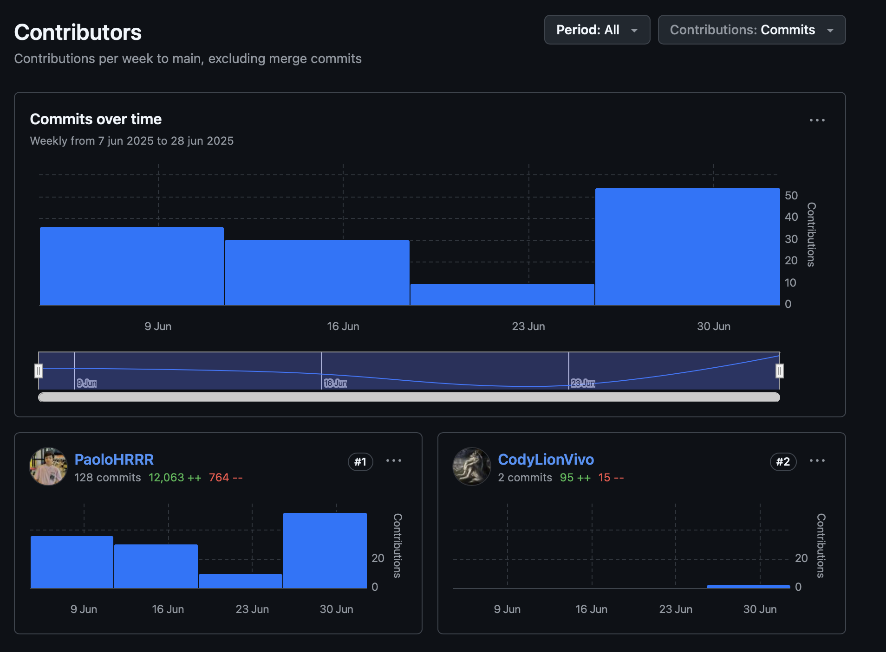

### 5.2.4. Sprint 4

#### 5.2.4.1. Sprint Planning 4

<table cellpadding="6" cellspacing="0" style="border-collapse: collapse; width: 100%;">
  <tr>
    <th colspan="2"><strong>Sprint #</strong></th>
    <td colspan="2">Sprint 4</td>
  </tr>
  <tr>
    <th colspan="4" style="background-color: #d9d9d9;"><strong>Sprint Planning Background</strong></th>
  </tr>
  <tr>
    <th style="width: 20%;">Date</th>
    <td colspan="3">2025-06-23</td>
  </tr>
  <tr>
    <th>Time</th>
    <td colspan="3">10:30 AM</td>
  </tr>
  <tr>
    <th>Location</th>
    <td colspan="3">Biblioteca Monterrico - Cubículo de estudiantes</td>
  </tr>
  <tr>
    <th>Prepared By</th>
    <td colspan="3">Orozco Torres, Álvaro Joaquín</td>
  </tr>
  <tr>
    <th>Attendees (to planning meeting)</th>
    <td colspan="3">Aponte Cruzado, Andrea Marielena / Orozco Torres, Álvaro Joaquín / León Vivas, Fabrizio Amir / Lopez Acuña, Mario Joaquin/ Reaño Delgadillo, Henry Paolo</td>
  </tr>
  <tr>
    <th>Sprint 3 Review Summary</th>
    <td colspan="3">El sprint anterior logró realizar la implementación del backend utilizando C# y el framework .NET. Se logró un avance en la implementación del Web Application front-end; sin embargo, este quedó inconcluso y quedaron múltiples tareas pendientes en estado "To-Do".</td>
  </tr>
  <tr>
    <th>Sprint 3 Retrospective Summary</th>
    <td colspan="3">Se identificó la necesidad de ajustar el modo de trabajo del equipo, a fin de permitir la colaboración efectiva y el desarrollo de capacidades multidisciplinarias por parte de cada miembro del equipo.</td>
  </tr>
  <tr>
    <th colspan="4" style="background-color: #d9d9d9;"><strong>Sprint Goal & User Stories</strong></th>
  </tr>
  <tr>
    <th>Sprint 4 Goal</th>
    <td colspan="3">Nuestro foco es cubrir la deuda técnica acumulada del sprint 3, redefinir y desarrollar las funcionalidades esenciales del producto, con el fin de validar su aporte al caso de negocio. Por ello, buscamos entregar una versión funcional de la aplicación para obtener retroalimentación directa de usuarios reales, lo cual nos permitirá confirmar hipótesis, ajustar requisitos no correctamente elicitados y asegurar que la solución responde a necesidades reales.</td>
  </tr>
  <tr>
    <th>Sprint 4 Velocity</th>
    <td colspan="3"> 40 Story Points</td>
  </tr>
  <tr>
    <th>Sum of Story Points</th>
    <td colspan="3">150 Story Points</td>
  </tr>
</table>

#### 5.2.4.2. Aspect Leaders and Collaborators

Para el Sprint 4, se proyectan actividades como y la implementación de las vistas del Web Application.

<table cellpadding="6" cellspacing="0" style="border-collapse: collapse; width: 100%;">
  <tr>
    <th>Team Member  (Last Name, First Name)</th>
    <th>GitHub Username</th>
    <th>Web Application Front-End Leader (L) / Collaborator (C)</th>
    <th>Web Application Back-End Leader (L) / Collaborator (C)</th>
  </tr>
  <tr>
    <td>Aponte Cruzado, Andrea Marielena</td>
    <td>iconicmiau</td>
    <td>C</td>
    <td>C</td>
  </tr>
  <tr>
    <td>Leon Vivas, Fabrizio Amir</td>
    <td>CodyLionVivo</td>
    <td>L</td>
    <td>C</td>
  </tr>
  <tr>
    <td>López Acuña, Mario Joaquín</td>
    <td>tertegen</td>
    <td>C</td>
    <td>C</td>
  </tr>
  <tr>
    <td>Orozco Torres, Álvaro Joaquín</td>
    <td>L1LZ4Z</td>
    <td>C</td>
    <td>C</td>
  </tr>
  <tr>
    <td>Reaño Delgadillo, Henry Paolo</td>
    <td>PaoloHRRR</td>
    <td>C</td>
    <td>L</td>
  </tr>
</table>

#### 5.2.4.3. Sprint Backlog 4

<a href="https://galaxiawonder.youtrack.cloud/dashboard?id=213-2" target="_blank">Ver tablero en YouTrack</a>

<b>Credenciales:</b>
<ul>
  <li>
    Correo: 
    
      invitadogw&#64;galaxiawonder.com
    
  </li>
  <li>Contraseña: GA14x4W0nd3r</li>
</ul>

<table cellpadding="6" cellspacing="0">
  <tr>
    <th colspan="8">Sprint #</th>
    <td colspan="8">Sprint n</td>
  </tr>
  <tr>
    <th colspan="2">User Story</th>
    <th colspan="6">Work-Item / Task</th>
  </tr>
  <tr>
    <th>Id</th>
    <th>Title</th>
    <th>Id</th>
    <th>Title</th>
    <th>Description</th>
    <th>Estimation (Hours)</th>
    <th>Assigned To</th>
    <th>Status (To-do / In-Process / To-Review / Done)</th>
<tr>
  <td>US084</td>
  <td>Solicitar datos para registrar adicional de obra al aprobar</td>
  <td>US084-1</td>
  <td>Mostrar campos requeridos</td>
  <td>Solicitar descripción del cambio y selección de hito relacionado</td>
  <td>2</td>
  <td>Orozco Torres, Álvaro Joaquín</td>
  <td>Done</td>
</tr>
<tr>
  <td></td><td></td>
  <td>US084-2</td>
  <td>Validar campos y registrar adicional</td>
  <td>Verificar campos obligatorios y registrar adicional de obra si son válidos</td>
  <td>2</td>
  <td>Orozco Torres, Álvaro Joaquín</td>
  <td>Done</td>
</tr>
<tr>
  <td>US085</td>
  <td>Crear nuevo hito a partir de un adicional de obra aprobado</td>
  <td>US085-1</td>
  <td>Solicitar datos del nuevo hito</td>
  <td>Pedir nombre, fecha de inicio y fecha de fin para el nuevo hito</td>
  <td>2</td>
  <td>Orozco Torres, Álvaro Joaquín</td>
  <td>Done</td>
</tr>
<tr>
  <td></td><td></td>
  <td>US085-2</td>
  <td>Validar rango y coherencia</td>
  <td>Verificar que las fechas estén dentro del rango del proyecto y corregir inconsistencias automáticamente</td>
  <td>2</td>
  <td>Leon Vivas, Fabrizio Amir</td>
  <td>Done</td>
</tr>
<tr>
  <td>US149</td>
  <td>Definir presupuesto inicial del proyecto</td>
  <td>US149-1</td>
  <td>Agregar campo de presupuesto en formulario</td>
  <td>Incluir el campo de presupuesto al crear o editar el proyecto</td>
  <td>2</td>
  <td>Reaño Delgadillo, Henry Paolo</td>
  <td>Done</td>
</tr>
<tr>
  <td></td><td></td>
  <td>US149-2</td>
  <td>Guardar y mostrar presupuesto en vista de proyecto</td>
  <td>Persistir el valor y mostrarlo en la pantalla de detalles del proyecto</td>
  <td>2</td>
  <td>Leon Vivas, Fabrizio Amir</td>
  <td>Done</td>
</tr>

<tr>
  <td>US150</td>
  <td>Asociar precio a cada tarea</td>
  <td>US150-1</td>
  <td>Agregar campo de costo en formulario de tarea</td>
  <td>Permitir definir el costo al crear o editar una tarea</td>
  <td>2</td>
  <td>Reaño Delgadillo, Henry Paolo</td>
  <td>Done</td>
</tr>
<tr>
  <td></td><td></td>
  <td>US150-2</td>
  <td>Guardar y asociar costo a la tarea</td>
  <td>Persistir el costo ingresado y vincularlo a la entidad de tarea</td>
  <td>2</td>
  <td>Reaño Delgadillo, Henry Paolo</td>
  <td>Done</td>
</tr>

<tr>
  <td>US151</td>
  <td>Editar costo de tarea y actualizar presupuesto</td>
  <td>US151-1</td>
  <td>Permitir editar costo en tareas existentes</td>
  <td>Habilitar la edición del campo de costo en tareas ya creadas</td>
  <td>2</td>
  <td>Reaño Delgadillo, Henry Paolo</td>
  <td>Done</td>
</tr>
<tr>
  <td></td><td></td>
  <td>US151-2</td>
  <td>Recalcular presupuesto disponible</td>
  <td>Actualizar el presupuesto del proyecto al modificar el costo de una tarea</td>
  <td>2</td>
  <td>Reaño Delgadillo, Henry Paolo</td>
  <td>Done</td>
</tr>
<tr>
  <td>US152</td>
  <td>Validar límite de presupuesto al crear tarea</td>
  <td>US152-1</td>
  <td>Verificar presupuesto disponible en creación de tarea</td>
  <td>Comparar el costo ingresado con el presupuesto restante</td>
  <td>2</td>
  <td>Leon Vivas, Fabrizio Amir</td>
  <td>Done</td>
</tr>
<tr>
  <td></td><td></td>
  <td>US152-2</td>
  <td>Mostrar error si el costo excede el presupuesto</td>
  <td>Bloquear la creación y notificar al usuario si no hay saldo suficiente</td>
  <td>2</td>
  <td>Reaño Delgadillo, Henry Paolo</td>
  <td>Done</td>
</tr>
<tr>
  <td>TS01</td>
  <td>Crear organización</td>
  <td>TS01-1</td>
  <td>Registrar organización exitosamente</td>
  <td>Implementar endpoint POST /organizations y devolver 201 Created con datos completos</td>
  <td>2</td>
  <td>León Vivas, Fabrizio Amir</td>
  <td>Done</td>
</tr>
<tr>
  <td></td><td></td>
  <td>TS01-2</td>
  <td>Validar datos incompletos o inválidos</td>
  <td>Responder 400 Bad Request si faltan campos obligatorios o tienen formato inválido</td>
  <td>2</td>
  <td>León Vivas, Fabrizio Amir</td>
  <td>Done</td>
</tr>

<tr>
  <td>TS02</td>
  <td>Listar organizaciones</td>
  <td>TS02-1</td>
  <td>Listar organizaciones exitosamente</td>
  <td>Implementar GET /organizations para devolver lista de organizaciones con 200 OK</td>
  <td>2</td>
  <td>Reaño Delgadillo, Henry Paolo</td>
  <td>Done</td>
</tr>
<tr>
  <td></td><td></td>
  <td>TS02-2</td>
  <td>Usuario sin organizaciones</td>
  <td>Responder 200 OK con lista vacía si usuario no tiene organizaciones</td>
  <td>2</td>
  <td>Reaño Delgadillo, Henry Paolo</td>
  <td>Done</td>
</tr>

<tr>
  <td>TS03</td>
  <td>Detalles de una organización</td>
  <td>TS03-1</td>
  <td>Obtener detalles exitosamente</td>
  <td>Implementar GET /organizations/{id} y devolver datos completos con 200 OK</td>
  <td>2</td>
  <td>León Vivas, Fabrizio Amir</td>
  <td>Done</td>
</tr>
<tr>
  <td></td><td></td>
  <td>TS03-2</td>
  <td>Organización no encontrada</td>
  <td>Responder 404 Not Found si la organización no existe</td>
  <td>2</td>
  <td>León Vivas, Fabrizio Amir</td>
  <td>Done</td>
</tr>

<tr>
  <td>TS04</td>
  <td>Actualizar información de organización</td>
  <td>TS04-1</td>
  <td>Actualizar organización exitosamente</td>
  <td>Implementar PATCH /organizations/{id} para actualizar datos válidos y devolver 200 OK</td>
  <td>2</td>
  <td>Reaño Delgadillo, Henry Paolo</td>
  <td>Done</td>
</tr>
<tr>
  <td></td><td></td>
  <td>TS04-2</td>
  <td>Validar datos inválidos o no encontrados</td>
  <td>Responder 400 Bad Request o 404 Not Found según errores de validación o inexistencia</td>
  <td>2</td>
  <td>Reaño Delgadillo, Henry Paolo</td>
  <td>Done</td>
</tr>

<tr>
  <td>TS05</td>
  <td>Eliminar organización (soft delete)</td>
  <td>TS05-1</td>
  <td>Solicitud de eliminación exitosa</td>
  <td>Implementar DELETE /organizations/{id} para marcar como deletion_pending y devolver 202 Accepted</td>
  <td>2</td>
  <td>León Vivas, Fabrizio Amir</td>
  <td>Done</td>
</tr>
<tr>
  <td></td><td></td>
  <td>TS05-2</td>
  <td>Organización ya marcada o no encontrada</td>
  <td>Responder 409 Conflict o 404 Not Found si ya está en proceso o no existe</td>
  <td>2</td>
  <td>León Vivas, Fabrizio Amir</td>
  <td>Done</td>
</tr>
<tr>
  <td>TS06</td>
  <td>Añadir miembro a organización</td>
  <td>TS06-1</td>
  <td>Añadir miembro exitosamente</td>
  <td>Implementar POST para agregar miembro con rol asignado y devolver 201 Created</td>
  <td>2</td>
  <td>León Vivas, Fabrizio Amir</td>
  <td>Done</td>
</tr>
<tr>
  <td></td><td></td>
  <td>TS06-2</td>
  <td>Validar datos inválidos o miembro existente</td>
  <td>Responder 400 o 409 si datos son inválidos o el miembro ya existe</td>
  <td>2</td>
  <td>León Vivas, Fabrizio Amir</td>
  <td>Done</td>
</tr>

<tr>
  <td>TS07</td>
  <td>Actualizar estado de miembro de organización</td>
  <td>TS07-1</td>
  <td>Cambiar estado exitosamente</td>
  <td>Implementar PATCH para actualizar estado (activo, suspendido, removido) con 200 OK</td>
  <td>2</td>
  <td>Reaño Delgadillo, Henry Paolo</td>
  <td>Done</td>
</tr>
<tr>
  <td></td><td></td>
  <td>TS07-2</td>
  <td>Validar estado inválido o miembro no encontrado</td>
  <td>Responder 400 o 404 si estado es inválido o miembro no existe</td>
  <td>2</td>
  <td>Reaño Delgadillo, Henry Paolo</td>
  <td>Done</td>
</tr>

<tr>
  <td>TS08</td>
  <td>Añadir proyecto a organización</td>
  <td>TS08-1</td>
  <td>Crear proyecto exitosamente</td>
  <td>Implementar POST para crear proyecto con datos válidos y devolver 201 Created</td>
  <td>2</td>
  <td>León Vivas, Fabrizio Amir</td>
  <td>Done</td>
</tr>
<tr>
  <td></td><td></td>
  <td>TS08-2</td>
  <td>Validar datos inválidos u organización no encontrada</td>
  <td>Responder 400 o 404 según error en datos o inexistencia de organización</td>
  <td>2</td>
  <td>León Vivas, Fabrizio Amir</td>
  <td>Done</td>
</tr>

<tr>
  <td>TS09</td>
  <td>Listar proyectos de organización</td>
  <td>TS09-1</td>
  <td>Listar proyectos exitosamente</td>
  <td>Implementar GET para devolver lista de proyectos con 200 OK</td>
  <td>2</td>
  <td>Reaño Delgadillo, Henry Paolo</td>
  <td>Done</td>
</tr>
<tr>
  <td></td><td></td>
  <td>TS09-2</td>
  <td>Organización sin proyectos o no encontrada</td>
  <td>Responder 200 con lista vacía o 404 si la organización no existe</td>
  <td>2</td>
  <td>Reaño Delgadillo, Henry Paolo</td>
  <td>Done</td>
</tr>

<tr>
  <td>TS10</td>
  <td>Detalles de un proyecto</td>
  <td>TS10-1</td>
  <td>Obtener detalles de proyecto exitosamente</td>
  <td>Implementar GET /projects/{id} para devolver datos completos con 200 OK</td>
  <td>2</td>
  <td>León Vivas, Fabrizio Amir</td>
  <td>Done</td>
</tr>
<tr>
  <td></td><td></td>
  <td>TS10-2</td>
  <td>Proyecto no encontrado</td>
  <td>Responder 404 Not Found si el proyecto no existe</td>
  <td>2</td>
  <td>León Vivas, Fabrizio Amir</td>
  <td>Done</td>
  <tr>
  <td>TS16</td>
  <td>Obtener detalles de cronograma</td>
  <td>TS16-1</td>
  <td>Obtener cronograma exitosamente</td>
  <td>Implementar GET para devolver cronograma con fechas e hitos con 200 OK</td>
  <td>2</td>
  <td>León Vivas, Fabrizio Amir</td>
  <td>Done</td>
</tr>
<tr>
  <td></td><td></td>
  <td>TS16-2</td>
  <td>Proyecto sin cronograma o no encontrado</td>
  <td>Responder 404 Not Found si el proyecto no tiene cronograma o no existe</td>
  <td>2</td>
  <td>León Vivas, Fabrizio Amir</td>
  <td>Done</td>
</tr>

<tr>
  <td>TS17</td>
  <td>Añadir hito al cronograma</td>
  <td>TS17-1</td>
  <td>Añadir hito exitosamente</td>
  <td>Implementar POST para crear hito con datos válidos y devolver 201 Created</td>
  <td>2</td>
  <td>Reaño Delgadillo, Henry Paolo</td>
  <td>Done</td>
</tr>
<tr>
  <td></td><td></td>
  <td>TS17-2</td>
  <td>Validar datos inválidos o conflicto</td>
  <td>Responder 400 o 409 si datos son inválidos o proyecto no tiene cronograma</td>
  <td>2</td>
  <td>Reaño Delgadillo, Henry Paolo</td>
  <td>Done</td>
</tr>

<tr>
  <td>TS18</td>
  <td>Listar hitos del cronograma</td>
  <td>TS18-1</td>
  <td>Listar hitos exitosamente</td>
  <td>Implementar GET para devolver lista de hitos con 200 OK</td>
  <td>2</td>
  <td>León Vivas, Fabrizio Amir</td>
  <td>Done</td>
</tr>
<tr>
  <td></td><td></td>
  <td>TS18-2</td>
  <td>Proyecto sin cronograma o no encontrado</td>
  <td>Responder 404 Not Found si el proyecto no tiene cronograma o no existe</td>
  <td>2</td>
  <td>León Vivas, Fabrizio Amir</td>
  <td>Done</td>
</tr>

<tr>
  <td>TS19</td>
  <td>Obtener detalles de hito</td>
  <td>TS19-1</td>
  <td>Obtener detalles de hito exitosamente</td>
  <td>Implementar GET /milestones/{id} para devolver datos completos con 200 OK</td>
  <td>2</td>
  <td>Reaño Delgadillo, Henry Paolo</td>
  <td>Done</td>
</tr>
<tr>
  <td></td><td></td>
  <td>TS19-2</td>
  <td>Hito o proyecto no encontrado</td>
  <td>Responder 404 Not Found si el hito o proyecto no existe</td>
  <td>2</td>
  <td>Reaño Delgadillo, Henry Paolo</td>
  <td>Done</td>
</tr>

<tr>
  <td>TS20</td>
  <td>Actualizar información de hito</td>
  <td>TS20-1</td>
  <td>Actualizar estado o duración exitosamente</td>
  <td>Implementar PATCH para modificar estado o duración del hito con 200 OK</td>
  <td>2</td>
  <td>León Vivas, Fabrizio Amir</td>
  <td>Done</td>
</tr>
<tr>
  <td></td><td></td>
  <td>TS20-2</td>
  <td>Validar datos inválidos o hito no encontrado</td>
  <td>Responder 400 o 404 si datos son inválidos o hito no existe en el proyecto</td>
  <td>2</td>
  <td>León Vivas, Fabrizio Amir</td>
  <td>Done</td>
</tr>
<tr>
  <td>TS21</td>
  <td>Crear tarea</td>
  <td>TS21-1</td>
  <td>Crear tarea exitosamente</td>
  <td>Implementar POST para crear tarea con datos válidos y devolver 201 Created</td>
  <td>2</td>
  <td>Reaño Delgadillo, Henry Paolo</td>
  <td>Done</td>
</tr>
<tr>
  <td></td><td></td>
  <td>TS21-2</td>
  <td>Validar datos inválidos o proyecto no encontrado</td>
  <td>Responder 400 o 404 si datos son inválidos o el proyecto no existe</td>
  <td>2</td>
  <td>Reaño Delgadillo, Henry Paolo</td>
  <td>Done</td>
</tr>

<tr>
  <td>TS22</td>
  <td>Listar tareas de hito</td>
  <td>TS22-1</td>
  <td>Listar tareas exitosamente</td>
  <td>Implementar GET para devolver lista de tareas del hito con 200 OK</td>
  <td>2</td>
  <td>León Vivas, Fabrizio Amir</td>
  <td>Done</td>
</tr>
<tr>
  <td></td><td></td>
  <td>TS22-2</td>
  <td>Hito o proyecto no encontrado</td>
  <td>Responder 404 Not Found si el hito o proyecto no existe</td>
  <td>2</td>
  <td>León Vivas, Fabrizio Amir</td>
  <td>Done</td>
</tr>

<tr>
  <td>TS23</td>
  <td>Obtener detalles de tarea</td>
  <td>TS23-1</td>
  <td>Obtener detalles de tarea exitosamente</td>
  <td>Implementar GET /tasks/{id} para devolver datos completos con 200 OK</td>
  <td>2</td>
  <td>Reaño Delgadillo, Henry Paolo</td>
  <td>Done</td>
</tr>
<tr>
  <td></td><td></td>
  <td>TS23-2</td>
  <td>Tarea o proyecto no encontrado</td>
  <td>Responder 404 Not Found si la tarea o proyecto no existe</td>
  <td>2</td>
  <td>Reaño Delgadillo, Henry Paolo</td>
  <td>Done</td>
</tr>

<tr>
  <td>TS24</td>
  <td>Actualizar información de tarea</td>
  <td>TS24-1</td>
  <td>Actualizar detalles de tarea exitosamente</td>
  <td>Implementar PATCH para modificar datos de tarea y devolver 200 OK</td>
  <td>2</td>
  <td>León Vivas, Fabrizio Amir</td>
  <td>Done</td>
</tr>
<tr>
  <td></td><td></td>
  <td>TS24-2</td>
  <td>Validar datos inválidos o tarea no encontrada</td>
  <td>Responder 400 o 404 si datos son inválidos o la tarea no existe</td>
  <td>2</td>
  <td>León Vivas, Fabrizio Amir</td>
  <td>Done</td>
</tr>

<tr>
  <td>TS25</td>
  <td>Crear solicitud de cambio</td>
  <td>TS25-1</td>
  <td>Crear solicitud exitosamente</td>
  <td>Implementar POST para registrar solicitud de cambio con 201 Created</td>
  <td>2</td>
  <td>Reaño Delgadillo, Henry Paolo</td>
  <td>Done</td>
</tr>
<tr>
  <td></td><td></td>
  <td>TS25-2</td>
  <td>Validar datos inválidos o proyecto no encontrado</td>
  <td>Responder 400 o 404 si datos son inválidos o proyecto no existe</td>
  <td>2</td>
  <td>Reaño Delgadillo, Henry Paolo</td>
  <td>Done</td>
</tr>
 <tr>
  <td>TS26</td>
  <td>Listar solicitudes de cambio</td>
  <td>TS26-1</td>
  <td>Listar solicitudes exitosamente</td>
  <td>Implementar GET para devolver lista de solicitudes con 200 OK</td>
  <td>2</td>
  <td>León Vivas, Fabrizio Amir</td>
  <td>Done</td>
</tr>
<tr>
  <td></td><td></td>
  <td>TS26-2</td>
  <td>Proyecto sin solicitudes o no encontrado</td>
  <td>Responder 200 con lista vacía o 404 si el proyecto no existe</td>
  <td>2</td>
  <td>León Vivas, Fabrizio Amir</td>
  <td>Done</td>
</tr>

<tr>
  <td>TS27</td>
  <td>Obtener detalles de solicitud de cambio</td>
  <td>TS27-1</td>
  <td>Obtener detalles exitosamente</td>
  <td>Implementar GET para devolver datos completos con 200 OK</td>
  <td>2</td>
  <td>Reaño Delgadillo, Henry Paolo</td>
  <td>Done</td>
</tr>
<tr>
  <td></td><td></td>
  <td>TS27-2</td>
  <td>Solicitud o proyecto no encontrado</td>
  <td>Responder 404 Not Found si la solicitud o proyecto no existe</td>
  <td>2</td>
  <td>Reaño Delgadillo, Henry Paolo</td>
  <td>Done</td>
</tr>

<tr>
  <td>TS28</td>
  <td>Aceptar / Denegar solicitud de cambio</td>
  <td>TS28-1</td>
  <td>Aceptar o denegar solicitud exitosamente</td>
  <td>Implementar PATCH para actualizar estado de solicitud con 200 OK</td>
  <td>2</td>
  <td>León Vivas, Fabrizio Amir</td>
  <td>Done</td>
</tr>
<tr>
  <td></td><td></td>
  <td>TS28-2</td>
  <td>Validar estado incorrecto o solicitud no encontrada</td>
  <td>Responder 400 o 404 según error de validación o inexistencia</td>
  <td>2</td>
  <td>León Vivas, Fabrizio Amir</td>
  <td>Done</td>
</tr>

<tr>
  <td>TS29</td>
  <td>Obtener detalles de desempeño de hito</td>
  <td>TS29-1</td>
  <td>Obtener detalles de desempeño exitosamente</td>
  <td>Implementar GET para devolver datos de desempeño con 200 OK</td>
  <td>2</td>
  <td>Reaño Delgadillo, Henry Paolo</td>
  <td>Done</td>
</tr>
<tr>
  <td></td><td></td>
  <td>TS29-2</td>
  <td>Hito sin tareas o no encontrado</td>
  <td>Responder 200 con mensaje o 404 si el hito no existe</td>
  <td>2</td>
  <td>Reaño Delgadillo, Henry Paolo</td>
  <td>Done</td>
</tr>
<tr>
  <td>TS35</td>
  <td>Login</td>
  <td>TS35-1</td>
  <td>Login exitoso</td>
  <td>Implementar POST /auth/login para devolver token y datos con 200 OK</td>
  <td>2</td>
  <td>Reaño Delgadillo, Henry Paolo</td>
  <td>Done</td>
</tr>
<tr>
  <td></td><td></td>
  <td>TS35-2</td>
  <td>Validar credenciales incorrectas o faltantes</td>
  <td>Responder 401 o 400 si credenciales son incorrectas o faltan campos</td>
  <td>2</td>
  <td>Reaño Delgadillo, Henry Paolo</td>
  <td>Done</td>
</tr>
<tr>
  <td>TS36</td>
  <td>Refrescar Token</td>
  <td>TS36-1</td>
  <td>Refrescar token exitosamente</td>
  <td>Implementar POST para devolver nuevo accessToken y refreshToken con 200 OK</td>
  <td>2</td>
  <td>León Vivas, Fabrizio Amir</td>
  <td>Done</td>
</tr>
<tr>
  <td></td><td></td>
  <td>TS36-2</td>
  <td>Validar token inválido o expirado</td>
  <td>Responder 401 o 403 si el token es inválido o expirado</td>
  <td>2</td>
  <td>León Vivas, Fabrizio Amir</td>
  <td>Done</td>
</tr>

<tr>
  <td>TS37</td>
  <td>Cerrar sesión + invalidar token</td>
  <td>TS37-1</td>
  <td>Cerrar sesión exitosamente</td>
  <td>Implementar POST para invalidar refreshToken y devolver 200 OK</td>
  <td>2</td>
  <td>Reaño Delgadillo, Henry Paolo</td>
  <td>Done</td>
</tr>
<tr>
  <td></td><td></td>
  <td>TS37-2</td>
  <td>Validar token inválido o faltante</td>
  <td>Responder 401 o 400 si el refreshToken es inválido o no se envía</td>
  <td>2</td>
  <td>Reaño Delgadillo, Henry Paolo</td>
  <td>Done</td>
</tr>

<tr>
  <td>TS38</td>
  <td>Registro</td>
  <td>TS38-1</td>
  <td>Registro exitoso</td>
  <td>Implementar POST para crear cuenta con 201 Created y enviar verificación</td>
  <td>2</td>
  <td>Aponte Cruzado, Andrea Marielena</td>
  <td>Done</td>
</tr>
<tr>
  <td></td><td></td>
  <td>TS38-2</td>
  <td>Validar email ya registrado o datos inválidos</td>
  <td>Responder 409 o 400 según el error</td>
  <td>2</td>
  <td>León Vivas, Fabrizio Amir</td>
  <td>Done</td>
</tr>
<tr>
  <td></td><td></td>
  <td>TS40-2</td>
  <td>Validar email no registrado o inválido</td>
  <td>Responder 404 o 400 si el email no está registrado o es inválido</td>
  <td>2</td>
  <td>León Vivas, Fabrizio Amir</td>
  <td>Done</td>
</tr>
<tr>
  <td></td><td></td>
  <td>TS41-2</td>
  <td>Validar token inválido o campos faltantes</td>
  <td>Responder 403 o 400 si el token es inválido o faltan campos</td>
  <td>2</td>
  <td>Reaño Delgadillo, Henry Paolo</td>
  <td>Done</td>

<tr>
  <td>TS42</td>
  <td>Encriptación segura de credenciales</td>
  <td>TS42-1</td>
  <td>Almacenar contraseña de forma segura</td>
  <td>Generar salt y hash con bcrypt al guardar contraseña</td>
  <td>2</td>
  <td>León Vivas, Fabrizio Amir</td>
  <td>Done</td>
<tr>
  <td>TS48</td>
  <td>Eliminar proyecto (soft delete)</td>
  <td>TS48-1</td>
  <td>Eliminar proyecto exitosamente (soft delete)</td>
  <td>Implementar DELETE para marcar proyecto como deletion_pending con 202 Accepted</td>
  <td>2</td>
  <td>León Vivas, Fabrizio Amir</td>
  <td>Done</td>
</tr>
<tr>
  <td></td><td></td>
  <td>TS48-2</td>
  <td>Validar proyecto ya marcado o inexistente</td>
  <td>Responder 409 o 404 si ya está en proceso o no existe</td>
  <td>2</td>
  <td>León Vivas, Fabrizio Amir</td>
  <td>Done</td>
</tr>
<tr>
  <td>TS49</td>
  <td>Eliminar usuario de proyecto</td>
  <td>TS49-1</td>
  <td>Eliminar usuario exitosamente</td>
  <td>Implementar DELETE para quitar miembro del proyecto con 200 OK</td>
  <td>2</td>
  <td>Reaño Delgadillo, Henry Paolo</td>
  <td>Done</td>
</tr>
<tr>
  <td></td><td></td>
  <td>TS49-2</td>
  <td>Validar usuario no pertenece o proyecto no encontrado</td>
  <td>Responder 404 Not Found si no pertenece o el proyecto no existe</td>
  <td>2</td>
  <td>Reaño Delgadillo, Henry Paolo</td>
  <td>Done</td>
</tr>
<tr>
  <td>TS57</td>
  <td>Eliminar proyecto (soft delete)</td>
  <td>TS57-1</td>
  <td>Eliminar proyecto exitosamente</td>
  <td>Implementar DELETE para marcar como deletion_pending con 202 Accepted</td>
  <td>2</td>
  <td>López Acuña, Mario Joaquín</td>
  <td>Done</td>
</tr>
<tr>
  <td></td><td></td>
  <td>TS57-2</td>
  <td>Validar proyecto ya marcado o inexistente</td>
  <td>Responder 409 o 404 si ya está en proceso o no existe</td>
  <td>2</td>
  <td>Reaño Delgadillo, Henry Paolo</td>
  <td>Done</td>
</tr>

<tr>
  <td>TS58</td>
  <td>Eliminar usuario de proyecto</td>
  <td>TS58-1</td>
  <td>Eliminar usuario exitosamente</td>
  <td>Implementar DELETE para quitar miembro del proyecto con 200 OK</td>
  <td>2</td>
  <td>León Vivas, Fabrizio Amir</td>
  <td>Done</td>
</tr>
<tr>
  <td></td><td></td>
  <td>TS58-2</td>
  <td>Validar usuario no pertenece o proyecto no encontrado</td>
  <td>Responder 404 Not Found si no pertenece o el proyecto no existe</td>
  <td>2</td>
  <td>León Vivas, Fabrizio Amir</td>
  <td>Done</td>
</tr>
<tr>
  <td>TS60</td>
  <td>Eliminar tarea</td>
  <td>TS60-1</td>
  <td>Eliminar tarea exitosamente</td>
  <td>Implementar DELETE para eliminar tarea y devolver 200 OK</td>
  <td>2</td>
  <td>León Vivas, Fabrizio Amir</td>
  <td>Done</td>
</tr>
<tr>
  <td></td><td></td>
  <td>TS60-2</td>
  <td>Validar tarea inexistente o proyecto no encontrado</td>
  <td>Responder 404 Not Found si la tarea o proyecto no existe</td>
  <td>2</td>
  <td>León Vivas, Fabrizio Amir</td>
  <td>Done</td>
</tr>
</table>

#### 5.2.4.4. Development Evidence for Sprint Review

Para el sprint 4 se proyectan actividades como implementacion de los endpoints en el BackEnd de la Web Application.

| Repository | Branch | Commit Id | Commit Message | Commit Message Body | Commit on |
| - | - | - | - | - | - |
| Platform | feature/ep01 | d76ff9467c8ed54cba97b0bbdd733bfb54eaa8ac | feat(ep01): add project domain model |   | 28/06/2025 |
| Platform | feature/ep01 | 3f6ffc562395e8d66a1caae2c13018631c6a399d | feat(ep01): add project and project status repository |   | 28/06/2025 |
| Platform | feature/ep01 | a491a7be62df3f8287acc97d948be75eba4f8812 | feat(ep01): add create project implementation |   | 28/06/2025 |
| Platform | feature/ep01 | e6aecd71636bc8287a316c2265fb5ade9096c692 | feat(ep01): add update name and description of a project endpoints |   | 28/06/2025 |
| Platform | feature/ep01 | a2edfd60eb03b38a9c7ebea24917e6754232ef5f | feat(ep01): add create project endpoint |   | 28/06/2025 |
| Platform | feature/ep01 | 778ab6d1bc675c42b9a08abc06775d813ccd9c37 | feat(ep01): add delete project endpoint |   | 28/06/2025 |
| Platform | feature/ep02 | 69a23c74fcba464fae439ebb96b9de362a798cb4 | feat(ep02): add project team member domain model  |   | 28/06/2025 |
| Platform | feature/ep02 | 4a6e85c96e34156ee7229b3d803e3895ba9fba98 | feat(ep02): add project team member and specialty repositories |   | 28/06/2025 |
| Platform | feature/ep02 | edde64c1b6ff3a105dfd03328e4b6895cf1145ed | feat(ep02): add create project team member implementation |   | 28/06/2025 |
| Platform | feature/ep02 | 6b0e693a320a0dca8e19467437fbdc224c593a8c | feat(ep02): add get all projects by person id implementation |   | 28/06/2025 |
| Platform | feature/ep02 | 359d99e86f281ae92cf238d3d886f72566d55cc1 | feat(ep02): add get all projects by person id endpoint |   | 29/06/2025 |
| Platform | feature/ep02 | 59b75c62341886214ba27a13c3e826424bdbbd63 | feat(ep02): add create a project team member linked to a project endpoint |   | 30/06/2025 |
| Platform | feature/ep02 | 8764a0eb5dfcb6261b9536e028d5f7b6742fe7f8 | bugfix(ep02): change create team project member needs innecesary parameters |   | 30/06/2025 |
| Platform | feature/ep02 | 04db409ba007e427c70187cb05a5d3ab16092b53 | bugfix(ep02): change projects response is not returning contractor id |   | 30/06/2025 |
| Platform | feature/ep02 | 48aa9160583ef3cb5de62ac63c01c3c000627522 | bugfix(ep02): change create project is not using contracting entity email as a parameter |   | 30/06/2025 |
| Platform | feature/ep02 | 1048899966b2340b07891a93f1d93f37a2f0c94e | feat(ep02): add delete project team member endpoint |   | 30/06/2025 |
| Platform | feature/ep03 | 0b6810039760876c957c4234ea2bb91028429f88 | feat(ep03): add milestone domain model |   | 30/06/2025 |
| Platform | feature/ep03 | c303d3494e04f5114465825c1e0935e329f3b6ef | feat(ep02): add domain event to create a project team member after create a project |   | 1/07/2025 |
| Platform | feature/ep03 | 18e9cdffb6d210b7633ced14061a37c8915186cb | bugfix(ep02): fix get projects by person id breaks when a person has two or more projects linked |   | 1/07/2025 |
| Platform | feature/ep03 | 2b995aabff836b57bf60c02efa1a0f5863431ec8 | feat(ep02): add get all projects by contracting entity id endpoint |   | 1/07/2025 |
| Platform | feature/ep03 | b6cfa290f8892781a2448ebc23e2f091650ee57e | chore(ep02): add project status in get projects endpoints |   | 1/07/2025 |
| Platform | feature/ep03 | 65685a1253d59b78c153750ee80e30d073652774 | chore(ep02): add organization in get projects by person id endpoint path  |   | 1/07/2025 |
| Platform | feature/ep03 | 628d0648659398c317bc876c1b41dfe4f97d4615 | feat(ep02): add update project status endpoint |   | 1/07/2025 |
| Platform | feature/ep03 | 337dc8eb96ca3b9e79b376f35521295fe4f6650f | docs(endpoints): change organization endpoints documentation |   | 1/07/2025 |
| Platform | feature/ep03 | 15ff412572e28ea611a58d95b66178fb41bd89c5 | feat(ep03): add command and query services interfaces to milestone aggregate|   | 1/07/2025 |
| Platform | feature/ep03 | 2725414ce0fa82987053948d1a33b049095353b8 | feat(ep03): add milestone reposity implementation |   | 1/07/2025 |
| Platform | feature/ep03 | 315ff1ce9c01eb306a51a7bee0411825161b01c1 | feat(ep03): add milestone command and query implementation with all features |   | 1/07/2025 |
| Platform | feature/ep03 | 79766ed875c31318faa2ff7f3b0e94191d6c33eb | feat(ep03): add create milestone endpoint |   | 1/07/2025 |
| Platform | feature/ep03 | 9b028ae197aa9b826fbea47a58219119364d83a6 | feat(ep03): add get all milestones by project id endpoint |   | 1/07/2025 |
| Platform | feature/ep03 | 47b6733a90f4355b004cb494e25feb28bcf63771 | feat(ep03): add update milestone endpoints |   | 1/07/2025 |
| Platform | feature/ep03 | 3721d0b47ff8e6ac024dcaa4a8c99d94b1982176 | feat(ep03): add delete milestone endpoint |   | 2/07/2025 |
| Platform | feature/ep03 | a1a0f767851c93a12e23d56797fb8550fa051203 | feat(ep02): add update date of a project endpoint |   | 2/07/2025 |
| Platform | feature/ep04 | a96bd6073ac71b4bf9296fb646200bd160259101 | feat(ep04): add domain model of tasks |   | 2/07/2025 |
| Platform | feature/ep04 | 2d6fc3d884d470dac675451a5f6bd82166191a14 | docs(ep02): change api route in get projects by person and organization endpoint |   | 2/07/2025 |
| Platform | feature/ep04 | 9fd90e19d412345b920b82016a0e0e9b1e0a8d6d | feat(ep04): add infrastructure queries to task aggregate |   | 2/07/2025 |
| Platform | feature/ep04 | 78883c4eaec72e4d63c15901251064f23fad08f3 | feat(ep02): add get project by his id endpoint |   | 2/07/2025 |
| Platform | feature/ep04 | d5393063376f88987475b242e706c5734cfe8a10 | feat(ep04): add task query and command implementation |   | 2/07/2025 |
| Platform | feature/ep04 | 6db14b52e0d426514be05036dcf138fa78720c01 | feat(ep04): add create task endpoint |   | 2/07/2025 |
| Platform | feature/ep04 | a0e1c6e27cbd88262050ae309eade4f43429314f | feat(ep04): add draft validation when a task is created |   | 2/07/2025 |
| Platform | feature/ep04 | a8206efa4be60ecdc6965bac81048a680def15e2 | feat(ep03): add roles in project team member to improve security |   | 2/07/2025 |
| Platform | feature/ep04 | 66dd47a41ba83dc12259a3050c4f5ad5e67259c5 | feat(ep03): add get all project team members by project id endpoint |   | 2/07/2025 |
| Platform | feature/ep04 | c68215179d7c71a4a317f6a64342161f8f4f22e1 | feat(ep04): add update task information endpoint |   | 2/07/2025 |
| Platform | feature/ep04 | f527e41f4aa173a5bb3cb4b59a5785908802f800 | feat(ep04): add get tasks by milestone and tasks by person endpoints |   | 2/07/2025 |
| Platform | feature/ep07 | c4183f65a4b8d9b1d2c991a99cc823e04904fd86 | feat(ep07): add change domain model |   | 3/07/2025 |
| Platform | feature/ep07 | fce717ac67b6dba6ae77e6d153fa93634990cdea | feat(persistency): add change context configuration to persist data in db context |   | 3/07/2025 |
| Platform | feature/ep07 | 385c2a406d9103fb35ca5ca8c72236b863b73502 | feat(ep07): add repository queries to support command and queries services in change context |   | 3/07/2025 |
| Platform | feature/ep07 | 7ae52e6213d675637b80984ee0dcc9fb06c634e4 | feat(ep07): add change process command and query services implementation with create and response to change |   | 3/07/2025 |
| Platform | feature/ep07 | ab3860e3871174b7526d469c69a048ff27cb1178 | feat(ep07): add create change process endpoint |   | 3/07/2025 |
| Platform | feature/ep07 | 2b5041813109da038812a4e1250f6c1c6533d76d | feat(ep08): add respond to change process endpoint |   | 3/07/2025 |
| Platform | feature/ep07 | c97be3954ece44becfebccc391d70e00cc923bd4 | feat(ep07): add get change process information by project id endpoint |   | 3/07/2025 |
| Platform | feature/ep19 | f1bc6b6a519e6c5680d109421f98fac8849a2e26 | feat(ep19): add task budget domain model in billings context |   | 3/07/2025 |
| Platform | feature/ep19 | 7ec3e7aed295dcdc26baf7374fd1d0fe17cb4afe | feat(ep19): add find task budgets by task ids repository query |   | 3/07/2025 |
| Platform | feature/ep19 | 5e1d3940fc5689ab056105e3e45d3137f0ec59d4 | feat(ep19): add task budget command and query services implementation |   | 3/07/2025 |
| Platform | feature/ep19 | c1a6c984ca24f6f311027f6e1295c70cbb3576b2 | feat(ep19): add get total task budget amount by project id  endpoint |   | 3/07/2025 |
| Platform | feature/ep19 | f532a2001f1d1ad8aa137f2d900cac6f3b49213e | bugfix(ep19): fix money resource in get total task budget is not returning currency |   | 3/07/2025 |
| Platform | feature/ep19 | 9b252df9da2eeb0c848b84462d36f1a987cb666c | feat(persistency): add billing context configuration to persist data in db context |   | 3/07/2025 |
| Platform | feature/ep19 | e2154d401cee0562aae34bdc6cd1a47967fde99c | feat(ep19): add task budget when a task is created |   | 3/07/2025 |
| Platform | develop | b865e00633e7c39e39f0244bc293510e7c288ced | bugfix(ep04): fix get tasks are not returning specialties |   | 3/07/2025 |
| FrontEnd | develop | 58d1d3c479b8b151bd798295bef9f3f9d37ebd22 | chore: modify component to use real api endpoint |   | 1/07/2025 |
| Platform | feature/ep03 | 402a936e3945abc2b6b70961b0324f3e00558a21 | feat(ep03): create budget field for the create project api endpoint |   | 1/07/2025 |
| FrontEnd | feature/ep01 | fe018f6e6787887fcaad699fc6ed9508c4eea1b6 | feat(ep01): change files to use real api endpoint |   | 1/07/2025 |
| FrontEnd | feature/ep01 | 7eb4aa97d01c55b70c92769ed8572b915f2e692f | feat(ep01): change project detail fake endpoint with real api endpoint |   | 2/07/2025 |
| FrontEnd | feature/ep01 | 4a3b4aa4109f7dfaa91c0bf382b8a4c3917fc884 | feat(ep01): replace project fake api endpoint for real api endpoint |   | 2/07/2025 |
| FrontEnd | feature/ep01 | aac274cafc1b4cdf7131dbe7521005b41b412347 | feat(e
p01): replace project setting fake api endpoint for real api endpoint |   | 2/07/2025 |
| FrontEnd | feature/ep01 | 3f351b21439f7d8ba7b6e76a7937a8a3c02e3f7c | feat(ep01): add updateDate api endpoint |   | 2/07/2025 |
| FrontEnd | feature/ep01 | cf8216b99ab9ab337a7b1cc8c6a2ad36f3b558e4 | feat(e
p01): replace project members fake api endpoint for real api endpoint |   | 2/07/2025 |
| FrontEnd | feature/ep01 | b4abbf65116d72d49a93b3fc8649396699becaf4 | feat(ep03): replace create milestone fake api endpoint for real api endpoint |   | 3/07/2025 |
| FrontEnd | feature/ep03 | dc2014cb0185860eb19179750889d69ba8c8ea05 | feat(ep03): replace list and delete milestone fake api endpoint for real api endpoint |   | 3/07/2025 |
| FrontEnd | feature/ep03 | 48c2bac77fd69a3d3b5a1da079d8248ba611c67c | feat(e
p03): replace edit milestone fake api endpoint for real api endpoint |   | 3/07/2025 |
| FrontEnd | feature/ep04 | 07976dab5633805e31f18ec76d1c98839f2975a7 | feat(ep04): replace task fake api endpoint for real api endpoint |   | 3/07/2025 |
| FrontEnd | feature/ep04 | 8891adee1c1d7633b2b76fbef444ed5cf51fb595 | feat(ep04): replace i18n for all |   | 4/07/2025 |
| Platform | develop | a7fa9afad384950dd0d177e5b2bbf462f489907c | feat(ep04): add delete task endpoint |   | 4/07/2025 |
| FrontEnd | feature/ep04 | 637b82c53ea5bf4bf3a24a87e2eea05fdb8868cb | feat(ep15): replace client fake api endpoint for real api endpoint |   | 4/07/2025 |
| FrontEnd | feature/ep04 | f07c4e86062f073404a55f376623eb089b7a1c2c | feat(ep15): route client view |   | 4/07/2025 |
| FrontEnd | feature/ep07 | 7f8a07136d7fac42d6f17acb40b1af628aa48c00 |
 feat(ep07): replace change management fake api endpoint for real api endpoint |   | 5/07/2025 |
| FrontEnd | feature/ep07 | 446efad20d415bb15fe91f9508ed278c314e9bb1 |
 feat(ep04): replace task budget fake api endpoint for real api endpoint |   | 5/07/2025 |
| FrontEnd | develop | 69fa2e8278c811c1c66f3ce3cce44d9acf17c591 | chore: update css styles |   | 5/07/2025 |
| FrontEnd | develop | 6b9d30f2519a4fe9d9e4549b482cdcf12b7a83bc | chore: update client styles |   | 5/07/2025 |
| FrontEnd | develop | 660734a093f68e8eb8c4bd44c23b9f6ebad05d6e | chore: validate roles paths |   | 5/07/2025 |

#### 5.2.4.5. Execution Evidence for Sprint Review

Seleccionar la opción de Aplicación Web Estática

Configurar nombre, organización, repositorio y rama

Configuración de build

Creamos una nueva clave de repositorio colocando nuestro backend

Finalmente, editamos el archivo .yml para llamar a la clave de repositorio.

BASE DE DATOS FLEXIBLE MYSQL8

definimos el usuario y contraseña para acceder

para probar el funcionamiento correcto de la bd ingresamos a traves de workbench con las credenciales

conectamos a workbench

VAMOS A NUESTRO BACKEND y desplegamos con azure

probamos algun endpoint para validar el acceso a la base de datos (sign up en este caso)

verificamos mediante un endpoint get (traer todas las persons)

probamos el endpoint de projects

verificamos mediante un endpoint get (traer todas los proyectos)

probamos el endpoint de milestone

verificamos mediante un endpoint get (traer todas las milestones)

probamos el endpoint de task

verificamos mediante un endpoint get (traer todas las task)

probamos el endpoint de organization

verificamos mediante un endpoint get (traer todas las organizaciones)

probamos el endpoint de changeprocess

verificamos mediante un endpoint get (traer todas los change process)

probamos el endpoint de taskbudget

verificamos mediante un endpoint get (traer el taskbudget)

probamos el endpoint de ProjectTeamMember

verificamos mediante un endpoint get (traer los miembros del proyecto)

#### 5.2.4.6. Services Documentation Evidence for Sprint Review

A lo largo del sprint, se ha logrado cubrir gran parte de los servicios web que pertenecían a lo proyectado a desarrollar en este sprint. Se presenta a continuación una tabla informativa:

<table style="font-size: 90%; width: 100%; border-collapse: collapse;">
  <thead>
    <tr>
      <th>🧭 Endpoint</th>
      <th>⚙️ Acción</th>
      <th>🔁 HTTP</th>
      <th>📥 Ejemplo de solicitud</th>
      <th>📤 Ejemplo de respuesta</th>
      <th>🌐 URL</th>
    </tr>
  </thead>
  <tbody>
    <tr>
      <td><code>/api/v1/organization/create-organization</code></td>
      <td>Crear una organización</td>
      <td><code>POST</code></td>
      <td>
        <pre>{
  "legalName": "SahurSAC",
  "commercialName": "sahur",
  "ruc": "20538856670",
  "createdBy": 1
}</pre>
      </td>
      <td>
        <strong>200 Created</strong>
        <pre>{
  "id": 2,
  "legalName": "SahurSAC",
  "commercialName": "sahur",
  "ruc": "20538856670",
  "createdBy": 1,
  "organizationStatusId": 1,
  "statusName": "ACTIVE",
  "organizationMemberIds": [1 ],
  "organizationInvitationIds": [],
  "createdAt": "2025-07-04T16:06:43.036902+00:00"
}</pre>
        <strong>400 Bad Request</strong>
        <pre>{
  "message": "Missing required fields or invalid RUC format"
}</pre>
      </td>
      <td><strong>http://localhost:5295/</strong></td>
    </tr>
    <tr>
      <td><code>/api/v1/organizations/invitations</code></td>
      <td>Invitar a una persona a una organización por correo</td>
      <td><code>POST</code></td>
      <td>
        <pre>{
  "organizationId": 1,
  "email": "sofia.ramirez@solintec.com"
}</pre>
      </td>
      <td>
        <strong>200 Created</strong>
        <pre>{
  "id": 15,
  "organizationName": "Solintec",
  "invitedBy": "Luis Torres",
  "status": "PENDING",
  "invitedAt": "2025-06-21T08:04:38.498Z",
  "invitedPerson": null
}</pre>
        <strong>400 Bad Request</strong>
        <pre>{
  "message": "Email already invited or user is already a member"
}</pre>
      </td>
      <td><strong>http://localhost:5295/</strong></td>
    </tr>
    <tr>
      <td><code>/api/v1/organizations/{id}</code></td>
      <td>Obtener organización por ID</td>
      <td><code>GET</code></td>
      <td>
        <code>/api/v1/organizations/1</code> 
        <em>Path Param:</em> <code>id: number</code>
      </td>
      <td>
        <strong>200 OK</strong>
        <pre>{
  "id": 1,
  "legalName": "SahurSAC",
  "commercialName": "sahur",
  "ruc": "20538856674",
  "createdBy": 0,
  "organizationStatusId": 1,
  "statusName": "ACTIVE",
  "organizationMemberIds": [
    1
  ],
  "organizationInvitationIds": [],
  "createdAt": "2025-07-04T15:19:39+00:00"
}</pre>
        <strong>404 Not Found</strong>
        <pre>{
  "message": "Organization with ID 7 not found"
}</pre>
      </td>
      <td><strong>http://localhost:5295/</strong></td>
    </tr>
    <tr>
  <td><code>/api/v1/organizations/{id}</code></td>
  <td>Actualizar información de una organización</td>
  <td><code>PATCH</code></td>
  <td>
    <code>/api/v1/organizations/1</code> 
    <em>Path Param:</em> <code>id: number</code>
     
     
    <strong>Body:</strong>
    <pre>{
  "commercialName": "Realio Consultores S.A.C.",
  "legalName": "Realio Consultores"
}</pre>
  </td>
  <td>
    <strong>200 Organization updated</strong>
    <pre>{
  "message": "Organization with ID 1 successfully updated"
}</pre>
    <strong>400 Bad Request</strong>
    <pre>{
  "message": "Invalid JSON format or missing fields"
}</pre>
    <strong>404 Not Found</strong>
    <pre>{
  "message": "Organization with ID 1 not found"
}</pre>
  </td>
  <td><strong>http://localhost:5295/</strong></td>
</tr>
<tr>
  <td><code>/api/v1/organizations/invitations/{id}/reject</code></td>
  <td>Rechazar una invitación pendiente</td>
  <td><code>PATCH</code></td>
  <td>
    <code>/api/v1/organizations/invitations/5/reject</code> 
    <em>Path Param:</em> <code>id: number</code>
  </td>
  <td>
    <strong>200 Created</strong>
    <pre>{
  "id": 5,
  "organizationName": "Realio Consultores S.A.C.",
  "invitedBy": "Henry Reaño",
  "status": "REJECTED",
  "invitedAt": "2025-06-21T07:43:19.464+00:00",
  "invitedPerson": null
}</pre>
    <strong>404 Not Found</strong>
    <pre>{
  "message": "Invitation with ID 5 not found"
}</pre>
    <strong>409 Conflict</strong>
    <pre>{
  "message": "Invitation is no longer pending and cannot be rejected"
}</pre>
  </td>
  <td><strong>http://localhost:5295/</strong></td>
</tr>
<tr>
  <td><code>/api/v1/organizations/invitations/{id}/accept</code></td>
  <td>Aceptar una invitación pendiente</td>
  <td><code>PATCH</code></td>
  <td>
    <code>/api/v1/organizations/invitations/6/accept</code> 
    <em>Path Param:</em> <code>id: number</code>
  </td>
  <td>
    <strong>201 Created</strong>
    <pre>{
  "id": 6,
  "organizationName": "Realio Consultores S.A.C.",
  "invitedBy": "Henry Reaño",
  "status": "ACCEPTED",
  "invitedAt": "2025-06-21T07:45:54.066+00:00",
  "invitedPerson": null
}</pre>
    <strong>404 Not Found</strong>
    <pre>{
  "message": "Invitation with ID 6 not found"
}</pre>
    <strong>409 Conflict</strong>
    <pre>{
  "message": "Invitation is no longer pending and cannot be accepted"
}</pre>
  </td>
  <td><strong>http://localhost:5295/</strong></td>
</tr>
<tr>
  <td><code>/api/v1/organizations/{organizationId}/members</code></td>
  <td>Listar miembros activos de una organización</td>
  <td><code>GET</code></td>
  <td>
    <code>/api/v1/organizations/2/members</code> 
    <em>Path Param:</em> <code>organizationId: number</code>
  </td>
  <td>
    <strong>200 OK</strong>
    <pre>[
  {
    "id": 2,
    "fullName": "Henry Reaño",
    "memberType": "CONTRACTOR",
    "joinedAt": "2025-06-21T04:40:53.914+00:00"
  },
  {
    "id": 3,
    "fullName": "Carlos Ochoa",
    "memberType": "WORKER",
    "joinedAt": "2025-06-21T04:42:02.115+00:00"
  }
]</pre>
    <strong>404 Not Found</strong>
    <pre>{
  "message": "Organization with ID 2 not found"
}</pre>
  </td>
  <td><strong>http://localhost:5295/</strong></td>
</tr>
<tr>
  <td><code>/api/v1/organizations/{organizationId}/invitations</code></td>
  <td>Listar invitaciones asociadas a una organización</td>
  <td><code>GET</code></td>
  <td>
    <code>/api/v1/organizations/2/invitations</code> 
    <em>Path Param:</em> <code>organizationId: number</code>
  </td>
  <td>
    <strong>200 OK</strong>
    <pre>[
  {
    "id": 10,
    "organizationName": "Realio Consultores S.A.C.",
    "invitedBy": "Henry Reaño",
    "status": "PENDING",
    "invitedAt": "2025-06-21T07:50:50.941Z",
    "invitedPerson": null
  }
]</pre>
    <strong>404 Not Found</strong>
    <pre>{
  "message": "Organization with ID 2 not found"
}</pre>
  </td>
  <td><strong>http://localhost:5295/</strong></td>
</tr>
<tr>
  <td><code>/api/v1/organizations/invitations/by-person-id/{personId}</code></td>
  <td>Listar invitaciones pendientes por persona</td>
  <td><code>GET</code></td>
  <td>
    <code>/api/v1/organizations/invitations/by-person-id/8</code> 
    <em>Path Param:</em> <code>personId: number</code>
  </td>
  <td>
    <strong>200 OK</strong>
    <pre>[
  {
    "id": 14,
    "organizationName": "Realio Consultores S.A.C.",
    "invitedBy": "Henry Reaño",
    "status": "PENDING",
    "invitedAt": "2025-06-21T07:51:45.018Z",
    "invitedPerson": null
  }
]</pre>
    <strong>404 Not Found</strong>
    <pre>{
  "message": "No invitations found for person ID 8"
}</pre>
  </td>
  <td><strong>http://localhost:5295/</strong></td>
</tr>
<tr>
  <td><code>/api/v1/organizations/by-person-id/{id}</code></td>
  <td>Listar organizaciones donde una persona es miembro</td>
  <td><code>GET</code></td>
  <td>
    <code>/api/v1/organizations/by-person-id/8</code> 
    <em>Path Param:</em> <code>id: number</code>
  </td>
  <td>
    <strong>200 OK</strong>
    <pre>[
  {
    "id": 2,
    "legalName": "Realio Consultores S.A.C.",
    "commercialName": "Realio",
    "ruc": "20103254678",
    "createdBy": 12,
    "status": "ACTIVE",
    "createdAt": "2025-06-21T07:53:16.111Z"
  }
]</pre>
    <strong>404 Not Found</strong>
    <pre>{
  "message": "No organizations found for person ID 8"
}</pre>
  </td>
  <td><strong>http://localhost:5295/</strong></td>
</tr>
<tr>
  <td><code>/api/v1/organizations/{id}</code></td>
  <td>Eliminar una organización por id</td>
  <td><code>DELETE</code></td>
  <td>
    <code>/api/v1/organizations/1</code> 
    <em>Path Param:</em> <code>ruc: string</code>
  </td>
  <td>
    <strong>200 Organization eliminated</strong>
    <pre>{
  "message": "Organization was successfully deleted"
}</pre>
    <strong>400 Bad Request</strong>
    <pre>{
  "message": "Organization not found"
}</pre>
  </td>
  <td><strong>http://localhost:5295/</strong></td>
</tr>
<tr>
  <td><code>/api/v1/organizations/members/{memberId}</code></td>
  <td>Eliminar un miembro de la organización</td>
  <td><code>DELETE</code></td>
  <td>
    <code>/api/v1/organizations/members/12</code> 
    <em>Path Param:</em> <code>memberId: number</code>
  </td>
  <td>
    <strong>204 No Content</strong>
    <pre>
Miembro con ID 12 eliminado exitosamente.
    </pre>
    <strong>400 Bad Request</strong>
    <pre>{
  "message": "Cannot delete a CONTRACTOR member"
}</pre>
    <strong>404 Not Found</strong>
    <pre>{
  "message": "Member with ID 12 not found"
}</pre>
  </td>
  <td><strong>http://localhost:5295/</strong></td>

<tr>
  <td><code>/api/v1/auth/signup</code></td>
  <td>Registro de un nuevo usuario</td>
  <td><code>POST</code></td>
  <td>
    <pre>{
  "userName": "chkioson",
  "password": "C$D#Gf01",
  "userType": "TYPE_WORKER",
  "firstName": "Jesús",
  "lastName": "Uribe",
  "email": "jesus@example.com",
  "phone": "+51321987789"
}</pre>
  </td>
  <td>
    <strong>200 OK</strong>
    <pre>{
  "userName": "chkioson",
  "userType": "TYPE_WORKER",
  "personId": 14
}</pre>
  </td>
  <td><strong>http://localhost:5295/</strong></td>
</tr>
<tr>
  <td><code>/api/v1/auth/signin</code></td>
  <td>Inicio de sesión</td>
  <td><code>POST</code></td>
  <td>
    <pre>{
  "userName": "chkiosor",
  "password": "ASDFGH!#"
}</pre>
  </td>
  <td>
    <strong>200 OK</strong>
    <pre>{
  "user": {
    "userName": "chkiosor",
    "userType": "TYPE_WORKER",
    "personId": 14
  },
  "token": "eyJhbGciOiJIUzI1NiIsInR5cCI6..."
}</pre>
  </td>
  <td><strong>http://localhost:5295 /</strong></td>
</tr>
<tr>
  <td><code>/api/v1/project</code></td>
  <td>Crear un nuevo proyecto</td>
  <td><code>POST</code></td>
  <td>
    <pre>{
  
  "projectName": "Obra",
  "description": "Realizacion de obra",
  "startDate": "2025-07-05T15:58:23.526Z",
  "endDate": "2026-07-04T15:58:23.526Z",
  "budget": 10000,
  "organizationId": 2,
  "contractingEntityEmail": "mariojoaquin06@hotmail.com"

}</pre>
  </td>
  <td>
    <strong>200 Project created successfully</strong>
    <pre>{
  "id": 6,
  "projectName": "Obra",
  "description": "Realizacion de obra",
  "startDate": "2025-07-05T00:00:00-05:00",
  "endDate": "2026-07-04T00:00:00-05:00",
  "budget": 10000,
  "organizationId": 2,
  "contractingEntityId": 2,
  "contractor": 1,
  "status": "BASIC_STUDIES"
}
</pre>
    <strong>400 Bad request</strong>
    <pre>{
  "message": "Project creation failed"
}</pre>
  </td>
  <td><strong>http://localhost:5295 /</strong></td>
</tr>
<tr>
  <td><code>/api/v1/project/{id}/name</code></td>
  <td>Actualizar nombre del proyecto</td>
  <td><code>PATCH</code></td>
  <td>
    <pre>{
  "name": "Supervisar"
}</pre>
  </td>
  <td>
    <strong>200 	
Project name updated successfully</strong>
    <pre>{
  "id": 6,
  "projectName": "Supervisar",
  "description": "Realizacion de obra",
  "startDate": "2025-07-05T00:00:00-05:00",
  "endDate": "2026-07-04T00:00:00-05:00",
  "budget": 10000,
  "organizationId": 2,
  "contractingEntityId": 2,
  "contractor": 1,
  "status": "CHANGE_REQUESTED"
}</pre>
<strong>400 Bad request</strong>
    <pre>{
  "message": "Project update failed"
}</pre>
  </td>
  <td><strong>http://localhost:5295 /</strong></td>
</tr>
<tr>
  <td><code>/api/v1/project/{id}/description</code></td>
  <td>Actualizar descripcion del proyecto</td>
  <td><code>PATCH</code></td>
  <td>
    <pre>{
  "description": "coordinar despacho"
}</pre>
  </td>
  <td>
    <strong>200 Project description updated successfully</strong>
    <pre>{
  "id": 6,
  "projectName": "Supervisar",
  "description": "coordinar despacho",
  "startDate": "2025-07-05T00:00:00-05:00",
  "endDate": "2026-07-04T00:00:00-05:00",
  "budget": 10000,
  "organizationId": 2,
  "contractingEntityId": 2,
  "contractor": 1,
  "status": "CHANGE_REQUESTED"
}</pre>
<strong>400 Bad request</strong>
    <pre>{
  "message": "Project update failed"
}</pre>
  </td>
  <td><strong>http://localhost:5295 /</strong></td>
</tr>
</tr>
<tr>
  <td><code>/api/v1/project/{projectId}/status</code></td>
  <td>Actualizar estado del proyecto</td>
  <td><code>PATCH</code></td>
  <td>
    <pre>{
 {
  "status": "APPROVED"
}
}</pre>
  </td>
  <td>
    <strong>200 Project status updated successfully</strong>
    <pre>{

  "id": 6,
  "projectName": "Supervisar",
  "description": "coordinar despacho",
  "startDate": "2025-07-05T00:00:00-05:00",
  "endDate": "2026-07-04T00:00:00-05:00",
  "budget": 10000,
  "organizationId": 2,
  "contractingEntityId": 2,
  "contractor": 1,
  "status": "APPROVED"

}</pre>
<strong>400 Bad request</strong>
    <pre>{
  "message": "Project update failed"
}</pre>
  </td>
  <td><strong>http://localhost:5295 /</strong></td>
</tr>
</tr>
<tr>
  <td><code>/api/v1/project/{projectId}/date-range</code></td>
  <td>Actualizar fecha del proyecto</td>
  <td><code>PATCH</code></td>
  <td>
    <pre>{
 {
  "startDate": "2025-07-09T17:02:47.371Z",
  "endDate": "2027-07-04T17:02:47.371Z"
}
}</pre>
  </td>
  <td>
    <strong>200 	
Project date range updated successfully</strong>
    <pre>{

  "id": 6,
  "projectName": "Supervisar",
  "description": "coordinar despacho",
  "startDate": "2025-07-09T00:00:00-05:00",
  "endDate": "2027-07-04T00:00:00-05:00",
  "budget": 10000,
  "organizationId": 2,
  "contractingEntityId": 2,
  "contractor": 1,
  "status": "APPROVED"

}</pre>
<strong>400 Bad request</strong>
    <pre>{
  "message": "Project update failed"
}</pre>
  </td>
  <td><strong>http://localhost:5295 /</strong></td>
</tr>
<tr>
  <td><code>/api/v1/project/{Id}</code></td>
  <td>Obtener los proyecto</td>
  <td><code>GET</code></td>
  <td>
 <code>/api/v1/project/6</code> 
    <em>Path Param:</em> <code>projectId: number</code>
  </td>
  <td>
    <strong>200 	
Project retrieved successfully</strong>
    <pre>{

  "id": 6,
  "projectName": "Obra",
  "description": "Realizacion de obra",
  "startDate": "2025-07-05T00:00:00-05:00",
  "endDate": "2026-07-04T00:00:00-05:00",
  "budget": 10000,
  "organizationId": 2,
  "contractingEntityId": 2,
  "contractor": 1,
  "status": "BASIC_STUDIES"

}</pre>
<strong>400 Bad request</strong>
    <pre>{
  "message": "Project not found"
}</pre>
  </td>
  <td><strong>http://localhost:5295 /</strong></td>
</tr>
<tr>
  <td><code>/api/v1/project/{Id}</code></td>
  <td>Eliminar proyecto</td>
  <td><code>DELETE</code></td>
  <td>
 <code>/api/v1/project/6</code> 
    <em>Path Param:</em> <code>projectId: number</code>
  </td>
  <td>
    <strong>200 OK</strong>
    <pre>{
  "message": 	Project deleted successfully
}</pre>
<strong>400 Bad request</strong>
    <pre>{
  "message": "Project not found"
}</pre>
  </td>
  <td><strong>http://localhost:5295 /</strong></td>
</tr>
<tr>
  <td><code>/api/v1/project-team-member</code></td>
  <td>Crear un miembro de proyecto</td>
  <td><code>POST</code></td>
  <td>
    <pre>{
  "role": "COORDINATOR",
  "specialty": "TOPOGRAPHY",
  "organizationMemberId": 2
}</pre>
  </td>
  <td>
    <strong>200 Project team member created successfully</strong>
    <pre>{
  "id": 2,
  "role": "COORDINATOR",
  "specialty": "TOPOGRAPHY",
  "organizationMemberId": 2,
  "personId": 1,
  "firstName": "mario",
  "lastName": "lopez",
  "emailAddress": "mariojoaquin06@gmail.com"
}</pre>
<strong>400 Bad request</strong>
    <pre>{
  "message": "Project team member creation failed"
}</pre>
  </td>
  <td><strong>http://localhost:5295 /</strong></td>
</tr>
<tr>
  <td><code>/api/v1/project-team-member/by-project-id/{projectId}</code></td>
  <td>Obtener los proyecto</td>
  <td><code>GET</code></td>
  <td>
 <code>/api/v1/project-team-member/by-project-id/{projectId}</code> 
    <em>Path Param:</em> <code>project-team-member: numberId</code>
  </td>
  <td>
    <strong>200 Project team members retrieved successfully</strong>
    <pre>{
  "id": 6,
  "projectName": "Obra",
  "description": "Realizacion de obra",
  "startDate": "2025-07-05T00:00:00-05:00",
  "endDate": "2026-07-04T00:00:00-05:00",
  "budget": 10000,
  "organizationId": 2,
  "contractingEntityId": 2,
  "contractor": 1,
  "status": "BASIC_STUDIES"
}</pre>
<strong>400 Bad request</strong>
    <pre>{
  "message": "Project team members retrieval failed"
}</pre>
  </td>
  <td><strong>http://localhost:5295 /</strong></td>
</tr>
<tr>
  <td><code>/api/v1/project-team-member/{id}</code></td>
  <td>Elimina miembros de proyecto</td>
  <td><code>DELETE</code></td>
  <td>
 <code>/api/v1/project-team-member/6</code> 
    <em>Path Param:</em> <code>project-team-member: numberId</code>
  </td>
  <td>
    <strong>200 OK</strong>
    <pre>{
 "message":Project team member deleted successfully
}</pre>
<strong>400 Bad request</strong>
    <pre>{
  "message": "Project team member deletion failed"
}</pre>
  </td>
  <td><strong>http://localhost:5295 /</strong></td>
</tr>
<tr>
  <td><code>/api/v1/milestone</code></td>
  <td>Crear una milestone</td>
  <td><code>POST</code></td>
  <td>
    <pre>{
  "name": "arreglo",
  "description": "arreglo de vereda",
  "projectId": 6,
  "startDate": "2025-07-06T15:57:42.996Z",
  "endDate": "2026-07-04T15:57:42.996Z"
}</pre>
  </td>
  <td>
    <strong>200 OK</strong>
    <pre>{
  "id": 1,
  "name": "arreglo",
  "description": "arreglo de vereda",
  "projectId": 6,
  "startDate": "2025-07-06T00:00:00-05:00",
  "endDate": "2026-07-04T00:00:00-05:00"
}</pre>
<strong>400 Bad request</strong>
    <pre>{
  "message": "Milestone creation failed"
}</pre>
  </td>
  <td><strong>http://localhost:5295 /</strong></td>
</tr>
<tr>
  <td><code>/api/v1/milestone/{id}/name</code></td>
  <td>Actualizar nombre de una milestone</td>
  <td><code>POST</code></td>
  <td>
    <pre>{
  "name": "tuberias rotas"
}</pre>
  </td>
  <td>
    <strong>200 Milestone name updated successfully</strong>
    <pre>{
  "id": 1,
  "name": "tuberias rotas",
  "description": "arreglo de vereda",
  "projectId": 6,
  "startDate": "2025-07-06T00:00:00-05:00",
  "endDate": "2026-07-04T00:00:00-05:00"
}</pre>
<strong>400 Bad request</strong>
    <pre>{
  "message": "Milestone update failed"
}</pre>
  </td>
  <td><strong>http://localhost:5295 /</strong></td>
</tr>
<tr>
  <td><code>/api/v1/milestone/{id}/name</code></td>
  <td>Actualizar nombre de una milestone</td>
  <td><code>PATCH</code></td>
  <td>
    <pre>{
  "name": "tuberias rotas"
}</pre>
  </td>
  <td>
    <strong>200 Milestone name updated successfully</strong>
    <pre>{
  "id": 1,
  "name": "tuberias rotas",
  "description": "arreglo de vereda",
  "projectId": 6,
  "startDate": "2025-07-06T00:00:00-05:00",
  "endDate": "2026-07-04T00:00:00-05:00"
}</pre>
<strong>400 Bad request</strong>
    <pre>{
  "message": "Milestone update failed"
}</pre>
  </td>
  <td><strong>http://localhost:5295 /</strong></td>
</tr>
<tr>
  <td><code>/api/v1/milestone/{id}/description</code></td>
  <td>Actualizar descripcion de una milestone</td>
  <td><code>PATCH</code></td>
  <td>
    <pre>{
  "description": "arreglo de tuberias"
}</pre>
  </td>
  <td>
    <strong>200 Milestone description updated successfully</strong>
    <pre>{
  "id": 1,
  "name": "tuberias rotas",
  "description": "arreglo de tuberias",
  "projectId": 6,
  "startDate": "2025-07-06T00:00:00-05:00",
  "endDate": "2026-07-04T00:00:00-05:00"
}</pre>
<strong>400 Bad request</strong>
    <pre>{
  "message": "Milestone update failed"
}</pre>
  </td>
  <td><strong>http://localhost:5295 /</strong></td>
</tr>
<tr>
  <td><code>/api/v1/milestone/{id}/date</code></td>
  <td>Actualizar la fecha de una milestone</td>
  <td><code>PATCH</code></td>
  <td>
    <pre>{
  "startDate": "2025-07-10T21:56:36.606Z",
  "endDate": "2027-07-04T21:56:36.606Z"
}</pre>
  </td>
  <td>
    <strong>200 Milestone date range updated successfully</strong>
    <pre>{
  "id": 1,
  "name": "tuberias rotas",
  "description": "arreglo de tuberias",
  "projectId": 6,
  "startDate": "2025-07-10T00:00:00-05:00",
  "endDate": "2027-07-04T00:00:00-05:00"
}</pre>
<strong>400 Bad request</strong>
    <pre>{
  "message": "Milestone update failed"
}</pre>
  </td>
  <td><strong>http://localhost:5295 /</strong></td>
</tr>
<tr>
  <td><code>/api/v1/milestone/by-project/{projectId}</code></td>
  <td>Obtener las milestones</td>
  <td><code>GET</code></td>
  <td>
 <code>/api/v1/milestone/by-project/6</code> 
    <em>Path Param:</em> <code>projectId: numberId</code>
  </td>
  <td>
    <strong>200 Milestones retrieved successfully</strong>
    <pre>{
    "id": 1,
    "name": "arreglo",
    "description": "arreglo de vereda",
    "projectId": 6,
    "startDate": "2025-07-06T00:00:00-05:00",
    "endDate": "2026-07-04T00:00:00-05:00"
}</pre>
<strong>400 Bad request</strong>
    <pre>{
  "message": "No milestones found for the specified project ID"
}</pre>
  </td>
  <td><strong>http://localhost:5295 /</strong></td>
</tr>
<tr>
  <td><code>/api/v1/milestone/{id}</code></td>
  <td>Eliminar milestones del proyecto</td>
  <td><code>DELETE</code></td>
  <td>
 <code>/api/v1/milestone/6</code> 
    <em>Path Param:</em> <code>milestoneId: numberId</code>
  </td>
  <td>
    <strong>200 OK</strong>
    <pre>{
 "message": Milestone deleted successfully
}</pre>
<strong>400 Bad request</strong>
    <pre>{
  "message": "Milestone deletion failed"
}</pre>
  </td>
  <td><strong>http://localhost:5295 /</strong></td>
</tr>
<tr>
  <td><code>/api/v1/task</code></td>
  <td>Crear una task</td>
  <td><code>POST</code></td>
  <td>
    <pre>{
  "name": "Supervision",
  "description": "supervision de obra",
  "startDate": "2025-07-07T16:11:36.617Z",
  "endDate": "2026-07-04T16:11:36.617Z",
  "milestoneId": 1,
  "specialty": "TOPOGRAPHY",
  "amount": 2000
}</pre>
  </td>
  <td>
    <strong>200 Task created successfully</strong>
    <pre>{
  "id": 1,
  "name": "Supervision",
  "description": "supervision de obra",
  "startDate": "2025-07-07T00:00:00-05:00",
  "endDate": "2026-07-04T00:00:00-05:00",
  "milestoneId": 1,
  "specialty": "TOPOGRAPHY",
  "status": "DRAFT",
  "personId": null
}</pre>
<strong>400 Bad request</strong>
    <pre>{
  "message": "Task creation failed"
}</pre>
  </td>
  <td><strong>http://localhost:5295 /</strong></td>
</tr>
<tr>
  <td><code>/api/v1/task/{id}</code></td>
  <td>Actualizar una task</td>
  <td><code>PATCH</code></td>
  <td>
    <pre>{
  "name": "Supervision",
  "description": "supervision de obra",
  "startDate": "2025-07-07T16:11:36.617Z",
  "endDate": "2026-07-04T16:11:36.617Z",
  "milestoneId": 1,
  "specialty": "TOPOGRAPHY",
  "amount": 2000
}</pre>
  </td>
  <td>
    <strong>200 Task updated successfully</strong>
    <pre>{
  "id": 1,
  "name": "Supervision",
  "description": "supervision de obra",
  "startDate": "2025-07-07T00:00:00-05:00",
  "endDate": "2026-07-04T00:00:00-05:00",
  "milestoneId": 1,
  "specialty": "TOPOGRAPHY",
  "status": "DRAFT",
  "personId": null
}</pre>
<strong>400 Bad request</strong>
    <pre>{
  "message": "Task update failed"
}</pre>
  </td>
  <td><strong>http://localhost:5295 /</strong></td>
</tr>
<tr>
  <td><code>/api/v1/task/{id}</code></td>
  <td>Eliminar task de milestones</td>
  <td><code>DELETE</code></td>
  <td>
 <code>/api/v1/task/1</code> 
    <em>Path Param:</em> <code>taskId: numberId</code>
  </td>
  <td>
    <strong>200 Task deleted successfully</strong>
    <pre>{
 "message": Task deleted successfully
}</pre>
<strong>400 Bad request</strong>
    <pre>{
  "message": "Task deletion failed"
}</pre>
  </td>
  <td><strong>http://localhost:5295 /</strong></td>
</tr>
<tr>
  <td><code>/api/v1/task/by-milestone-id/{milestoneId}</code></td>
  <td>Obtener task de milestones</td>
  <td><code>GET</code></td>
  <td>
 <code>/api/v1/task/by-milestone-id/1</code> 
    <em>Path Param:</em> <code>milestoneId: numberId</code>
  </td>
  <td>
    <strong>200 Tasks retrieved successfully</strong>
    <pre>{
     "id": 1,
    "name": "Supervision",
    "description": "supervision de obra",
    "startDate": "2025-07-07T00:00:00-05:00",
    "endDate": "2026-07-04T00:00:00-05:00",
    "milestoneId": 1,
    "specialty": "TOPOGRAPHY",
    "status": "DRAFT",
    "personId": null
}</pre>
<strong>400 Bad request</strong>
    <pre>{
  "message": "Task retrieval failed"
}</pre>
  </td>
  <td><strong>http://localhost:5295 /</strong></td>
</tr>
<tr>
  <td><code>/api/v1/change-process/by-project-id/{projectId}</code></td>
  <td>Crear un change process</td>
  <td><code>POST</code></td>
  <td>
    <pre>{
  "justification": "arreglo de informe"
}</pre>
  </td>
  <td>
    <strong>200 Change process created successfully</strong>
    <pre>{
  "id": 1,
  "origin": "CHANGE_REQUEST",
  "status": "PENDING",
  "justification": "arreglo de informe",
  "response": null,
  "projectId": 6
}</pre>
<strong>400 Bad request</strong>
    <pre>{
  "message": "Change process creation failed"
}</pre>
  </td>
  <td><strong>http://localhost:5295 /</strong></td>
</tr>
<tr>
  <td><code>/api/v1/change-process/by-project-id/{projectId}</code></td>
  <td>Obtener cambios del proyecto</td>
  <td><code>GET</code></td>
  <td>
 <code>/api/v1/change-process/by-project-id/6</code> 
    <em>Path Param:</em> <code>changeId: projectId</code>
  </td>
  <td>
    <strong>200 Change process retrieved successfully</strong>
    <pre>{
  "id": 1,
  "origin": "CHANGE_REQUEST",
  "status": "PENDING",
  "justification": "arreglo de informe",
  "response": null,
  "projectId": 6
}</pre>
<strong>400 Bad request</strong>
    <pre>{
  "message": "Change process not found for the given project ID"
}</pre>
  </td>
  <td><strong>http://localhost:5295 /</strong></td>
</tr>
<tr>
  <td><code>/api/v1/change-process/{changeProcessId}</code></td>
  <td>Actualizar un change process</td>
  <td><code>PATCH</code></td>
  <td>
    <pre>{
  "response": "obras",
  "status": "PENDING"
}</pre>
  </td>
  <td>
    <strong>200 Change process updated successfully</strong>
    <pre>{
  "id": 1,
  "origin": "CHANGE_REQUEST",
  "status": "PENDING",
  "justification": "arreglo de informe",
  "response": "obras",
  "projectId": 6
}</pre>
<strong>400 Bad request</strong>
    <pre>{
  "message": "Change process update failed"
}</pre>
  </td>
  <td><strong>http://localhost:5295 /</strong></td>
</tr>
<tr>
  <td><code>/api/v1/projects/{projectId}/total-task-bugdet</code></td>
  <td>Obtener el presupuesto total del proyecto</td>
  <td><code>GET</code></td>
  <td>
 <code>/api/v1/projects/6/total-task-bugdet</code> 
    <em>Path Param:</em> <code>taskId: projectId</code>
  </td>
  <td>
    <strong>200 	
Total task budget retrieved successfully</strong>
    <pre>{
 "amount": 2000,
  "currency": "USD"
}</pre>
<strong>400 Bad request</strong>
    <pre>{
  "message": "Project not found"
}</pre>
  </td>
  <td><strong>http://localhost:5295 /</strong></td>
</tr>
</table>

#### 5.2.4.7. Software Deployment Evidence for Sprint Review

Para este cuarto sprint, se llevó a cabo el desarrollo de la aplicación web, cuyo despliegue incluyó:

Creación del tercer release a partir de lo avanzado en develop.

Integración del código en la branch de producción (main).

Configuración en Azure para el despliegue.

Un hotfix debido a un error de producción con las variables de entorno.

Hacer la implementacion completa del Back-End

#### 5.2.4.8. Team Collaboration Insights during Sprint

En este cuarto sprint se ha logrado el objetivo de implementar a totalidad toda la interfaz funcional de la aplicación web y se ha conseguido un avance total del desarrollo del modelo y los servicios.

**Front_End Insights**

**Back_End Insights**

